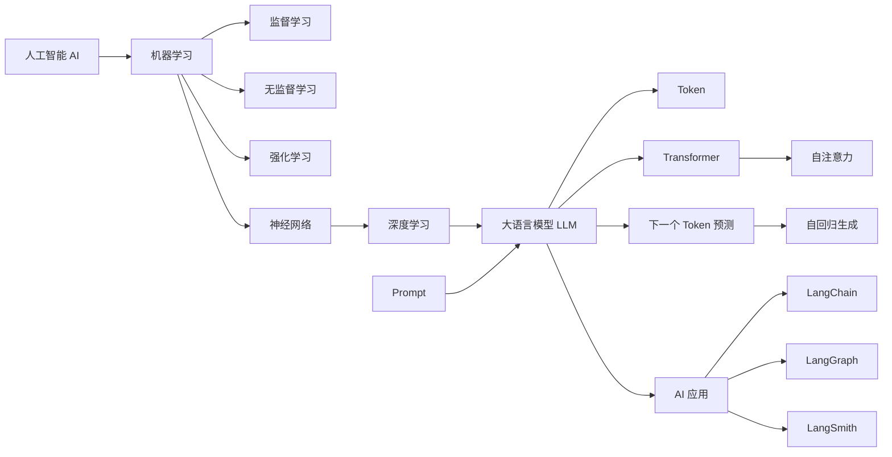

# AI 应用开发基础概念

这里整理 AI 应用开发需要反复用到的基础概念。内容不是按学科百科展开，而是围绕一个实际问题组织：**从理解 AI 的能力边界，到理解 LLM 为什么能生成内容，再到搭建开发环境并开始做应用。**

## 建议阅读顺序

| 阶段 | 先解决的问题 | 推荐入口 |
| --- | --- | --- |
| 1. 建立全局认识 | AI、AGI、LLM 和 AI 应用分别是什么？ | [AI、AGI 与 LLM 基础知识总览](<00-AGI知识体系介绍.md>) |
| 2. 理解学习机制 | 机器如何从数据中形成可泛化的能力？ | [机器学习](<机器学习.md>) -> [神经网络](<神经网络.md>) -> [深度学习](<深度学习.md>) |
| 3. 理解 LLM 内核 | Prompt 如何经过模型变成连续输出？ | [LLM](<LLM.md>) -> [Token](<Token.md>) -> [Transformer 架构](<Transformer 架构.md>) -> [自注意力机制](<自注意力机制.md>) -> [自回归生成方式](<自回归生成方式.md>) |
| 4. 开始应用开发 | 如何准备 Python 环境并调用模型？ | [开发环境的搭建](<02-开发环境的搭建.md>) -> [conda 命令](<conda命令.md>) -> [LangChain 生态简介](<01-LangChain生态简介.md>) |

## 知识关系图

这张图需要注意两点：

- **层级关系不等于唯一实现。** 不是所有 AI 都依赖机器学习，也不是所有神经网络都属于深度学习。
- **训练目标和生成方式不是一回事。** [下一个 Token 预测](<下一个词预测训练目标.md>)描述模型如何学习，[自回归生成](<自回归生成方式.md>)描述模型如何一步步输出。

## 主题索引

### AI、AGI 与个人行动

- [AI、AGI 与 LLM 基础知识总览](<00-AGI知识体系介绍.md>)：建立从概念到应用的整体地图。
- [规则、搜索与机器学习都属于 AI 吗？](<为什么机器学习、神经网络是AI，而规则搜索不是？.md>)：纠正“只有会学习的系统才算 AI”的误区。
- [AGI 时代的个人定位](<在AGI时代如何寻找自己的定位和自己的机会.md>)：用“懂业务、懂 AI、懂实现”寻找人机协作位置。
- [AI 场景落地思路](<AGI落地思路.md>)：从熟悉领域和小任务开始验证价值。
- [用好 AI 的核心心法](<用好AI的核心心法.md>)：边界、拆解、示例、迭代和验证。

### 机器学习基础

- [机器学习](<机器学习.md>)：总览监督学习、无监督学习、强化学习和神经网络。
- [监督学习](<监督学习.md>)：从带标签样本学习输入到输出的映射。
- [无监督学习](<无监督学习.md>)：从无标签数据中发现结构。
- [强化学习](<强化学习.md>)：通过环境反馈学习策略。
- [神经网络](<神经网络.md>)：理解神经元、参数和训练循环。
- [深度学习](<深度学习.md>)：理解多层表示学习与端到端训练。

### LLM 生成机制

- [LLM](<LLM.md>)：训练、推理和生成过程总览。
- [Token](<Token.md>)：模型读写文本时使用的离散单位。
- [Prompt](<Prompt.md>)：提供任务、上下文、输入与输出约束。
- [Transformer 架构](<Transformer 架构.md>)：主流 LLM 的核心网络架构。
- [自注意力机制](<自注意力机制.md>)：让每个位置聚合上下文信息。
- [下一个 Token 预测训练目标](<下一个词预测训练目标.md>)：许多生成式 LLM 的预训练目标。
- [自回归生成方式](<自回归生成方式.md>)：把新 Token 追加到上下文并继续预测。

### 开发环境与工具

- [开发环境的搭建](<02-开发环境的搭建.md>)：Python、虚拟环境、模型接入与依赖安装。
- [conda 常用命令](<conda命令.md>)：创建、激活、导出和删除环境。
- [LangChain 生态简介](<01-LangChain生态简介.md>)：区分 LangChain、LangGraph 与 LangSmith。
- [资源索引](<resources.md>)：官方文档、论文与工具入口。

## 阅读方式

单篇笔记负责解释一个核心概念，重复出现的内容会通过相对链接关联。阅读时先看定义和判断，再沿“相关笔记”继续向上追溯或向下展开。示例用于建立直觉，不应当作生产代码或绝对结论。

## 附件说明

- `pictures/`：正文配图与结构图。
- `pictures/codeblock_cards/`：早期代码块卡片，仅在仍能帮助理解时保留引用。
- `*.canvas`：Obsidian Canvas 结构草图。
