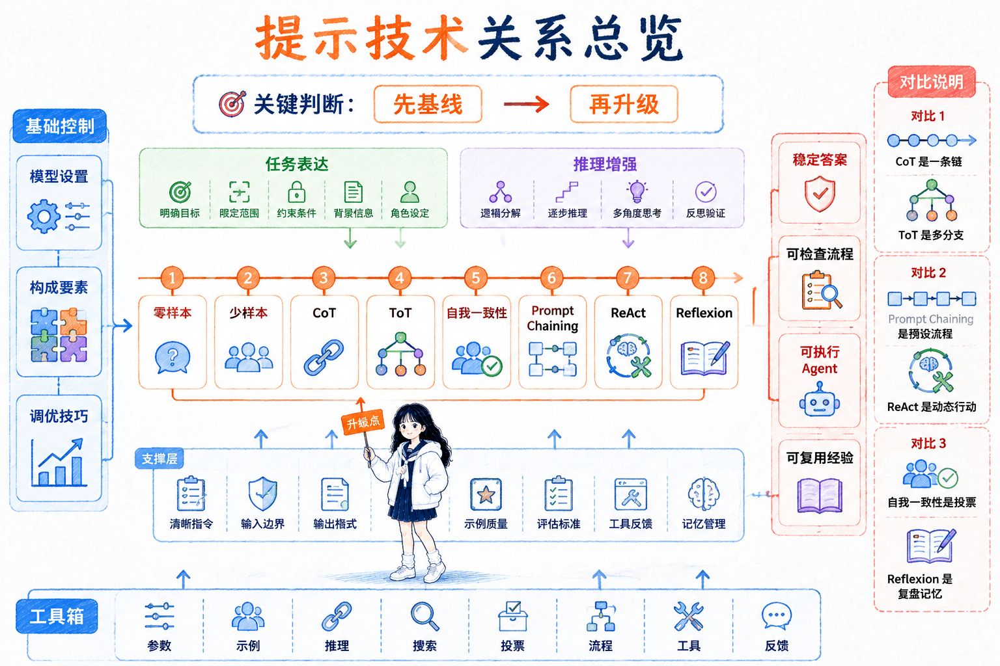

# 提示工程技术关系总览

参考资料：

- [01_大预言模型设置](<01_大预言模型设置.md>)
- [02_提示词构成要素](<02_提示词构成要素.md>)
- [03_设计提示词的通用技巧](<03_设计提示词的通用技巧.md>)
- [04_零样本提示 Zero-shot](<04_零样本提示 Zero-shot.md>)
- [05_少样本提示 Few-shot](<05_少样本提示 Few-shot.md>)
- [06_链式思考（CoT）提示](<06_链式思考（CoT）提示.md>)
- [07_思维树 ToT](<07_思维树 ToT.md>)
- [08_自我一致性 Self-Consistency](<08_自我一致性 Self-Consistency.md>)
- [09_链式提示 Prompt Chaining](<09_链式提示 Prompt Chaining.md>)
- [10_ReAct 框架](<10_ReAct 框架.md>)
- [11_自我反思 Reflexion](<11_自我反思 Reflexion.md>)

## 先按层次理解这些技术

提示工程里的这些概念不是平铺的工具箱，而是可以按“从低成本到高控制”的顺序理解。

**第一层是基础控制层**：[01_大预言模型设置](<01_大预言模型设置.md>) 控制生成的随机性、长度、重复度和停止边界；[02_提示词构成要素](<02_提示词构成要素.md>) 控制 prompt 里应该交代哪些信息；[03_设计提示词的通用技巧](<03_设计提示词的通用技巧.md>) 控制怎么迭代、分隔、具体化和减少歧义。

这一层解决的是：**模型有没有收到清楚的任务信号，以及生成参数是否适合当前任务。**

**第二层是任务表达层**：[04_零样本提示 Zero-shot](<04_零样本提示 Zero-shot.md>) 和 [05_少样本提示 Few-shot](<05_少样本提示 Few-shot.md>) 负责决定“是否给示例”。零样本先用清晰指令建立基线，少样本再用示例补充任务边界和输出格式。

这一层解决的是：**模型是否知道你想要什么样的答案。**

**第三层是推理增强层**：[06_链式思考（CoT）提示](<06_链式思考（CoT）提示.md>)、[07_思维树 ToT](<07_思维树 ToT.md>) 和 [08_自我一致性 Self-Consistency](<08_自我一致性 Self-Consistency.md>) 都在处理复杂推理，但侧重点不同。CoT 让模型沿一条链推完整，ToT 让模型在多条路线里搜索，自我一致性让模型多推几次再投票。

这一层解决的是：**模型会不会跳步、押错路线，或者单次推理不稳定。**

**第四层是流程和 Agent 层**：[09_链式提示 Prompt Chaining](<09_链式提示 Prompt Chaining.md>)、[10_ReAct 框架](<10_ReAct 框架.md>) 和 [11_自我反思 Reflexion](<11_自我反思 Reflexion.md>) 已经不只是单个 prompt 的写法，而是在组织任务流程。Prompt Chaining 把任务拆成外部工作流，ReAct 让模型边思考边行动，Reflexion 让 Agent 从反馈里沉淀经验。

这一层解决的是：**复杂任务如何被拆开、执行、观察、复盘和改进。**

## 一条实用升级路径

实际做 prompt 时，不建议一开始就上复杂技术。更稳的顺序是：

- **先检查模型设置**：输出太发散、太短、太重复时，先看 `temperature`、`top_p`、`max length`、惩罚参数和停止符。
- **再检查 prompt 构成**：任务、上下文、输入、输出格式是否说清楚。
- **先用零样本建立基线**：如果模型能稳定完成，就不要急着加示例。
- **边界不清再加少样本**：用少量高质量例子说明标签、格式、风格或判断标准。
- **推理容易跳步时用 CoT**：让模型把中间过程写出来。
- **路线不确定时用 ToT**：让模型生成多个候选方向，再评估和回溯。
- **单次推理不稳定时用自我一致性**：多次采样推理链，聚合最终答案。
- **一个 prompt 承担太多动作时用 Prompt Chaining**：把任务拆成可检查的阶段。
- **需要工具和环境反馈时用 ReAct**：让模型根据观察结果决定下一步行动。
- **任务可重试且有反馈时用 Reflexion**：把失败经验写入记忆，影响下一次尝试。

**这条路径的核心不是“越往后越高级”，而是先用最低成本方法建立基线，再根据错误类型升级。**

## 容易连在一起看的关系

| 关系 | 共同点 | 关键区别 | 适用判断 |
| --- | --- | --- | --- |
| 零样本提示 vs 少样本提示 | 都通过当前 prompt 描述任务，不修改模型参数 | 零样本只提供指令和上下文；少样本额外提供输入输出示例 | 先用零样本建立基线；模型不理解隐含标准、标签边界或固定格式时再加少样本 |
| CoT vs ToT | 都通过展开中间过程增强复杂推理 | CoT 沿一条路线逐步推理；ToT 同时探索、评估和回溯多条分支 | 路线明确但容易跳步时用 CoT；方向不确定、需要比较候选路线时用 ToT |
| CoT vs 自我一致性 | 都可以生成推理链 | CoT 关注一条推理链是否完整；自我一致性生成多条独立推理链并对最终答案投票 | 单次推理缺步骤时先用 CoT；同一问题多次答案波动时再叠加自我一致性 |
| CoT vs Prompt Chaining | 都会把复杂问题拆成步骤 | CoT 是一次模型回答内部的推理步骤；Prompt Chaining 是多次模型调用或多个处理节点之间的任务流 | 只需改善单次推理时用 CoT；需要中间结果、阶段校验或模块复用时用 Prompt Chaining |
| Prompt Chaining vs ReAct | 都能组织多步骤任务 | Prompt Chaining 的流程由开发者预先编排；ReAct 由 Agent 根据 Observation 动态决定下一步行动 | 流程稳定、步骤已知时用 Prompt Chaining；行动依赖实时工具反馈时用 ReAct |
| ReAct vs Reflexion | 都用于提高 Agent 完成复杂任务的能力 | ReAct 管理当前一次任务中的推理和行动循环；Reflexion 把失败反馈转成记忆，影响下一次尝试 | 需要边观察边执行时用 ReAct；任务允许重试且有可靠反馈时再加入 Reflexion |
| 自我一致性 vs Reflexion | 都通过多次尝试提高可靠性 | 自我一致性并行采样后投票，不改变后续策略；Reflexion 串行接收反馈、形成反思并调整下一次策略 | 有明确唯一答案、适合投票时用自我一致性；需要根据失败原因逐次改进时用 Reflexion |

## 几组容易混淆的点

**CoT 和自我一致性不是同一个层级。** CoT 是让模型展开一次推理，自我一致性是让模型展开多次推理并聚合答案。前者提升“单次推理可见度”，后者提升“结果稳定性”。

**ToT 和自我一致性都涉及多个候选，但动作不同。** 自我一致性通常是多次独立生成完整推理链，再对最终答案投票；ToT 会在中间状态就评估分支，决定继续扩展、淘汰还是回溯。

**Prompt Chaining 和 ReAct 都是多步骤，但控制权不同。** Prompt Chaining 的步骤一般由开发者提前设计好；ReAct 的下一步行动由模型根据 Observation 动态决定。前者更像流程编排，后者更像现场执行。

**Reflexion 和自我一致性都在提高可靠性，但时间尺度不同。** 自我一致性是在同一个问题上并行多采样，选出更稳定的答案；Reflexion 是在一次失败之后生成反思，把经验带到下一次尝试。

**模型设置和提示技术要一起看。** 如果输出只是太随机、太长或太重复，先调参数可能比重写 prompt 更快；如果模型误解任务、缺少边界或推理跳步，再升级提示结构或提示技术。

## 一个简化判断表

| 问题表现                 | 优先检查或使用                       |
| -------------------- | ----------------------------- |
| 输出太发散、太随机            | [01_大预言模型设置](<01_大预言模型设置.md>)                |
| 任务说明、输入和输出格式混在一起     | [02_提示词构成要素](<02_提示词构成要素.md>)                |
| prompt 改了很多次仍不稳定     | [03_设计提示词的通用技巧](<03_设计提示词的通用技巧.md>)             |
| 新任务想先快速试试            | [04_零样本提示 Zero-shot](<04_零样本提示 Zero-shot.md>)        |
| 模型不理解你的标准或格式         | [05_少样本提示 Few-shot](<05_少样本提示 Few-shot.md>)         |
| 需要一步一步推理             | [06_链式思考（CoT）提示](<06_链式思考（CoT）提示.md>)            |
| 一条推理路线容易走错           | [07_思维树 ToT](<07_思维树 ToT.md>)                |
| 同一题多次答案不一致           | [08_自我一致性 Self-Consistency](<08_自我一致性 Self-Consistency.md>) |
| 任务里混着提取、生成、校验等多个动作   | [09_链式提示 Prompt Chaining](<09_链式提示 Prompt Chaining.md>)   |
| 任务需要搜索、工具、文件、网页或环境反馈 | [10_ReAct 框架](<10_ReAct 框架.md>)               |
| Agent 能重试，并且每次失败后有反馈 | [11_自我反思 Reflexion](<11_自我反思 Reflexion.md>)         |

这篇总览可以当作复习入口：先定位当前问题属于哪一层，再跳到对应笔记看具体构造方式。
