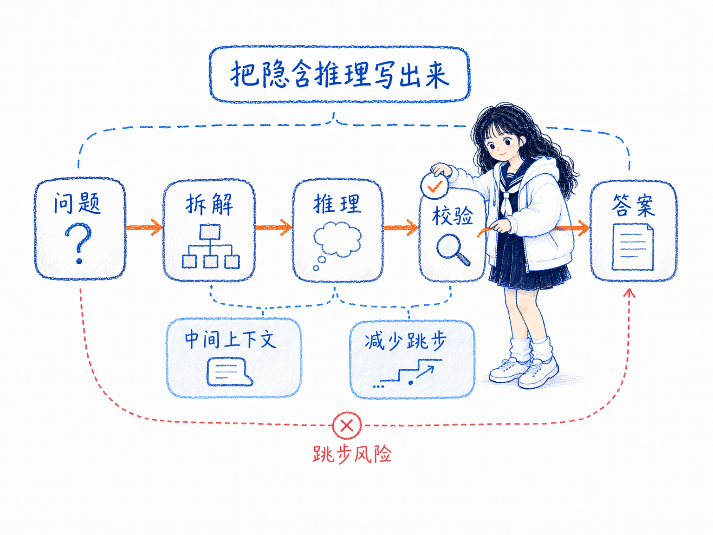
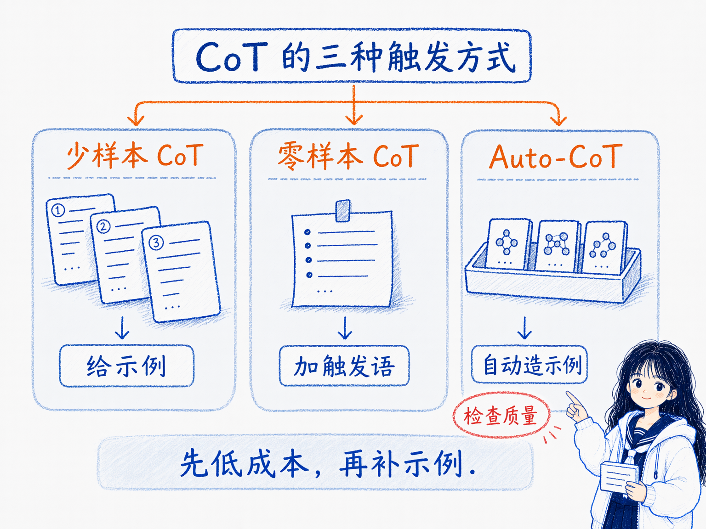
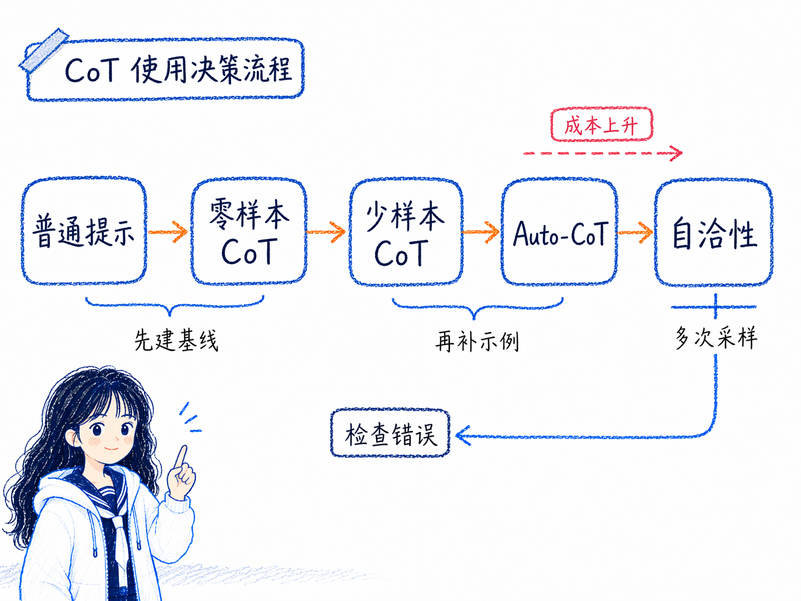

# 链式思考（CoT）提示
---
参考资料：
- [Chain-of-Thought Prompting Elicits Reasoning in Large Language Models](https://arxiv.org/pdf/2201.11903)
- [IBM：What is chain of thought prompting?](https://www.ibm.com/think/topics/chain-of-thoughts)
- [Prompt Engineering Guide：链式思考（CoT）提示](https://www.promptingguide.ai/zh/techniques/cot)
---

## 什么是链式思考？

**链式思考（Chain-of-Thought, CoT）提示是一种让大模型在给出最终答案前，先生成中间推理步骤的提示技术。** 它的核心不是让模型直接“猜答案”，而是让模型把问题拆开，一步一步写出推理过程，再得出结论。

例如，普通提示可能会让模型直接回答：

```text
问题：小明有 10 个苹果，送出 4 个，又买了 5 个，吃掉 1 个。还剩几个？
答案：
```

链式思考提示会要求模型先展开过程：

```text
问题：小明有 10 个苹果，送出 4 个，又买了 5 个，吃掉 1 个。还剩几个？
请一步一步思考后再回答。
```

这样模型更容易先算出 `10 - 4 = 6`，再算 `6 + 5 = 11`，最后算 `11 - 1 = 10`，而不是跳过中间步骤直接输出一个看起来合理但可能错误的数字。

CoT prompting 在 2022 年被系统化讨论后，逐渐成为提示工程里处理复杂推理任务的重要方法。它的典型形式是：**在少样本提示中提供“输入 -> 推理链 -> 输出”的示例，让模型模仿这种分步推理模式。**

## 链式思考的工作原理

链式思考的核心在于：**把中间推理步骤显式放进上下文，让模型后续生成答案时受到这些步骤约束。**

具体来说：

- **分解复杂问题**， CoT 会把一个多步问题拆成多个小步骤。每一步只处理一部分信息，降低模型一次性跳到答案的难度。
- **增加中间上下文**， 大模型是自回归生成的，前面已经生成的内容会影响后面 token 的概率。中间推理步骤会成为“上文”，继续约束最终答案。
- **模仿人类解题过程**， 人类做数学题、逻辑题、规划题时，也通常会先理解题目、列条件、推中间结果，再得出结论。CoT 让模型用类似形式组织答案。
- **提供可观察的推理窗口**， 中间步骤让人更容易看出模型在哪里理解错了、算错了、漏掉了条件。它不等于模型真实内部机制完全透明，但对调试很有帮助。
- **让难题获得更多计算预算**， 推理链会消耗更多 token，相当于让模型在复杂问题上花更多生成步骤。论文的消融实验也说明，真正有用的不只是“多生成一些 token”，而是用自然语言表达中间推理。

需要注意：**CoT 并不是模型真正具备人类思维的证明，它只是用自然语言推理链改善输出的一种提示方式。**



## 链式思考的触发方式

CoT 常见有三种触发方式：少样本 CoT、零样本 CoT 和 Auto-CoT。



### 少样本 CoT

少样本 CoT 是原论文里最典型的形式：在 prompt 中提供几个带推理步骤的示例，让模型模仿“先推理、再回答”的结构。

基本结构是：

```text
问题：示例问题 1
推理：一步一步说明中间过程。
答案：最终答案

问题：示例问题 2
推理：一步一步说明中间过程。
答案：最终答案

问题：新问题
推理：
```

这和 [05_少样本提示 Few-shot](<05_少样本提示 Few-shot.md>) 的关系很近。普通 few-shot 示例通常只是“输入 -> 输出”，而少样本 CoT 示例是“输入 -> 推理链 -> 输出”。

### 零样本 CoT

零样本 CoT 不提供示例，而是在原始问题后加一句触发语，比如：

```text
让我们逐步思考。
```

或者：

```text
请一步一步分析后再回答。
```

普通直接回答时，模型可能跳过中间步骤，直接给出一个看似合理但错误的答案；加入“让我们逐步思考”后，模型更容易先列出中间过程，再得到正确结果。

零样本 CoT 适合没有足够示例、但又希望模型先展开推理的场景。它通常比普通零样本更适合多步问题，但稳定性不一定比精心设计的少样本 CoT 高。

### Auto-CoT

Auto-CoT 是为了减少人工编写推理示例的成本。它的大致思路是：先把问题聚类，再从每类问题中抽代表样本，用零样本 CoT 自动生成推理链，最后把这些推理链作为示例。

可以理解为：

- **问题聚类**， 先把问题按类型分组，保证示例有多样性。
- **示例抽样**， 每组挑一个代表问题。
- **自动生成推理链**， 用“让我们逐步思考”之类的提示生成中间步骤。
- **组合成 few-shot CoT prompt**， 把自动生成的示例放进最终提示中。

Auto-CoT 的好处是减少手工构造示例的工作量；风险是自动生成的推理链本身也可能出错，所以仍然需要检查示例质量。

## 链式思考的应用场景

CoT 适合那些“答案不是一步能直接得出”的任务。

- **数学和计算问题**： 例如应用题、概率题、方程求解、数量变化问题。CoT 可以让模型先列条件和中间计算。
- **逻辑推理问题**： 例如判断真假、条件排除、逻辑谜题。CoT 能帮助模型逐条处理条件。
- **常识推理问题**： 例如需要结合多个常识点的问题。CoT 可以让模型先说明每个常识判断，再汇总答案。
- **符号推理问题**： 例如字母拼接、状态追踪、硬币翻转。原论文展示了 CoT 对这类任务的长度泛化有帮助，尤其是在模型足够大时。
- **多步规划和决策问题**： 例如制定执行计划、分析方案优先级、拆解复杂任务。CoT 可以帮助模型把目标、约束、步骤分开考虑。
- **教学解释场景**： 当你不只是要答案，还想知道解题思路时，CoT 能让输出更适合学习和复盘。

如果任务只是简单事实问答，比如“法国首都是哪里”，CoT 往往是多余的。它更适合需要推理链的任务，而不是所有任务。

## 链式思考的优势

- **提升复杂推理表现**， CoT 在算术、常识、符号推理等任务上能显著改善大型模型的表现，尤其是多步问题。
- **让答案更可检查**， 中间步骤暴露后，人可以看到模型是否漏掉条件、算错中间结果或走错推理方向。
- **不需要微调模型**， 原论文强调 CoT 可以通过提示离线模型触发，不需要为每个任务训练一个新模型。
- **可以和少样本提示结合**， 少样本 CoT 用几个带推理步骤的示例，就能让模型模仿分步推理模式。
- **可以和自洽性结合**， 对复杂问题可以多次生成不同推理链，再用 [08_自我一致性 Self-Consistency](<08_自我一致性 Self-Consistency.md>) 的方式选择更稳定的最终答案。
- **适用范围比较广**， 只要任务本身适合用语言分步骤解决，理论上都可以尝试 CoT。

## 链式思考的局限性

- **依赖模型规模和能力**， CoT 更依赖模型规模和基础能力；较小模型可能生成流畅但不合逻辑的推理链。
- **不保证推理一定正确**， 模型可能写出看似合理的步骤，但中间某一步已经错了，最终答案也会被带偏。
- **增加 token 成本和响应时间**， 推理链越长，消耗的上下文、输出 token 和推理时间越多。
- **示例质量很重要**， 少样本 CoT 需要高质量、多样化的推理示例。示例写得不好，模型会模仿错误模式。
- **不适合简单任务**， 对单步事实问题或非常明确的分类任务，CoT 可能只是增加冗余。
- **可解释性有限**， 推理链能帮助观察输出过程，但不等于完整揭示模型内部真实计算过程。
- **可能暴露错误思路**， 如果模型在早期推理里误解了题意，后续步骤往往会沿着错误路径继续展开。

## 链式思考的使用经验

写 CoT prompt 时，可以先判断：这个任务是否真的需要多步推理。

如果任务复杂，可以按这个顺序尝试：

- **先用普通提示建立基线**， 看模型是否能直接答对。
- **再加零样本 CoT 触发语**， 例如“请一步一步分析后再回答”。
- **如果仍不稳定，再加入少样本 CoT 示例**， 给模型几个“输入 -> 推理链 -> 输出”的样例。
- **如果示例构造成本高，再考虑 Auto-CoT**， 用自动生成的推理链做候选示例，但要检查质量。
- **如果答案仍有波动，再结合自洽性**， 多次采样推理链，选择更稳定的最终答案。



**CoT 最适合解决“模型会一点，但容易跳步、漏条件、直接猜答案”的问题。** 它不是万能增强器，而是一种让模型把隐含推理显式写出来的提示方法。

使用时也要避免一个误区：不要把“写了很多步骤”当成“推理一定正确”。真正要检查的是：每一步是否符合题意、计算是否正确、最后答案是否真的由前面步骤推出。

## 相关关系笔记

- [13_CoT 和 Prompt Chaining的区别](<13_CoT 和 Prompt Chaining的区别.md>)：区分一次回答内部的推理链和多次调用之间的任务链。
- [15_CoT 和 ToT的区别](<15_CoT 和 ToT的区别.md>)：区分线性推理和多分支搜索。
- [16_CoT 和自我一致性的区别](<16_CoT 和自我一致性的区别.md>)：区分单条推理链和多条推理链投票。
- [00_Prompt Engineering技术关系总览](<00_Prompt Engineering技术关系总览.md>)：把 CoT 放回推理增强层中，和 ToT、自我一致性一起比较。
