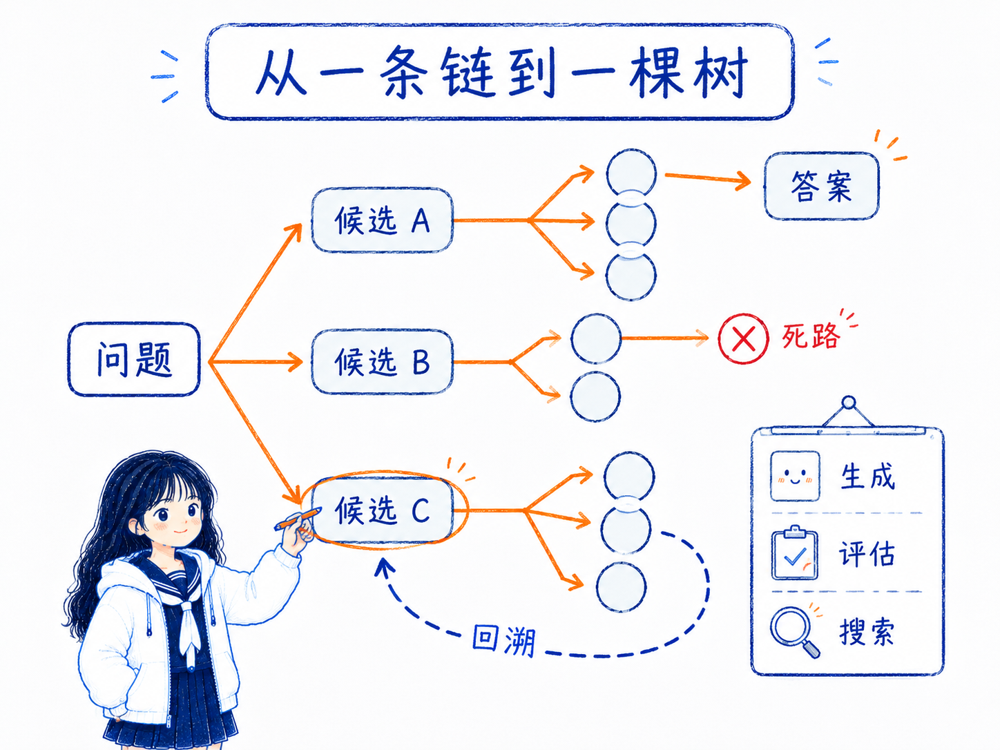
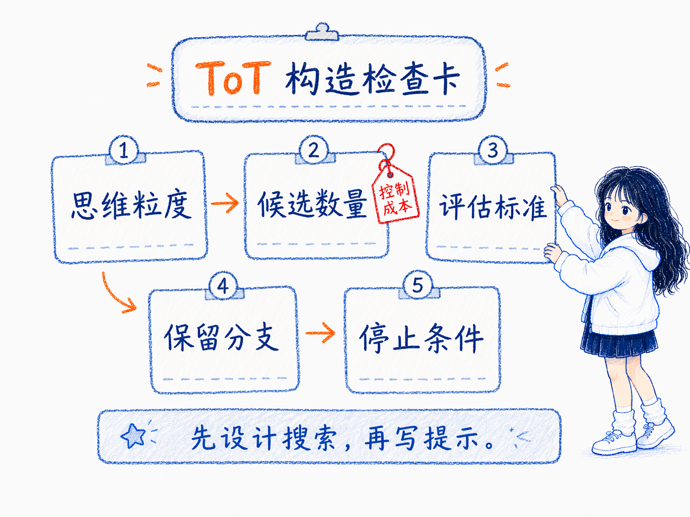

# 思维树 ToT
---
参考资料：
- [IBM：什么是思维树提示？](https://www.ibm.com/cn-zh/think/topics/tree-of-thoughts)
- [Prompt Engineering Guide：思维树（ToT）](https://www.promptingguide.ai/zh/techniques/tot)
---

## 什么是思维树？

**思维树（Tree of Thoughts, ToT）是一种让大模型同时探索多条推理路径，并对中间思路进行评估、选择、回溯的提示和推理框架。** 如果说 [06_链式思考（CoT）提示](<06_链式思考（CoT）提示.md>) 是把一条推理链写出来，那么 ToT 更像是把多个可能的推理方向展开成一棵树，再从里面找出更有希望的路径。

ToT 适合处理那种“第一步选错，后面全错”的复杂问题。比如解谜、规划、策略选择、复杂计算、创意写作等任务，往往不是沿着一条线一直往下推就够了，而是需要先提出多个候选方案，再判断哪些方案值得继续深入。

可以把 ToT 想成一种更主动的搜索过程：

- 先把问题拆成若干中间步骤；
- 每一步不只生成一个想法，而是生成多个候选想法；
- 对候选想法做评估，判断哪些更有希望；
- 继续扩展好路径，必要时回到前面换一条路。

## 思维树的工作原理

思维树的核心在于：**把“生成答案”改造成“搜索答案”。** 模型不再只沿着一条推理链往前走，而是在多个中间状态之间探索、比较和回退。

具体来说，ToT 通常包含四个关键环节：

- **思维分解**， 先定义什么算一个“思维”。它可以是一步计算、一个局部方案、一个中间状态，也可以是创意写作里的一个情节方向。思维粒度不能太大，否则无法评估；也不能太小，否则会让搜索变得琐碎。
- **思维生成**， 在每个节点生成多个候选思路。生成方式可以是独立采样多个候选，也可以基于前一步逐个提出后续候选。前者更适合开放创意任务，后者更适合逻辑约束强的任务。
- **状态评估**， 对每个候选中间状态进行评分或判断。例如“确定可行 / 可能可行 / 不可能”，或者用分数表示这个路径继续推进的价值。评估可以由模型自己完成，也可以由规则、工具或外部检查器辅助完成。
- **搜索与回溯**， 根据评估结果选择下一步扩展哪些分支。常见搜索策略包括广度优先搜索、深度优先搜索和 beam search。遇到死路时，系统可以回退到前面的节点，换一条路径继续探索。

这也是 ToT 和普通提示最大的区别：**普通 prompt 更像一次性回答，CoT 更像沿一条路线推理，ToT 则更像在多条路线中搜索。**



## 思维树的构造方式

写 ToT prompt 时，重点不是把提示词写得更长，而是把“候选、评估、选择、回溯”这几个动作说清楚。

一个 ToT 任务通常要先明确几个问题：

- **思维粒度是什么？** 每一步要生成的是一个公式、一个子方案、一个动作，还是一段解释？
- **每一步生成几个候选？** 候选太少，探索不充分；候选太多，token 和评估成本会快速上升。
- **怎么评估候选？** 是打分、投票、分类，还是用规则检查？
- **保留多少分支？** 可以只保留最优分支，也可以保留前几个候选继续扩展。
- **什么时候停止？** 找到确定答案、达到最大深度、分支都不可行，或评分没有继续提升时停止。

一种简单的 ToT prompt 可以这样写：

```text
请用思维树方式解决这个问题。

问题：...

要求：
1. 先提出 3 个可能的解题方向。
2. 分别评估每个方向的可行性，标记为：可行、可能、不太可行。
3. 选择最有希望的方向继续展开。
4. 如果展开过程中发现矛盾，请回退并尝试其他方向。
5. 最后给出答案，并说明为什么选择这条路径。
```

还有一种常见写法，是让多个“专家”并行提出步骤，再淘汰明显错误的路线：

```text
假设有三位专家分别尝试解决这个问题。
每位专家先写出第一步思路。
比较三位专家的思路，淘汰明显错误或无效的方向。
剩余专家继续写下一步。
重复这个过程，直到得到可靠答案。

问题：...
```

这种写法不一定是真正工程化的 ToT，但它能把 ToT 的核心思想压缩进一次 prompt：**多路线探索 + 中间评估 + 淘汰错误路径。**



## 思维树的应用场景

ToT 适合那些需要探索、试错和前瞻判断的任务。

- **数学和逻辑谜题**： 例如 24 点、数独、填字游戏、复杂逻辑题。模型可以先尝试多个局部解，再排除会走向矛盾的路径。
- **复杂规划问题**： 例如项目方案、路线规划、执行策略。ToT 可以同时比较多个方案，再选择更可行的推进路线。
- **创意写作**： 例如故事情节、文章结构、标题方向。模型可以生成多个创意分支，再评估哪个更连贯、更贴合目标。
- **代码和调试思路**： 当 bug 原因不确定时，可以列出多个假设，逐个验证并回退，而不是一开始就押注某个原因。
- **决策分析**： 对需要权衡成本、风险、收益的任务，ToT 可以把不同选择展开成分支，方便比较后果。

如果任务本身只有一个明确步骤，或者答案可以直接查到，ToT 往往过重。它更适合“路径选择会影响最终结果”的问题。

## 思维树的优势

- **能探索多个方案**， 不容易被第一条看似合理的推理路径锁死。对开放问题和复杂问题尤其有用。
- **允许回溯和纠错**， 一条路径走不通时，可以回到前面的节点换路，而不是沿着错误假设继续编下去。
- **中间过程更可检查**， 每个候选思路和评估理由都可以被人看到，更方便判断模型到底在哪里选错。
- **更适合战略性任务**， 对规划、推演、解谜、创作这类任务，ToT 比线性推理更接近真实的问题解决方式。
- **可以和其他方法组合**， ToT 可以结合 [08_自我一致性 Self-Consistency](<08_自我一致性 Self-Consistency.md>)、工具调用、规则检查器或搜索算法，让评估环节更可靠。

## 思维树的局限性

- **成本明显更高**， 多分支生成、评估和回溯会消耗更多 token、时间和计算资源。
- **实现更复杂**， 真正工程化的 ToT 不只是写一段 prompt，还要设计候选生成、状态评估、搜索策略、停止条件和结果汇总。
- **评估器会影响结果**， 如果模型自己评估候选，但评估标准不清或模型判断能力不足，就可能保留错误路径、淘汰正确路径。
- **可能搜索低价值分支**， 如果没有好的启发式策略，ToT 可能在很多没希望的路径上浪费成本。
- **不适合简单任务**， 对事实问答、简单分类、固定格式转换，ToT 会显得笨重，甚至降低效率。
- **不保证答案正确**， ToT 提高的是探索和纠错能力，不等于每条评估都可靠，也不等于最终一定正确。

## 思维树的使用经验

使用 ToT 时，可以按这个顺序判断：

- **先问任务是否真的需要搜索**， 如果只是简单问答，不要上 ToT。
- **先用 CoT 建立基线**， 看一条推理链能否稳定解决。
- **如果模型容易卡在错误路线，再升级 ToT**， 让它同时生成多个候选方向。
- **给评估标准**， 不要只说“选最好的”，而要说清楚什么叫可行、什么叫矛盾、什么叫更优。
- **限制分支数量和深度**， 否则成本会失控，输出也会变得很散。
- **必要时加入外部检查**， 对数学、代码、事实核验类任务，不要完全依赖模型自评。

**ToT 最适合解决“方向不确定，需要先探索再选择”的问题。** 它不是普通 CoT 的替代品，而是当线性推理不够时，用更高成本换更强搜索能力的一种方法。

## 相关关系笔记

- [15_CoT 和 ToT的区别](<15_CoT 和 ToT的区别.md>)：比较线性推理链和多分支搜索树。
- [00_Prompt Engineering技术关系总览](<00_Prompt Engineering技术关系总览.md>)：把 ToT 和 CoT、自我一致性放在同一层看，理解它适合什么时候升级使用。
