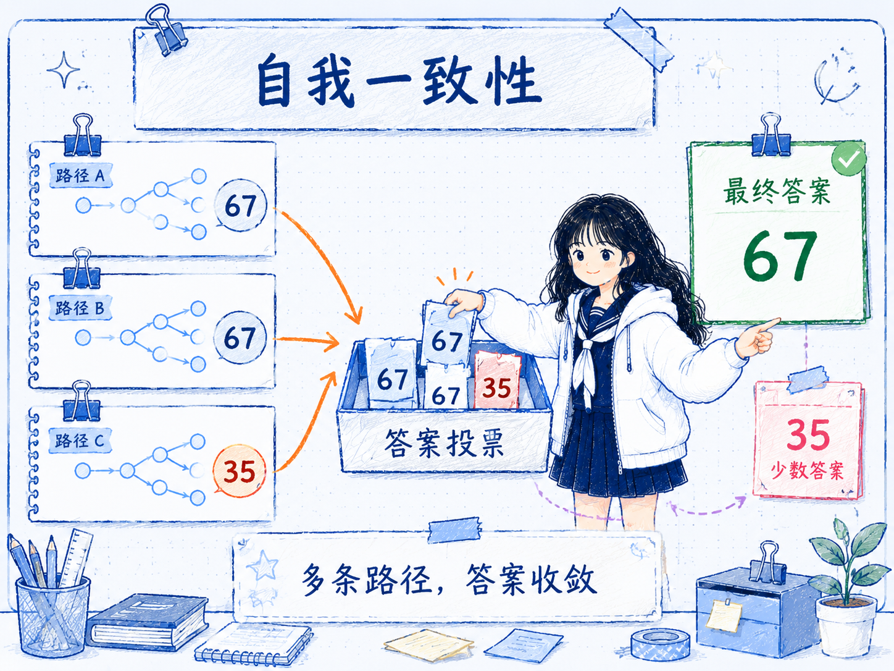
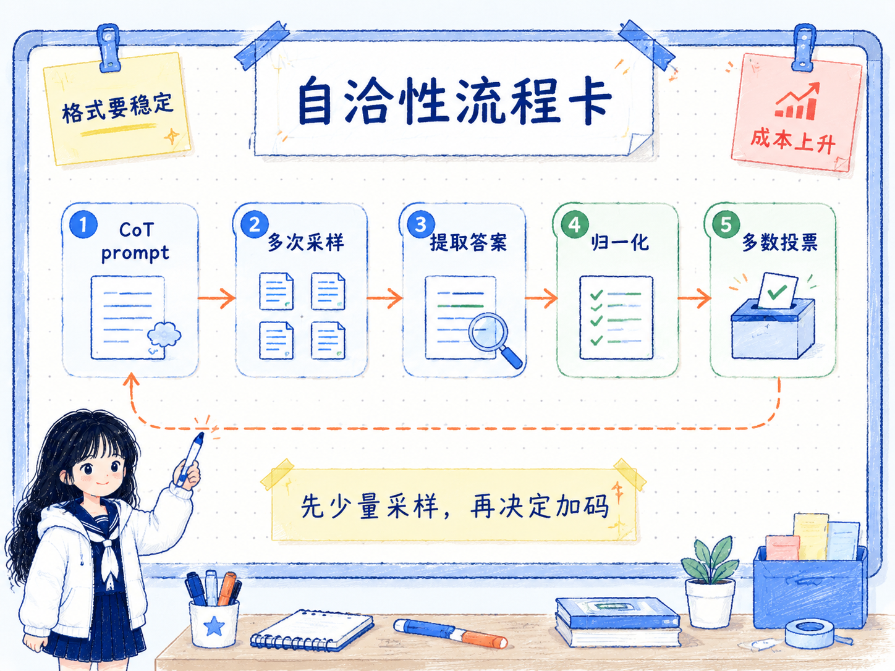

# 自我一致性 Self-Consistency
---
参考资料：
- [Self-Consistency Improves Chain of Thought Reasoning in Language Models](https://arxiv.org/pdf/2203.11171)
- [Prompt Engineering Guide：自我一致性](https://www.promptingguide.ai/zh/techniques/consistency)
---

## 什么是自我一致性？

**自我一致性（Self-Consistency）是一种通过多次采样推理路径，并从多个最终答案中选择最一致答案的推理增强方法。** 它通常和 [06_链式思考（CoT）提示](<06_链式思考（CoT）提示.md>) 一起使用：CoT 让模型写出一条推理链，自我一致性则让模型写出多条可能的推理链，再看最终答案是否收敛。

它解决的是单条推理路径不稳定的问题。复杂问题往往不只有一种解法，如果模型第一次生成时刚好走到错误路径，贪心解码会把这条路径一路走到底。自我一致性的想法是：**不要只相信第一次推理，而是让模型从不同角度多做几遍，再用答案分布来判断哪个结果更可靠。**

需要注意，自我一致性不是“让模型自我反省一次”。它更像是推理阶段的投票机制：多次生成、提取答案、统计结果，最后选择出现最多或最稳定的答案。

## 自我一致性的工作原理

自我一致性的核心在于：**把单次推理改成多路径采样，把单个答案改成答案聚合。**

它通常包含几个关键步骤：

- **使用 CoT prompt 触发推理**， 先让模型用分步推理的方式回答问题，而不是直接输出答案。
- **采样多条推理路径**， 通过较高的 `temperature`、不同随机种子或多次请求，让模型生成不同的中间推理过程。
- **提取最终答案**， 每条推理链最后都要有一个明确答案，例如数字、选项、分类标签或简短结论。
- **聚合答案分布**， 把多次输出的最终答案放在一起统计，选择出现频率最高的答案。对于数值问题，也可以根据任务需要做规范化、去单位、取众数等处理。
- **用一致性判断可靠度**， 如果 10 次采样里 8 次得到同一个答案，这个答案通常比 10 次里分散成 5 个答案更值得信任。

这里真正被“投票”的不是推理文本本身，而是最终答案。不同推理链可以写法不同、角度不同，只要它们收敛到同一个答案，就说明这个答案在当前模型分布里更稳定。



## 自我一致性的构造方式

自我一致性更像一种调用策略，而不只是 prompt 句式。一个基本流程可以这样设计：

- **先准备一个 CoT prompt**， 让模型输出中间推理过程和最终答案。
- **重复调用多次**， 每次保留同样的问题和提示，但允许模型采样出不同路径。
- **要求最终答案格式稳定**， 例如统一用“最终答案：...”结尾，方便后续程序解析。
- **对答案做归一化**， 比如把 `67 岁`、`67`、`答案是 67` 统一成同一个值。
- **统计并选择答案**， 使用多数投票；如果没有明显多数，就标记为不确定或增加采样次数。

一个简化 prompt 可以这样写：

```text
请一步一步推理，并在最后单独给出最终答案。

问题：...

输出格式：
推理：...
最终答案：...
```

调用时不要只运行一次，而是运行多次：

```text
第 1 次：推理路径 A -> 最终答案：67
第 2 次：推理路径 B -> 最终答案：67
第 3 次：推理路径 C -> 最终答案：35

投票结果：67 出现 2 次，35 出现 1 次
最终采用：67
```

工程上最容易漏掉的是“答案提取”。如果输出格式不稳定，自我一致性会变成一堆文本人工比对，后续很难自动化。所以在 prompt 里明确最终答案字段，比单纯要求“多想几遍”更重要。



## 自我一致性的应用场景

自我一致性适合那些答案有明确判定标准、但单次推理容易波动的任务。

- **数学和计算题**： 多步计算中只要早期一步错了，最终答案就会偏掉。多次采样可以让正确答案更容易浮现出来。
- **逻辑推理题**： 条件多、分支多时，模型可能漏掉某个约束。不同推理路径能暴露不同可能性。
- **常识推理题**： 有些问题需要综合多个常识判断，单次回答可能受措辞影响较大，多次采样能提高稳定性。
- **选择题或分类任务**： 只要最终答案能归一化成有限选项，就适合用投票聚合。
- **代码思路和调试假设**： 可以让模型多次提出可能原因，再统计哪些结论反复出现，但最终仍需要用测试或日志验证。

如果任务是开放写作、审美判断、长文生成或创意发散，自我一致性就不一定适合直接用多数投票。因为这类任务常常没有唯一正确答案，多个不同输出未必代表“谁更对”。

## 自我一致性的优势

- **提高复杂推理稳定性**， 它降低了单条错误推理链把答案带偏的概率。
- **实现成本低**， 不需要微调模型，也不需要额外训练一个判断器；主要是在推理阶段多调用几次。
- **和 CoT 互补性强**， CoT 负责展开推理，自我一致性负责从多条推理里选更稳定的答案。
- **可以估计不确定性**， 答案高度集中时信心更高；答案很分散时，说明问题、提示或模型能力可能不够稳定。
- **适合自动化评估链路**， 当最终答案能结构化解析时，可以用程序完成投票、统计和异常标记。

## 自我一致性的局限性

- **成本会成倍增加**， 采样 5 次、10 次或更多次，意味着 token、时间和 API 成本都会增加。
- **依赖答案可聚合**， 如果最终答案无法规范化，投票就会变得困难。开放式回答尤其明显。
- **多数不等于正确**， 如果模型系统性误解题目，多次采样可能只是稳定地得到同一个错误答案。
- **推理文本可能互相矛盾**， 最终答案一致不代表每条推理链都可靠，中间过程仍然可能有错误。
- **需要设计停止策略**， 采样次数不是越多越好。如果前几次已经高度一致，继续采样可能只是浪费成本。
- **对简单任务过重**， 事实问答、简单分类、固定格式转换通常不需要自我一致性。

## 自我一致性的使用经验

使用自我一致性时，可以按这个顺序判断：

- **先确认任务是否需要推理**， 简单事实问题不要上复杂采样。
- **先用 CoT 建立单次基线**， 如果一次 CoT 已经稳定正确，就没必要增加成本。
- **当答案波动明显时再多采样**， 特别是数学、逻辑、选择题这类可判定任务。
- **把最终答案格式写死**， 例如固定输出 `最终答案：...`，方便程序提取。
- **先用少量采样试探**， 例如 3 次或 5 次；如果答案仍然分散，再决定是否增加采样。
- **对高风险任务加入外部验证**， 多数投票只能提高稳定性，不能替代计算器、单元测试、事实核验或人工审核。

**自我一致性最适合解决“模型会推理，但单次推理结果不稳定”的问题。** 它用更多推理成本换更高可靠性；真正的关键不是让模型说得更多，而是让多个独立路径在最终答案上收敛。

## 相关关系笔记

- [16_CoT 和自我一致性的区别](<16_CoT 和自我一致性的区别.md>)：区分单条推理链和多条推理链投票。
- [18_自我一致性和 Reflexion的区别](<18_自我一致性和 Reflexion的区别.md>)：区分并行答案聚合和串行反馈学习。
- [00_Prompt Engineering技术关系总览](<00_Prompt Engineering技术关系总览.md>)：把自我一致性和 CoT、ToT、Reflexion 放在一起比较，理解“多次采样投票”和“反馈后改进”的区别。
