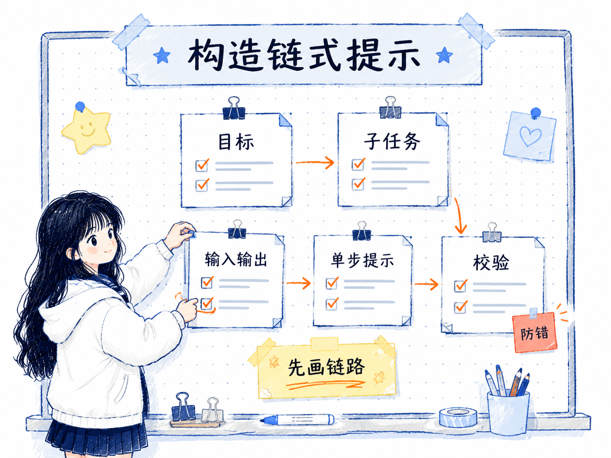
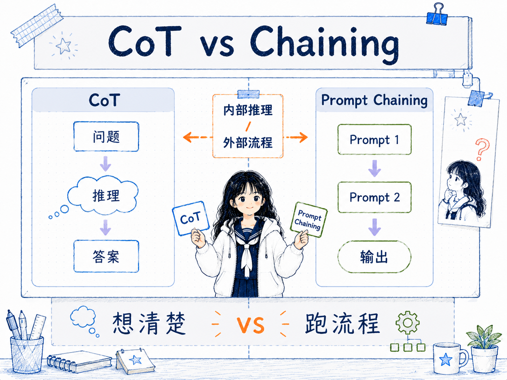

# 链式提示 Prompt Chaining
---
参考资料：
- [IBM：What is prompt chaining?](https://www.ibm.com/think/topics/prompt-chaining)
- [Prompt Engineering Guide：Prompt Chaining](https://www.promptingguide.ai/techniques/prompt_chaining)
- [Prompt Chaining or Stepwise Prompt? Refinement in Text Summarization](https://arxiv.org/pdf/2406.00507)
---

## 什么是链式提示？

**链式提示（Prompt Chaining）是一种把复杂任务拆成多个子任务，并让前一步输出作为后一步输入的提示工程方法。**

它的核心不是把一个 prompt 写得更长，而是把任务拆成一条更清晰的处理链：先让模型完成一个相对单一的动作，再把结果交给下一步继续处理。这样做的好处是，每一步的目标更明确，中间结果也更容易检查。

可以把它理解成一个小型工作流：

```text
原始输入 -> Prompt 1 -> 中间结果 -> Prompt 2 -> 中间结果 -> Prompt 3 -> 最终输出
```

比如做一篇长文问答时，不一定要让模型直接“读完整篇文章并回答问题”。更稳的方式是先提取相关片段，再基于片段回答，最后检查答案是否超出了给定材料。这样每一步都能单独检查、替换和优化。


## 链式提示的工作原理

链式提示的关键，是把大任务从“单次生成”改成“多阶段生成”。

- **任务分解**：先把复杂任务拆成几个更小、更清楚的子任务。每个子任务最好只承担一个主要目标，例如提取、分类、改写、推理、校验。
- **中间结果传递**：前一步的输出不是最终答案，而是下一步的输入。中间结果越清晰，后续步骤越稳定。
- **阶段边界清晰**：每一步都要知道自己接收什么、产出什么。边界不清时，链条会变成一串互相污染的长 prompt。
- **逐步检查和纠错**：如果结果不对，可以定位是哪一步出了问题，而不是只能反复改一个巨大的 prompt。
- **输出格式约束**：每一步最好约定输出格式，例如列表、JSON、标签块或固定字段，方便下一步读取。

链式提示适合处理那些“一个 prompt 里同时塞了太多动作”的任务。只要一个提示词同时要求模型理解材料、提取信息、判断关系、生成答案、检查格式，就很容易变得难调试。

## 链式提示的构造方式

构造链式提示时，可以先不急着写 prompt，而是先画清楚任务链路。

- **确定最终目标**：先明确最后要交付什么，例如答案、摘要、代码、分类结果或结构化数据。
- **拆出子任务**：把最终目标倒推成几个中间步骤，尽量让每一步都足够小。
- **定义输入输出**：为每一步写清楚输入来自哪里、输出交给谁、格式是什么。
- **设计单步提示**：每个 prompt 只关注当前步骤，不把后面步骤提前塞进来。
- **加入校验节点**：在容易出错的位置增加检查步骤，例如事实核对、格式校验、遗漏检查。
- **逐步测试整条链**：先测试单步，再测试相邻步骤，最后测试完整链条。

一个文档问答任务可以这样拆：

```text
Prompt 1：从文档中提取和问题相关的原文片段，输出为引用列表
Prompt 2：只基于引用列表回答问题，并说明依据
Prompt 3：检查答案是否使用了引用列表之外的信息
```

一个总结改写任务可以这样拆：

```text
Prompt 1：生成摘要初稿
Prompt 2：批评初稿，指出遗漏、冗余和不准确处
Prompt 3：根据批评意见重写摘要
```

这里的重点是：**每一步都要有可被下一步稳定消费的中间产物。** 如果中间结果本身很含糊，后面的 prompt 再好也会被前面的噪声拖偏。



## 链式提示的应用场景

链式提示适合那些需要多个处理阶段、并且中间结果有检查价值的任务。

- **文档问答**：先检索或提取相关内容，再基于材料回答，最后检查答案是否有依据。
- **摘要和改写**：先生成初稿，再批评缺陷，最后根据批评意见重写。
- **内容创作流程**：先提纲，再扩写，再润色，再检查风格和结构。
- **代码生成**：先理解需求，再拆解模块，再生成代码，再写测试或检查边界条件。
- **数据抽取和清洗**：先抽取字段，再统一格式，再校验缺失和异常。
- **推荐和决策辅助**：先收集约束，再生成候选方案，再比较优缺点，再输出建议。

它尤其适合和工具调用、检索增强生成、结构化输出一起使用。因为这些场景本来就需要明确的输入输出边界，链式提示可以把每个环节拆得更可控。

## 链式提示的优势

- **降低单个 prompt 的复杂度**：每一步只处理一个局部问题，提示词更短、更清楚。
- **提高可控性**：可以单独调整某一步，而不必重写整段提示词。
- **更容易调试**：中间结果会暴露问题来源，方便判断是提取错了、推理错了，还是格式错了。
- **减少错误扩散**：通过检查节点，可以在错误进入最终答案前拦截一部分问题。
- **方便复用**：稳定的子链可以被复用到其他任务里，例如“提取证据 -> 生成答案 -> 校验依据”。

链式提示的价值不只是“多问几次模型”，而是把模型调用组织成一条可观察、可替换、可测试的流程。

## 链式提示的局限性

链式提示并不是越拆越好。拆得太细，也会带来新的问题。

- **成本更高**：多次调用模型会增加 token 消耗、延迟和工程复杂度。
- **错误会传递**：如果前一步输出错了，后一步可能会沿着错误继续生成。
- **上下文可能丢失**：每一步只看到局部信息时，可能遗漏整体语境。
- **需要维护接口**：每一步的输入输出格式都要稳定，否则链条很容易断。
- **简单任务会显得冗余**：如果任务本来一句话就能完成，链式提示反而会增加负担。

所以判断是否要使用链式提示，关键不是看任务高级不高级，而是看这个任务是否真的需要多个可检查的中间阶段。

## 链式提示和链式思考的关系

链式提示容易和 [[06_链式思考（CoT）提示]] 混在一起，但它们关注的层面不同。

**链式思考（CoT）更像是在一次回答里引导模型展开推理过程；链式提示（Prompt Chaining）更像是在多次调用之间设计一条外部工作流。**

- CoT 关注的是“模型如何想”：让模型把推理步骤说出来，适合数学、逻辑、常识推理等问题。
- Prompt Chaining 关注的是“任务如何流转”：把一个复杂任务拆成多个阶段，适合文档处理、内容生成、代码生成、结构化抽取等流程。

两者可以组合使用。例如链式提示中的某一步是“分析问题并给出判断”，这一小步内部可以使用 CoT；但整条任务链的组织方式，仍然属于 Prompt Chaining。



更详细的对比可以放到 [[13_CoT 和 Prompt Chaining的区别]] 里复用，避免在每篇笔记里重复展开。

## 链式提示的使用经验

- **先画链路，再写 prompt**：先确定每一步的输入、输出和责任，再写具体提示词。
- **每一步只做一件事**：如果某一步仍然很难描述，说明它可能还需要继续拆。
- **中间结果尽量结构化**：列表、字段、标签块通常比自然段更容易被下一步稳定读取。
- **关键位置加校验**：涉及事实、格式、引用、代码或外部操作时，最好有检查节点。
- **保留中间输出**：真实项目里要记录每一步结果，否则出错时很难定位。
- **不要为了拆而拆**：如果拆分没有带来可检查性、可复用性或稳定性，就没有必要链式化。

**当一个 prompt 同时承担理解、提取、推理、改写、校验时，就应该考虑拆成链。**

## 相关关系笔记

- [[13_CoT 和 Prompt Chaining的区别]]：专门区分推理链和任务链。
- [[00_Prompt Engineering技术关系总览]]：把 Prompt Chaining 放在流程层中，和 ReAct、Reflexion 一起比较。
