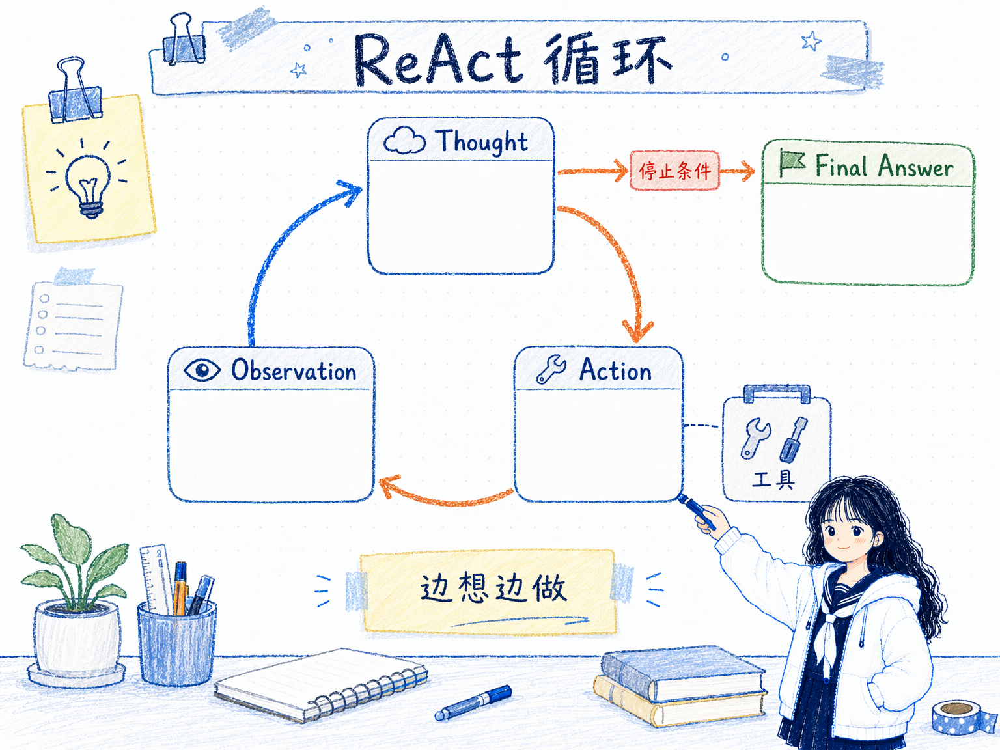
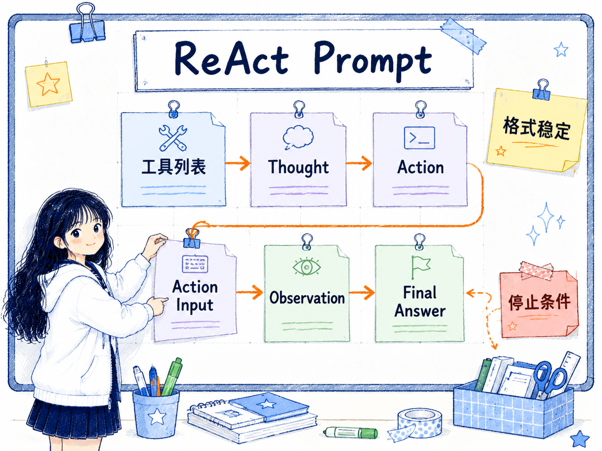
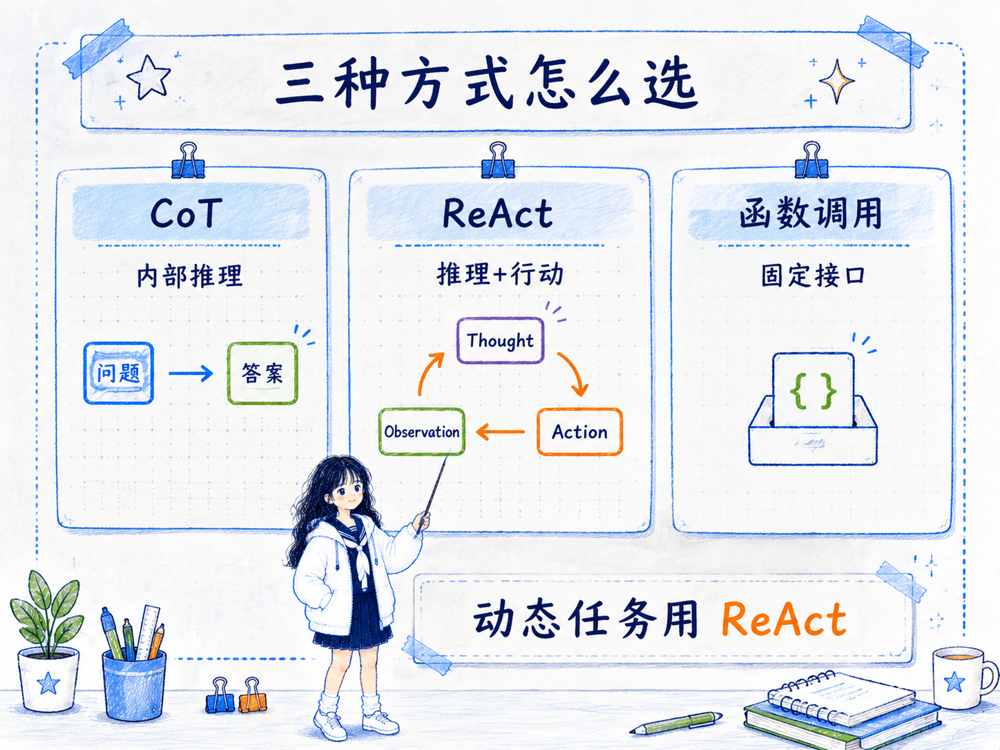

# ReAct 框架
---
参考资料：
- [IBM：什么是 ReAct 智能体？](https://www.ibm.com/cn-zh/think/topics/react-agent)
- [ReAct: Synergizing Reasoning and Acting in Language Models](https://arxiv.org/pdf/2210.03629)
- [Prompt Engineering Guide：ReAct 框架](https://www.promptingguide.ai/zh/techniques/react)
---

## 什么是 ReAct？

**ReAct 是一种把 Reasoning（推理）和 Acting（行动）交替结合起来的 Agent 框架。**

它解决的问题是：大模型只靠内部推理，很容易在不知道事实、缺少环境信息或需要执行操作时“脑补”；但如果只让模型调用工具，又可能缺少计划、判断和纠错能力。ReAct 把这两件事接在一起：模型先思考下一步要做什么，再采取一个行动，然后根据外部观察结果继续思考。

一个典型的 ReAct 循环长这样：

```text
Thought -> Action -> Observation -> Thought -> Action -> Observation -> Final Answer
```

这里的重点不是让模型写更多推理文字，而是让推理真正驱动行动，让行动结果反过来修正推理。它是从“会回答问题的模型”走向“能在环境里做事的 Agent”的关键框架之一。



## ReAct 的工作原理

ReAct 的核心是一个不断迭代的反馈循环。

- **Thought（思考）**：模型先判断当前任务需要什么信息、下一步应该做什么、是否需要调用工具。
- **Action（行动）**：模型执行一个动作，例如搜索、查询知识库、调用计算器、访问 API、点击页面、读取文件等。
- **Observation（观察）**：环境或工具返回结果，模型把这个结果作为新的上下文。
- **继续循环或结束**：模型根据观察结果决定继续行动，还是已经足够回答问题。

这让模型不再是一次性“想完就答”，而是在执行过程中不断校准自己。

比如一个问题需要先查事实再计算：

```text
Question：某人的年龄的 0.23 次方是多少？

Thought：我需要先找到这个人的年龄。
Action：搜索这个人的年龄。
Observation：搜索结果显示年龄是 29 岁。

Thought：现在需要计算 29 的 0.23 次方。
Action：调用计算器。
Observation：结果是 2.169...

Thought：我已经有最终答案。
Final Answer：这个人的年龄是 29 岁，0.23 次方约为 2.169。
```

这个流程里，推理负责规划和判断，工具负责补充外部事实或执行确定性操作。**ReAct 的可靠性来自“边想边做、边观察边修正”。**

## ReAct Prompt 的构造方式

ReAct prompt 通常需要把“可用工具”和“输出格式”说清楚。模型不是随便行动，而是在给定工具集合里选择动作。

一个简化结构可以写成：

```text
你可以使用以下工具：
- Search：用于查询外部信息
- Calculator：用于计算
- Lookup：用于查找文档内容

请按以下格式工作：
Question：用户问题
Thought：你下一步需要判断什么
Action：要调用的工具名称
Action Input：工具输入
Observation：工具返回结果
...可以重复多轮
Final Answer：最终答案
```

构造时要注意几个点：

- **工具边界要清楚**：每个工具能做什么、输入格式是什么、什么时候用，都要尽量明确。
- **动作名称要稳定**：Action 的名称最好固定，方便程序解析并映射到真实工具。
- **观察结果要回填上下文**：工具返回的 Observation 必须进入下一轮推理，否则行动无法影响后续判断。
- **要有停止条件**：可以设置最大循环次数、置信度条件、任务完成条件，避免模型无限循环。
- **最终答案要和中间观察对齐**：Final Answer 不应该绕过 Observation 自己编结论。

真实工程里，ReAct 往往不是一段单纯的提示词，而是“LLM + 工具注册 + 循环控制 + 日志记录 + 错误处理”的组合。



## ReAct 的应用场景

ReAct 适合那些需要模型一边推理、一边和外部环境交互的任务。

- **知识密集型问答**：问题需要查资料、找证据、对多段信息做综合判断时，ReAct 可以先检索再回答。
- **事实验证**：模型可以先提出要验证的点，再调用搜索或知识库，最后根据证据判断真假。
- **数学和数据处理**：模型负责拆解问题，计算器或代码工具负责精确计算。
- **网页和软件操作**：模型通过观察页面状态、选择下一步动作、再观察结果，逐步完成任务。
- **Agent 工作流**：在客服、资料整理、自动化办公、代码辅助等场景里，ReAct 可以作为“思考 -> 工具 -> 反馈”的执行框架。
- **探索型任务**：当一开始不知道需要哪些信息时，ReAct 可以边查边调整路线，而不是一次性假设完整答案。

它尤其适合和搜索、RAG、数据库查询、浏览器操作、代码执行器、文件系统工具一起使用。

## ReAct 的优势

- **减少纯推理幻觉**：当模型不确定事实时，可以通过工具获取外部信息，而不是硬猜。
- **更容易处理动态环境**：环境发生变化时，Observation 会把新状态反馈给模型，让模型调整下一步。
- **过程更可解释**：Thought、Action、Observation 的轨迹能帮助人理解 Agent 为什么这样做。
- **便于调试 Agent**：如果结果错了，可以查看是推理错、工具选错、工具输入错，还是观察结果被误读。
- **能把 LLM 接到真实能力上**：搜索、计算、数据库、API、浏览器和文件操作都可以成为 Action。

ReAct 的价值在于把大模型从“语言生成器”推进到“会基于环境反馈做事的执行者”。

## ReAct 的局限性

ReAct 也不是所有 Agent 的万能答案。

- **成本和延迟更高**：每一轮 Thought、Action、Observation 都会增加调用次数、token 和等待时间。
- **依赖工具质量**：如果搜索结果、数据库内容或 API 返回质量很差，后续推理也会被带偏。
- **可能陷入循环**：如果停止条件不清楚，模型可能反复搜索、反复尝试，迟迟不给最终答案。
- **动作空间过大时会不稳定**：工具太多、描述太模糊，模型容易选错工具或构造错误输入。
- **中间推理不等于真实内心**：Thought 更像可读的任务轨迹，不应被当成绝对可信的真实思维过程。
- **安全边界更重要**：一旦 Action 能操作文件、网页、支付、消息发送或生产系统，就必须加入权限、确认和审计。

所以 ReAct 的工程重点不只是写 prompt，而是设计好工具边界、循环控制、错误恢复和人工确认点。

## ReAct 和其他技术的关系

ReAct 和 [06_链式思考（CoT）提示](<06_链式思考（CoT）提示.md>) 的关系最紧密。CoT 让模型把推理步骤写出来，ReAct 则把推理步骤和外部行动交替起来。

**CoT 更像“想清楚再回答”，ReAct 更像“想一步，做一步，看结果，再决定下一步”。**

ReAct 和 [09_链式提示 Prompt Chaining](<09_链式提示 Prompt Chaining.md>) 也有相似处：它们都会把任务拆成多个阶段。但 Prompt Chaining 更偏外部流程编排，通常由开发者设计好每一步；ReAct 更偏 Agent 自主决策，由模型根据观察结果选择下一步行动。

ReAct 和函数调用也不是同一件事。函数调用更像一种工具调用接口或结构化动作输出方式；ReAct 是围绕“为什么调用、调用什么、调用后如何继续”的循环框架。简单、可预测的工具任务可以直接函数调用；复杂、动态、需要多轮判断的任务更适合 ReAct。



和 [11_自我反思 Reflexion](<11_自我反思 Reflexion.md>) 相比，ReAct 关注当前任务中的“推理和行动循环”，Reflexion 更关注任务结束后的“经验反思和下次改进”。

## ReAct 的使用经验

- **先限制工具，再开放自主性**：工具越多，越需要明确描述和权限边界。
- **先做短循环，再放长任务**：从 2-3 轮可控任务开始验证，不要一上来让 Agent 无限探索。
- **Observation 要尽量结构化**：工具返回结果越清楚，模型越容易继续判断。
- **必须设置停止条件**：最大轮数、最终答案条件、失败退出条件都要写进系统设计里。
- **把轨迹记录下来**：ReAct 的可调试性来自 Thought、Action、Observation 日志。
- **关键动作前加人工确认**：涉及写文件、发消息、下单、删除、转账、发布等动作时，不要让 ReAct 直接自动执行到底。

**判断是否要用 ReAct 的核心问题是：这个任务是否需要模型根据外部反馈不断决定下一步行动。** 如果只是内部推理，用 CoT 可能就够；如果只是固定工具调用，函数调用可能更轻；如果任务需要“边查、边做、边修正”，ReAct 才真正有价值。

## 相关关系笔记

- [00_Prompt Engineering技术关系总览](<00_Prompt Engineering技术关系总览.md>)：把 ReAct 放在流程和 Agent 层中，和 Prompt Chaining、Reflexion 一起比较。
