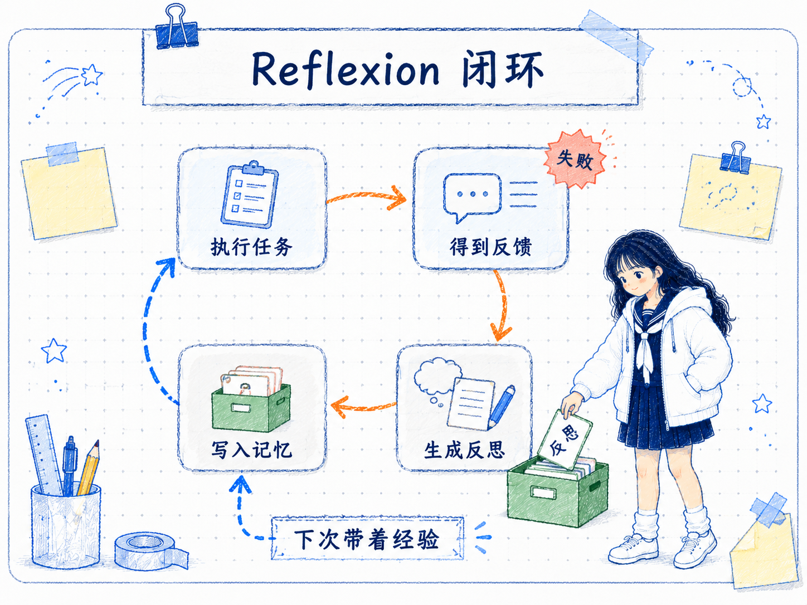
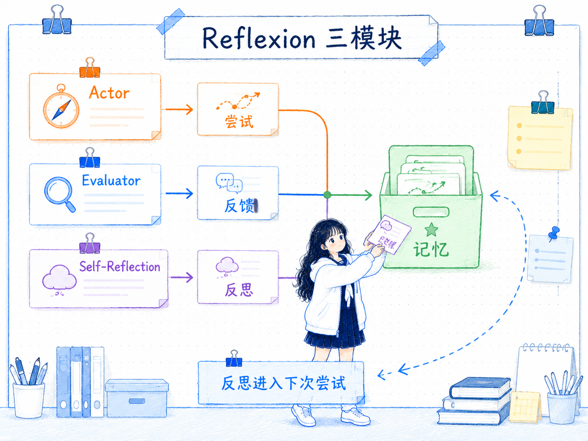
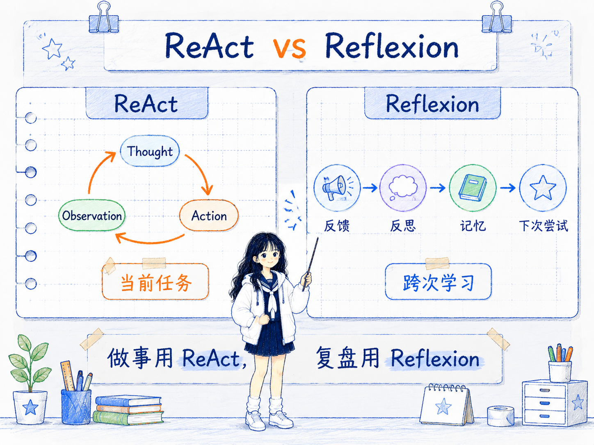

# 自我反思 Reflexion
---
参考资料：
- [Reflexion: Language Agents with Verbal Reinforcement Learning](https://arxiv.org/pdf/2303.11366)
- [Prompt Engineering Guide：Reflexion](https://www.promptingguide.ai/zh/techniques/reflexion)
- [Self-critiquing models for assisting human evaluators](https://arxiv.org/pdf/2206.05802)
---

## 什么是 Reflexion？

**Reflexion 是一种让 Agent 在任务失败或表现不佳后，把反馈转化为文字反思，并在下一次尝试中复用这些经验的框架。**

它的关键点是“反思进入记忆”。普通的自我检查通常只发生在一次回答内部：模型看一看自己的答案，尝试改一版。而 Reflexion 更像是给 Agent 加了一本经验手册：这次失败后，总结出哪里错了、下次应该怎么做，然后把这段反思放进下一轮上下文。

可以把它理解成一个试错学习循环：

```text
执行任务 -> 得到反馈 -> 生成反思 -> 写入记忆 -> 下次尝试时读取记忆
```

Reflexion 不需要直接更新模型参数。它更像是一种“文字形式的强化学习”：不是通过梯度修改模型，而是通过自然语言反馈和短期记忆改变 Agent 下一次的行为。



## Reflexion 的工作原理

Reflexion 通常由三类角色或模块协作完成。

- **Actor（执行者）**：负责真正执行任务，可以是普通 LLM，也可以是 [10_ReAct 框架](<10_ReAct 框架.md>) 形式的 Agent。它会根据当前任务、历史反思和可用工具生成行动轨迹。
- **Evaluator（评估者）**：负责判断这次尝试是否成功，可以来自程序测试、规则检查、环境奖励、人类反馈，或者另一个模型的评价。
- **Self-Reflection（反思者）**：负责把失败轨迹和评估结果转成文字经验，例如“刚才没有检查边界条件”“下次要先搜索最新信息”“不要在证据不足时直接下结论”。

一个典型循环是：

```text
第 1 次尝试：Agent 执行任务
反馈：失败，原因是遗漏了约束
反思：下次先列出所有约束，再开始行动
记忆：保存这条反思

第 2 次尝试：Agent 带着反思重新执行
反馈：成功或继续失败
```

这里最重要的是：**反思不是为了让模型“显得会复盘”，而是为了改变下一次行动策略。** 如果反思没有进入下一轮上下文，或者下一轮没有使用它，那它就只是一次普通总结。



## Reflexion 的构造方式

Reflexion 的 prompt 通常会包含三部分：任务轨迹、反馈结果、反思要求。

一个简化结构可以写成：

```text
任务：
{task}

本次尝试轨迹：
{trajectory}

评估反馈：
{feedback}

请生成一段简短反思，说明：
- 失败的关键原因是什么
- 下次尝试时应该改变什么策略
- 哪些错误不要重复

反思：
{reflection}
```

下一次执行任务时，再把反思作为记忆放回上下文：

```text
历史反思：
- 上次失败是因为没有先检查约束；本次先列出约束，再执行。
- 上次调用工具前没有明确输入；本次每次行动前先确认工具输入。

当前任务：
{task}

请根据历史反思完成任务。
```

构造时要注意几个点：

- **反馈要具体**：只告诉模型“错了”价值不大，最好指出错在哪里、哪个测试没过、哪一步和目标不一致。
- **反思要短而可执行**：好的反思应该像下一轮策略，而不是长篇检讨。
- **记忆要筛选**：不是所有反思都值得保留。错误、冗余或过期的反思会污染后续上下文。
- **反思要绑定任务类型**：写代码、查资料、解谜、网页操作的反思重点不同，不要把所有任务都塞进同一套经验。
- **下一轮必须读取反思**：Reflexion 的效果来自“反思 -> 记忆 -> 再尝试”的闭环。

## Reflexion 的应用场景

Reflexion 适合那些可以多次尝试、并且每次尝试后能得到反馈的任务。

- **代码生成和调试**：测试失败后，让 Agent 总结失败原因，再根据反思修改代码。
- **复杂问答和推理**：答案错误时，记录推理偏差，下次先补证据或检查假设。
- **网页和工具操作**：操作失败后，总结页面状态、工具输入或步骤顺序的问题。
- **长任务 Agent**：在多轮任务中保留经验，避免重复犯同样的策略错误。
- **训练评估辅助**：模型先自我批判输出中的问题，再帮助人类更快定位可疑点。

它尤其适合和 ReAct 组合：ReAct 负责当前任务中的“思考 -> 行动 -> 观察”，Reflexion 负责任务结束后的“反馈 -> 反思 -> 记忆”。

## Reflexion 的优势

- **不需要微调模型**：通过文字记忆改变下一次行为，工程成本比重新训练低。
- **能利用失败经验**：失败不只是一次坏结果，而会变成下一次尝试的提示上下文。
- **更容易调试**：反思文本能暴露 Agent 认为自己哪里错了，方便人检查策略是否合理。
- **适合试错型任务**：代码测试、游戏环境、网页操作、工具调用等任务天然会给反馈。
- **能和其他框架组合**：Reflexion 可以叠加在 ReAct、工具调用、测试驱动生成、RAG 等流程上。

它的价值不在于让模型一次变聪明，而在于让 Agent 在多次尝试之间保留可复用经验。

## Reflexion 的局限性

Reflexion 的效果高度依赖反馈质量和记忆管理。

- **反馈不准，反思也会偏**：如果评估器误判，Agent 会把错误经验写进记忆。
- **反思可能只是漂亮话**：模型可能写出听起来合理但不能指导行动的总结。
- **记忆会污染上下文**：过多、过旧、互相矛盾的反思会增加噪声。
- **成本更高**：每次失败后还要评估、反思、重试，会增加调用次数和时间。
- **不适合一次性任务**：如果任务没有重试机会，或者没有可靠反馈，Reflexion 的价值会下降。
- **不能替代真实验证**：反思文本不能证明答案正确，仍然需要测试、工具、检索或人工确认。

所以 Reflexion 的关键不是“让模型多反省”，而是建立一条可验证的学习闭环。

## Reflexion 和其他技术的关系

Reflexion 和 [10_ReAct 框架](<10_ReAct 框架.md>) 经常一起出现，但两者关注的时间尺度不同。

**ReAct 关注当前任务里如何边想边做；Reflexion 关注一次尝试结束后如何从反馈中学习，下次不要重复犯错。**

Reflexion 和自我批判也不同。自我批判更像是对当前输出做检查和改写；Reflexion 更强调把批判结果沉淀为记忆，并在后续尝试中复用。

和 [08_自我一致性 Self-Consistency](<08_自我一致性 Self-Consistency.md>) 相比，自我一致性是对同一问题多次采样并投票，主要用“多数答案”提高稳定性；Reflexion 则是通过反馈和反思改变下一次策略，主要用“经验记忆”提高后续表现。



## Reflexion 的使用经验

- **先确认有没有反馈源**：没有测试、评分、环境结果或人工反馈，就很难形成有效反思。
- **反思要写成下一次策略**：例如“先检查约束再行动”，比“我应该更仔细”更有用。
- **只保留高价值记忆**：重复、空泛、过期、互相冲突的反思要清理。
- **把反思和任务类型绑定**：代码调试的反思不要直接套到资料检索任务里。
- **限制反思长度**：反思太长会挤占上下文，也会让 Agent 抓不住重点。
- **反思后仍要验证**：下一次尝试是否变好，要看测试、反馈或结果，不看反思写得多漂亮。

**判断是否要用 Reflexion 的核心问题是：这个任务是否允许多次尝试，并且每次尝试后能得到可用反馈。** 如果没有反馈，反思容易变成自言自语；如果有反馈和重试，Reflexion 才能真正变成 Agent 的经验循环。

## 相关关系笔记

- [00_Prompt Engineering技术关系总览](<00_Prompt Engineering技术关系总览.md>)：把 Reflexion 和自我一致性、ReAct 放在一起看，理解不同可靠性增强方法的时间尺度。
