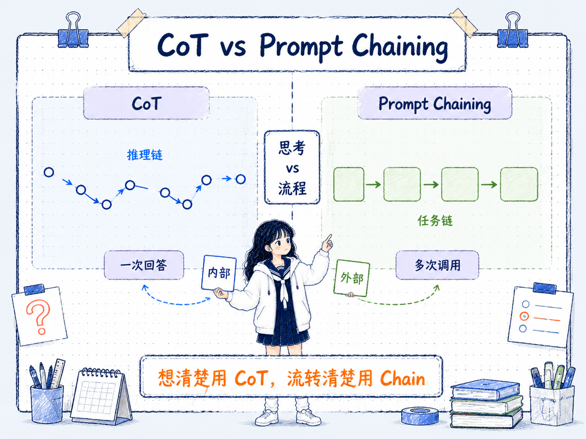

# CoT 和 Prompt Chaining 的区别
---
参考资料：
- [06_链式思考（CoT）提示](<06_链式思考（CoT）提示.md>)
- [09_链式提示 Prompt Chaining](<09_链式提示 Prompt Chaining.md>)
---

## 它们的核心关系

**CoT 和 Prompt Chaining 都带有“链”的味道，但它们解决的是两个层面的问题：CoT 是一次回答内部的推理链，Prompt Chaining 是多次调用之间的任务链。**

CoT 关注的是模型在一个问题里如何展开中间推理。它通常发生在一次 prompt 或一次模型调用里，通过“请一步一步分析”或少样本推理示例，让模型先写出推理过程，再给出答案。

Prompt Chaining 关注的是任务如何被拆成多个阶段。它把复杂任务拆成若干个 prompt，每一步输出一个中间结果，再交给下一步继续处理。

可以这样理解：

- **CoT**：让模型在脑子里多走几步，把推理过程写出来。
- **Prompt Chaining**：把一个复杂工作拆成流水线，每一步只做一件事。



## 它们的主要区别

| 对比维度 | CoT | Prompt Chaining |
|---|---|---|
| 核心问题 | 如何更好地推理 | 如何更好地拆任务和组织流程 |
| 发生位置 | 一次回答内部 | 多次 prompt 或多次模型调用之间 |
| 主要产物 | 推理步骤和最终答案 | 中间结果、阶段输出和最终交付 |
| 控制方式 | 通过提示模型分步思考 | 通过外部流程规定每一步输入输出 |
| 适合任务 | 数学、逻辑、常识推理、多步判断 | 文档处理、摘要改写、代码生成、抽取校验 |
| 调试方式 | 检查推理链中哪一步错了 | 检查任务链中哪一个节点错了 |
| 成本 | 通常增加输出 token | 通常增加调用次数和流程维护成本 |
| 风险 | 推理链看起来合理但其实有错 | 前一步错误会传递到后一步 |

**最关键的区别是：CoT 拆的是“思考过程”，Prompt Chaining 拆的是“工作流程”。**

## 什么时候先用 CoT？

**当任务的主要难点是推理，而不是流程管理时，先用 CoT。**

如果一个问题可以在一次上下文里解决，只是模型容易跳步、漏条件、直接猜答案，就适合先让模型展开推理链。

例如：

```text
请一步一步分析这个问题，并在最后给出答案。

问题：
一个项目有 3 个阶段，每个阶段都可能延迟 2 天。如果第 1 阶段延迟会影响后续阶段，第 2 阶段可以并行压缩 1 天，最终最短延期是多少？
```

这类问题的关键不是要拆成多个系统步骤，而是让模型先把条件、影响关系和计算过程理清楚。

CoT 尤其适合：

- **单个复杂问题**，问题边界清楚，但需要多步推导。
- **推理过程需要检查**，希望看到中间步骤是否合理。
- **没有明显外部阶段**，任务不需要先提取、再改写、再校验这类流程。
- **想先建立低成本基线**，还不确定是否需要多次调用模型。

## 什么时候升级为 Prompt Chaining？

**当一个 prompt 里同时塞了太多动作，或者中间结果本身值得被保存和检查时，可以升级为 Prompt Chaining。**

常见触发信号包括：

- **任务动作太多**，例如同时要求阅读材料、提取证据、生成答案、检查事实、输出 JSON。
- **中间结果很重要**，例如先提取引用，再基于引用回答，最后检查是否越界。
- **需要多次校验**，例如代码生成后要写测试、跑测试、再修复。
- **每一步需要不同格式**，例如第一步输出字段列表，第二步输出摘要，第三步输出结构化 JSON。
- **某一步可能替换为工具或规则**，例如检索、计算、格式校验、数据库查询。

例如文档问答可以拆成：

```text
Prompt 1：从文档中提取和问题相关的原文片段
Prompt 2：只根据片段回答问题
Prompt 3：检查答案是否超出片段依据
```

这里如果只用 CoT，模型可能会在一次回答里混合“提取、推理、回答、校验”，过程看起来完整，但很难定位到底哪里出了问题。

## Prompt Chaining 不一定总比 CoT 好

**Prompt Chaining 更可控，但不一定更轻、更快、更准确。**

- **简单推理任务**，用 CoT 就够了，拆成多步调用反而增加延迟。
- **中间接口设计不好**，前一步输出含糊，后一步会接着含糊。
- **链条越长，维护成本越高**，每一步的 prompt、格式、异常处理都要维护。
- **错误仍然会传递**，链式提示只是让错误更容易被发现，不会自动消除错误。

所以判断标准不是“链越长越高级”，而是：

- 这个任务有没有明确的阶段边界？
- 中间结果是否需要被检查或复用？
- 拆开后是否真的降低了单步复杂度？
- 多次调用的成本是否值得？

## 它们在学习路径里的位置

在提示工程学习里，CoT 和 Prompt Chaining 是两种不同方向的升级。

**CoT 是推理能力升级**：它训练的是如何让模型把隐含推理显式展开，适合从“直接回答”升级到“分步分析”。

**Prompt Chaining 是工程流程升级**：它训练的是如何把复杂任务拆成可观察、可调试、可复用的多阶段流程。

两者可以组合使用。比如在一条 Prompt Chain 里，某一步是“判断方案是否可行”，这一小步内部可以使用 CoT；但整条任务从“提取约束 -> 生成方案 -> 评估方案 -> 输出建议”的组织方式，仍然属于 Prompt Chaining。

## 一个实用决策顺序

实际做 prompt 时，可以按这个顺序判断：

- **先用普通 prompt 建立基线**，看模型是否能直接完成。
- **如果主要问题是跳步或推理错误**，先加入 CoT。
- **如果主要问题是任务动作混在一起**，把任务拆成 Prompt Chaining。
- **如果链条里的某一步仍然需要推理**，在那一步内部使用 CoT。
- **如果链条输出仍不稳定**，再考虑加入校验节点、结构化输出或自洽性。

**一句话判断：想让模型“想清楚”，用 CoT；想让任务“流转清楚”，用 Prompt Chaining。**

## 容易混淆的点

- **Prompt Chaining 不是把 CoT 写得更长**。它是多个 prompt 之间的流程设计，不是单次回答里的长推理。
- **CoT 不等于工作流**。CoT 可以解释思路，但它不会自动把任务拆成多个可检查节点。
- **Prompt Chaining 里可以包含 CoT**。某个子任务需要推理时，可以让那一步使用 CoT。
- **两者都不能保证正确**。CoT 可能推理错，Prompt Chaining 可能把错误中间结果继续传下去。
- **不要为了“看起来高级”而拆链**。如果一次 CoT 已经稳定解决，就没有必要做复杂流程。

## 相关关系笔记

- [00_Prompt Engineering技术关系总览](<00_Prompt Engineering技术关系总览.md>)：把 CoT 和 Prompt Chaining 放在推理增强层、流程编排层之间比较。
