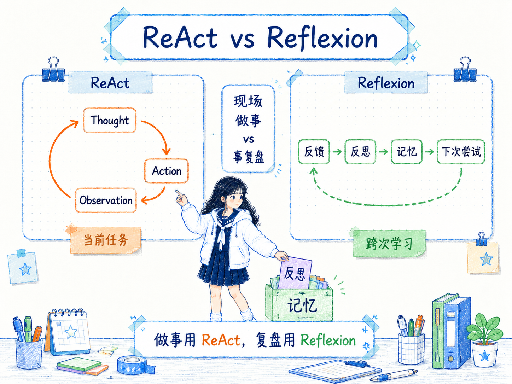

# ReAct 和 Reflexion 的区别
---
参考资料：
- [[10_ReAct 框架]]
- [[11_自我反思 Reflexion]]
---

## 它们的核心关系

**ReAct 和 Reflexion 都属于 Agent 相关方法，但它们关注的时间尺度不同：ReAct 管“当前这次任务怎么边想边做”，Reflexion 管“这次失败后下次怎么不要再犯”。**

ReAct 把推理和行动交替起来，让 Agent 在当前任务中不断经历：

```text
Thought -> Action -> Observation -> Thought -> Action -> Observation
```

Reflexion 则把一次尝试后的反馈转成文字反思，再写入记忆，影响下一次尝试：

```text
执行任务 -> 得到反馈 -> 生成反思 -> 写入记忆 -> 下次尝试读取记忆
```

可以这样理解：

- **ReAct**：像一个人在现场一边观察、一边行动、一边调整。
- **Reflexion**：像任务结束后的复盘，把失败经验写进下次行动手册。



## 它们的主要区别

| 对比维度 | ReAct | Reflexion |
|---|---|---|
| 核心问题 | 当前任务中如何推理、行动、观察 | 多次尝试之间如何从反馈中学习 |
| 时间尺度 | 单次任务内部 | 多次任务或多轮尝试之间 |
| 基本循环 | Thought -> Action -> Observation | Feedback -> Reflection -> Memory |
| 依赖对象 | 工具、环境、观察结果 | 反馈、评估器、记忆管理 |
| 主要产物 | 行动轨迹和最终答案 | 反思文本和经验记忆 |
| 适合任务 | 搜索、网页操作、工具调用、动态环境任务 | 代码调试、游戏环境、长任务 Agent、可重试任务 |
| 调试重点 | 工具选错、输入错、观察误读、循环失控 | 反馈不准、反思空泛、记忆污染、策略没变化 |
| 风险 | 行动循环成本高，可能陷入反复尝试 | 反思看起来合理，但没有真正改善下一次行动 |

**最关键的区别是：ReAct 让 Agent 在任务中根据环境反馈做下一步；Reflexion 让 Agent 在任务后根据结果反馈改下一次。**

## 什么时候先用 ReAct？

**当任务需要和外部环境互动，而不是只靠模型内部知识回答时，先用 ReAct。**

例如：

```text
用户问题：帮我找出某篇文档里和预算相关的内容，并总结风险。

Thought：我需要先搜索预算相关段落。
Action：搜索文档关键词“预算”“成本”“费用”。
Observation：找到 5 段相关内容。

Thought：现在需要筛选真正和风险有关的段落。
Action：提取风险句子。
Observation：得到 3 条风险。
```

这类任务的关键是：模型不能一次性凭空回答，它需要通过工具获得材料，再根据观察结果继续判断。

ReAct 尤其适合：

- **需要查询外部信息**，例如搜索、RAG、数据库、文件读取。
- **需要执行动作**，例如点击页面、调用 API、运行代码、读取工具结果。
- **环境会变化**，下一步要根据最新 Observation 决定。
- **任务路线不完全确定**，需要边做边调整。

## 什么时候升级为 Reflexion？

**当 ReAct 或其他 Agent 任务可以反复尝试，并且每次尝试后能得到反馈时，可以加入 Reflexion。**

常见触发信号包括：

- **Agent 反复犯同类错误**，例如总是忘记先读约束、总是工具输入格式不对。
- **任务有明确反馈**，例如测试通过/失败、评分、环境奖励、人类反馈。
- **下一次尝试可以复用经验**，例如同类代码题、同类网页操作、同类资料检索任务。
- **需要长期改进行为策略**，而不是只修正当前一步。

例如代码调试任务可以这样组合：

```text
第 1 次 ReAct：
读取报错 -> 修改代码 -> 运行测试 -> 测试失败

Reflexion：
反思：上次只修了表面报错，没有检查边界条件；下次先读测试用例，再改代码。

第 2 次 ReAct：
带着反思重新读取测试 -> 修改边界逻辑 -> 运行测试
```

这里 ReAct 负责“怎么做事”，Reflexion 负责“失败后把经验带到下一次”。

## Reflexion 不一定总比 ReAct 好

**Reflexion 不是给所有 Agent 加一层“自我反省”就会变好。**

- **没有反馈源时**，反思容易变成空泛总结。
- **反馈不准确时**，Agent 会把错误经验写进记忆。
- **没有重试机会时**，反思很难发挥价值。
- **记忆管理不好时**，旧反思、错反思、重复反思会污染上下文。
- **当前任务只是需要工具行动时**，ReAct 可能已经足够，不需要跨次学习。

所以判断 Reflexion 是否有价值，要看：

- 任务能不能重试？
- 有没有可靠反馈？
- 反思能不能进入下一次上下文？
- 下一次行为是否真的因为反思而改变？

## 它们在学习路径里的位置

在 Agent 学习路径里，ReAct 和 Reflexion 可以看成两个不同层级。

**ReAct 是执行层框架**：它让模型能够边推理、边调用工具、边读取环境反馈，是从“回答问题”走向“执行任务”的关键一步。

**Reflexion 是学习层框架**：它让 Agent 把失败经验转成记忆，在后续尝试中复用，是从“单次执行”走向“多次改进”的关键一步。

两者经常组合：

- ReAct 负责当前任务轨迹；
- Evaluator 负责判断这次轨迹是否成功；
- Reflexion 负责把失败原因写成经验；
- 下一次 ReAct 读取这些经验后重新行动。

## 一个实用决策顺序

实际设计 Agent 时，可以按这个顺序判断：

- **如果任务只需要内部推理**，先考虑 [[06_链式思考（CoT）提示]]。
- **如果任务需要调用工具或观察环境**，使用 ReAct。
- **如果 ReAct 任务经常失败但有反馈**，加入 Reflexion。
- **如果反思很多但行为没变化**，检查反思是否进入下一轮上下文。
- **如果记忆越来越乱**，先做记忆筛选，而不是继续追加反思。

**一句话判断：现场做事用 ReAct，事后复盘用 Reflexion；需要持续改进的 Agent，通常两者一起用。**

## 容易混淆的点

- **Reflexion 不是 ReAct 的替代品**。它不负责选择工具和执行动作，而是给下一次行动提供经验。
- **ReAct 也有反馈，但反馈发生在当前任务内**。Observation 用来决定下一步行动；Reflexion 的反馈用于总结经验并影响下次尝试。
- **反思不等于验证**。反思写得好看，不代表答案正确，仍然需要测试、工具或人工评估。
- **记忆不是越多越好**。低质量反思会让 Agent 越学越偏。
- **两者都需要边界控制**。ReAct 需要工具权限和停止条件，Reflexion 需要反馈质量和记忆清理。

## 相关关系笔记

- [[00_Prompt Engineering技术关系总览]]：把 ReAct 和 Reflexion 放在 Prompt Chaining、Self-Consistency 等方法旁边看，区分流程、行动和学习。
