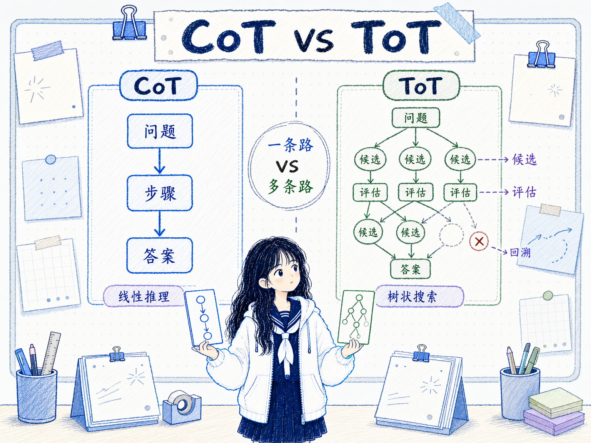

# CoT 和 ToT 的区别
---
参考资料：
- [[06_链式思考（CoT）提示]]
- [[07_思维树 ToT]]
---

## 它们的核心关系

**CoT 和 ToT 都是在增强模型的推理过程，但 CoT 是线性推理，ToT 是树状搜索。**

CoT 让模型沿着一条推理链逐步展开：

```text
问题 -> 步骤 1 -> 步骤 2 -> 步骤 3 -> 答案
```

ToT 则让模型在每一步生成多个候选思路，并对这些候选做评估、选择和回溯：

```text
问题
├─ 思路 A -> 继续展开
├─ 思路 B -> 淘汰
└─ 思路 C -> 回溯后再试
```

可以这样理解：

- **CoT**：先选一条路，然后一步一步走到底。
- **ToT**：先展开多条路，边评估边选择更有希望的路线。



## 它们的主要区别

| 对比维度 | CoT | ToT |
|---|---|---|
| 推理形态 | 一条线性推理链 | 多条分支组成的推理树 |
| 核心动作 | 分步推理 | 生成候选、评估、选择、回溯 |
| 适合问题 | 路径相对明确的多步问题 | 路径不确定、需要探索和试错的问题 |
| 中间状态 | 每一步通常只有一个主要方向 | 每一步可以保留多个候选状态 |
| 错误处理 | 早期走错后容易一路错下去 | 可以发现死路后回退换方向 |
| 成本 | 中等，主要增加输出 token | 更高，会增加生成、评估和搜索成本 |
| 实现复杂度 | 较低，一句触发语或少样本示例即可 | 较高，需要设计候选数量、评估标准和搜索策略 |
| 风险 | 推理链流畅但可能错误 | 搜索空间太大或评估器不准，导致成本失控 |

**最关键的区别是：CoT 解决“怎么把一条思路推完整”，ToT 解决“该选择哪条思路继续推”。**

## 什么时候先用 CoT？

**当问题可以沿一条比较清晰的路线解决时，先用 CoT。**

例如：

```text
请一步一步分析后回答：
一个商品原价 200 元，先打 8 折，再满减 20 元，最后加 10 元运费，最终价格是多少？
```

这类问题虽然有多个步骤，但路线很明确：先算折扣，再算满减，再加运费。让模型分步写出来，就能降低跳步和漏条件的风险。

CoT 尤其适合：

- **数学应用题**，步骤清楚，但模型容易跳算。
- **逻辑判断题**，需要逐条处理条件。
- **常识推理题**，需要把多个常识点串起来。
- **多步解释**，希望模型展示推导过程，方便检查。

## 什么时候升级为 ToT？

**当问题不是“沿一条路推下去”，而是“先判断哪条路值得走”时，可以升级为 ToT。**

常见触发信号包括：

- **第一步选择会强烈影响结果**，例如解谜、规划、策略设计。
- **有多个可能方案**，需要先生成候选，再比较优劣。
- **容易陷入死路**，一条推理链走到后面才发现前面假设错了。
- **需要回溯**，发现当前方向不行后，要回到上一步换路线。
- **答案空间开放**，例如创意写作、方案设计、复杂调试假设。

例如：

```text
请用思维树方式解决这个问题：

1. 先提出 3 个可能方案。
2. 分别评估每个方案的可行性和风险。
3. 选择最有希望的方案继续展开。
4. 如果发现矛盾，回退并尝试其他方案。
5. 最后给出推荐方案。
```

这里真正困难的不是“推理步骤多”，而是“可能路线多”。如果只用 CoT，模型很可能过早押注第一条看似合理的路线。

## ToT 不一定总比 CoT 好

**ToT 可以探索更多路线，但它不是 CoT 的无脑升级版。**

- **成本更高**，多分支生成和评估会消耗更多 token、时间和调用次数。
- **评估标准更难写**，如果不知道如何判断候选好坏，ToT 也会乱搜。
- **简单任务会被复杂化**，本来一条链能解决的问题，用 ToT 反而拖慢。
- **搜索空间可能失控**，候选太多、深度太深，会让输出变散。
- **模型自评不一定可靠**，错误分支可能被保留，正确分支可能被淘汰。

所以判断标准不是“ToT 更高级”，而是：

- 这个问题是否真的有多条可行路线？
- 是否需要比较候选方案？
- 是否可能需要回溯？
- 是否有明确的评估标准？
- 增加搜索成本是否值得？

## 它们在学习路径里的位置

在提示工程学习里，CoT 是更基础的推理增强方法，ToT 是更复杂的搜索增强方法。

**CoT 训练的是“把推理链写完整”的能力。** 它适合帮助模型减少跳步、漏条件和直接猜答案的问题。

**ToT 训练的是“在多条推理路径中搜索”的能力。** 它适合帮助模型避免被第一条路线锁死，尤其适合需要探索和试错的任务。

可以把它们放在一个递进关系里：

- 先用普通 prompt 看模型能否直接完成；
- 不稳定时，用 CoT 让模型分步推理；
- 如果一条推理链容易走错路，再用 ToT 生成候选、评估和回溯；
- 如果多个 ToT 结果仍不稳定，可以再结合 [[08_自我一致性 Self-Consistency]] 或外部工具验证。

## 一个实用决策顺序

实际做 prompt 时，可以按这个顺序判断：

- **先判断任务是否需要推理**，不需要推理就不要上 CoT 或 ToT。
- **如果只需要沿一条路线推导**，使用 CoT。
- **如果需要同时比较多个路线**，考虑 ToT。
- **如果 ToT 的评估标准写不清楚**，先不要急着用 ToT，先补清楚评价规则。
- **如果 ToT 成本太高**，限制候选数量、搜索深度，或只在关键节点展开分支。

**一句话判断：路线清楚用 CoT，路线不确定用 ToT。**

## 容易混淆的点

- **ToT 不是更长的 CoT**。它的核心是多分支搜索，而不是写一条更详细的推理链。
- **CoT 不一定比 ToT 弱**。对路线明确的问题，CoT 更简单、更便宜、更容易控制。
- **ToT 的关键不是“多生成几个答案”**。真正重要的是对候选中间状态进行评估和选择。
- **ToT 不等于一定正确**。如果评估器不可靠，搜索也可能把错误路径当成好路径。
- **两者都可以和其他方法组合**。CoT 可以结合少样本提示和自洽性，ToT 可以结合工具、规则检查器和搜索算法。

## 相关关系笔记

- [[00_Prompt Engineering技术关系总览]]：把 CoT 和 ToT 放进推理增强层中，和自我一致性一起比较。
