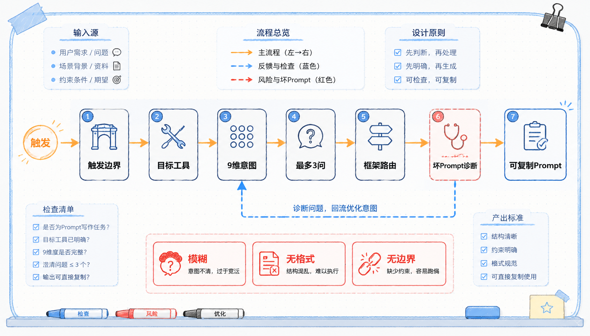
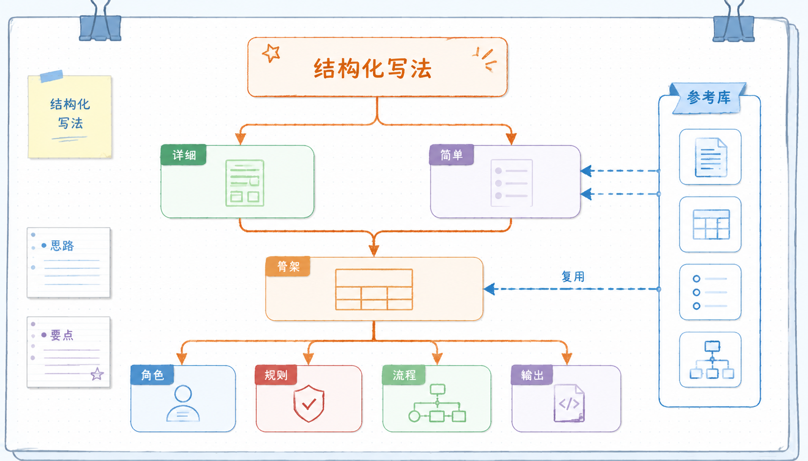
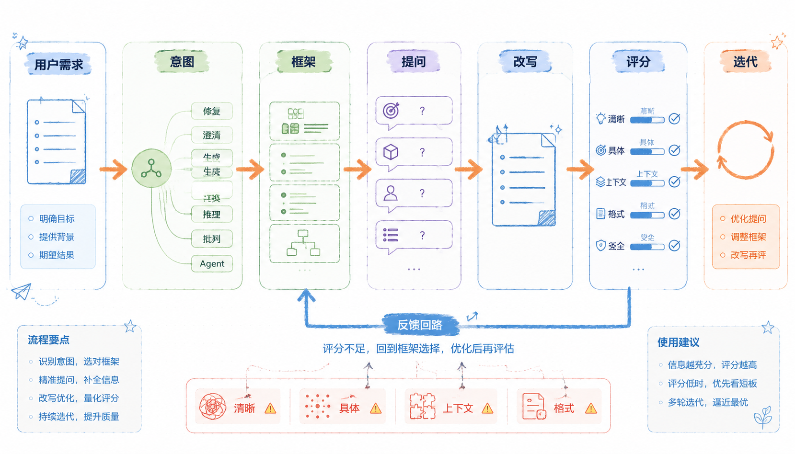

# Prompt 写作开源项目方法整理
---
参考资料：
- [nidhinjs/prompt-master](https://github.com/nidhinjs/prompt-master)
- [yzfly/structured-prompt-skill](https://github.com/yzfly/structured-prompt-skill)
- [ckelsoe/prompt-architect](https://github.com/ckelsoe/prompt-architect)
---

这三个项目可以放在一起理解：它们都在回答“怎样把 prompt 写作从临时手感变成稳定方法”。

`prompt-master` 更像一个实战型 prompt 写作助手，重点是判断什么时候该触发 prompt 写作、目标工具是谁、坏 prompt 坏在哪里。`structured-prompt-skill` 更像一个结构化模板库，重点是把 prompt 写成可复用、可维护的角色说明书。`prompt-architect` 更像一个 prompt 架构系统，重点是先判断任务意图，再选择框架，并用评分维度检查 prompt 质量。

我的理解是：**prompt 写作不是背模板，而是在做三件事：先判断任务边界，再选择合适结构，最后检查输出是否能稳定使用。**

## prompt-master：先判断是不是该写 Prompt

`prompt-master` 最重要的设计，是把触发边界收得很窄。它只在用户明确要求写 prompt、优化 prompt、修复 prompt、改写 prompt、适配某个 AI 工具时才触发。

这点很关键。很多 prompt 助手容易把所有问题都变成 prompt 工程问题：用户想写文章，它开始讲 prompt；用户想改代码，它开始把需求改成提示词。`prompt-master` 的边界更清楚：它服务的是“prompt 本身”，不是替用户直接完成原任务。

| 用户意图 | 是否适合触发 prompt 写作 | 判断 |
|---|---|---|
| 帮我写一个给 Claude Code 的改项目 prompt | 适合 | 用户要的是可粘贴 prompt |
| 优化这段提示词，让 Cursor 更好改代码 | 适合 | 用户要改 prompt |
| 这个 prompt 为什么效果差 | 适合 | 用户要诊断 prompt |
| 帮我写一篇文章 | 不适合 | 用户要内容，不是 prompt |
| 修复这个 bug | 不适合 | 用户要执行工程任务，不是写 prompt |

**它先把自己从“万能助手”里切出来，只做 prompt 写作这一件事。** 这会减少误触发，也让 skill 的职责更稳定。



## prompt-master 的核心流程

`prompt-master` 写 prompt 时不是先套模板，而是先判断目标工具。同一个任务给 ChatGPT、Claude、Cursor、Claude Code、Midjourney、n8n 使用，写法并不一样。

它的流程大致是：

1. **识别目标工具**：先知道 prompt 要贴到哪里。
2. **抽取 9 个意图维度**：任务、目标工具、输入、输出格式、约束、上下文、受众、成功标准、示例。
3. **最多问 3 个澄清问题**：只问真正影响质量的问题，不把用户拖进长问卷。
4. **选择合适框架**：根据任务类型选择 RTF、CO-STAR、RISEN、ReAct、图像描述、文件范围修改等结构。
5. **使用稳妥技巧**：角色设定、少样本、输入分隔、输出格式、边界约束可以常用；复杂推理框架要谨慎。
6. **做 token 效率审计**：每句话都要有用，删掉不承载任务信息的客套和填充。
7. **输出一个可复制 prompt block**：结果应该能直接粘贴到目标工具里。

这里面最值得记的是：**prompt 不是越长越好，而是每个词都应该承担任务信号。**

## 9 个意图维度

这 9 个维度可以当作写 prompt 前的检查清单。

| 维度 | 要问清什么 | 为什么重要 |
|---|---|---|
| 任务 | 模型到底要做什么动作 | 避免“分析一下”“优化一下”过于笼统 |
| 目标工具 | prompt 要给哪个 AI 工具用 | 不同工具的格式、能力、限制不同 |
| 输入 | 用户会提供什么材料 | 决定是否要分隔符、字段说明、引用规则 |
| 输出格式 | 最终交付成什么样 | 决定自然语言、Markdown、JSON、代码块等形态 |
| 约束 | 哪些事情必须做或不能做 | 防止越界、跑题、改错文件、输出不可解析 |
| 上下文 | 当前项目、业务、历史决策是什么 | 减少模型从通用假设开始猜 |
| 受众 | 输出给谁看或谁会使用 | 决定解释深度、语气和术语密度 |
| 成功标准 | 什么结果算完成 | 让模型知道如何判断“做对了” |
| 示例 | 有没有参考输入和理想输出 | 用样例锁定格式、风格和判断边界 |

如果只写“帮我优化 prompt”，模型只能猜；如果把这 9 个维度补齐，prompt 写作就从猜测变成了有依据的组装。

## 工具路由：同一任务，不同写法

`prompt-master` 的核心经验是：先问 prompt 要贴到哪里，再决定怎么写。

给通用聊天模型时，重点通常是任务、上下文、输出格式和输入边界。长上下文任务可以用 Markdown 标题、XML 标签或代码块分区，让模型知道哪部分是指令，哪部分是待处理内容。

给推理原生模型时，不适合机械加入“请一步步思考”。如果模型本身已经在推理模式上做过优化，外部强行写 CoT 可能只是增加冗余。更稳的做法是把任务、约束、答案格式和判断标准写清楚。

给 Claude Code、Cursor、Windsurf 这类编程 Agent 时，prompt 要更像工程任务单：

- 当前状态是什么。
- 目标状态是什么。
- 允许改哪些文件。
- 禁止动哪些文件。
- 完成后如何验证。
- 什么时候停下来。
- 什么时候需要人工确认。

给图像、视频、音频工具时，prompt 要更强调主体、构图、镜头、材质、风格、比例和负面约束。自然语言聊天式 prompt 往往不够稳定。

给 n8n、Make、Zapier 这类自动化工具时，prompt 要写清输入变量、节点职责、异常路径、输出字段、失败处理和下游依赖。

**工具路由的本质是承认每个 AI 工具都有自己的输入习惯。** 一个“万能 prompt”通常不如一个“适配目标工具的 prompt”。

## 坏 Prompt 诊断

`prompt-master` 还有一个很实用的地方：它把坏 prompt 的常见模式列出来。很多时候 prompt 效果差，不是缺少高级技巧，而是基础边界没有写清。

| 问题类型 | 典型表现 | 改进方向 |
|---|---|---|
| 任务模糊 | “帮我优化一下”“分析这个” | 改成明确动作和成功标准 |
| 多任务混在一起 | 一个 prompt 同时要求研究、写作、改代码、测试 | 拆成主任务和步骤 |
| 没有输出格式 | 只说“给我结果” | 指定 Markdown、JSON、表格、代码块等形态 |
| 没有上下文 | 默认模型知道项目背景 | 补充项目状态、约束、历史决策 |
| 没有范围边界 | 让 Agent 随便改 | 写清允许/禁止修改的路径和行为 |
| 没有停止条件 | Agent 一直探索或过度修改 | 写清完成标准、验证方式和停机条件 |
| 错误使用 CoT | 对推理原生模型额外要求逐步思考 | 按模型特性决定是否显式触发推理 |
| 错误工具模板 | 给 Midjourney 写聊天式长段落 | 按目标工具改成对应描述结构 |

我会把这部分当作 prompt 修改前的第一步：**先诊断哪里坏，再决定用什么技巧补。**

## structured-prompt-skill：把 Prompt 写成可复用角色

`structured-prompt-skill` 的重点不是“怎么写一句好 prompt”，而是“怎么把 prompt 写成一份可复用的结构化角色说明书”。

它把 prompt 写作分成两种模式：

| 模式 | 适合什么任务 | 核心特点 |
|---|---|---|
| 详细模式 | 复杂角色、专家人格、长期多轮对话、专业领域助手 | 结构完整，包含世界观、知识框架、方法论、禁区和交互协议 |
| 简单模式 | 单一任务、工具助手、快速部署、规则明确的场景 | 结构轻，保留本质、规则和流程 |

这个项目最值得学的是：**把 prompt 当成一个可维护的“角色产品”，而不是一次性指令。**



## 结构化模板怎样组织？

它的模板通常不是从“任务”开始，而是从“角色”开始。一个结构化角色 prompt 会把身份、能力、方法、边界和交互方式分开写。

| 模块 | 作用 | 写作重点 |
|---|---|---|
| 标题/角色名 | 给助手一个明确身份 | 让 prompt 有入口，也方便复用和检索 |
| Requirements | 写明输入、输出、模型、作者、版本 | 形成元信息和版本锚点 |
| Essence | 定义角色本质、价值观或核心能力 | 不写空泛人设，而写回答时的底层取向 |
| Knowledge / Framework | 写明知识结构和分析框架 | 让角色不是只靠泛泛经验输出 |
| Methodology / Workflow | 定义工作方法和步骤 | 把能力变成稳定流程 |
| Rules / Taboos | 写明必须遵守和禁止触碰的边界 | 防止角色跑偏、过度发挥或输出禁区内容 |
| Interaction Protocol | 定义多轮交互方式 | 让助手知道何时提问、何时输出、如何推进 |
| Initialization | 首轮如何开始 | 让用户知道怎么启动这个角色 |

这套结构的价值在于，它不只是告诉模型“帮我做什么”，还告诉模型“你是谁、怎么做、怎么和用户协作、什么不能做”。

## 详细模式：长期可用的角色

详细模式适合那些不是一次性完成的任务，比如产品导师、写作教练、创业顾问、学习陪练、行业分析助手。

它的写法可以拆成三层。

第一层是身份和边界。角色不是“你是专家”这么简单，而是要写清：

- 你是谁。
- 你擅长什么。
- 你不负责什么。
- 你面对什么用户。
- 你用什么判断标准。

**好的角色设定不是为了表演，而是为了稳定回答视角。** 比如“资深产品经理”仍然太宽；“面向早期 SaaS 团队、擅长从用户访谈中抽取机会点的产品顾问”就更可执行。

第二层是知识和方法。详细模式会把分析维度、判断模型、工作流、常见误区、输入输出协议写进 prompt。这样模型每次回答时都有固定的方法支架。

第三层是交互协议。复杂角色不能只会回答，还要会推进对话。交互协议可以规定：

- 信息不足时是否先提问。
- 一次最多问几个问题。
- 用户输入不完整时如何补全。
- 什么时候给建议，什么时候先诊断。
- 是否要给下一步行动。

这让我意识到：复杂角色的 prompt 不是“说得更详细”，而是要把角色的默认工作方式写清楚。

## 简单模式：轻量工具助手

简单模式适合目标明确、输入输出稳定、不需要复杂人格的任务。例如文本改写、摘要、标签分类、代码解释、固定格式输出。

简单模式通常只保留这些部分：

| 模块 | 写什么 |
|---|---|
| 角色本质 | 这个助手到底帮用户解决什么 |
| 规则 | 必须遵守的限制和输出边界 |
| 流程 | 按什么顺序处理输入 |
| 输出 | 最终交付形态 |
| 初始化 | 用户应该怎么开始 |

**简单模式不是粗糙模式，而是把复杂角色里不必要的部分删掉。** 如果任务只是把输入改写成三种标题，就不需要写世界观、人格和长方法论。

## 参考库的价值

`structured-prompt-skill` 还整理了大量参考 prompt，包括角色人格、小红书、创意写作、GPT Store、系统工具 prompt 等。

参考库的价值不在于照抄，而在于观察不同类型 prompt 的结构差异。

| 材料类型 | 用法 |
|---|---|
| 结构样本 | 看复杂角色通常如何拆模块 |
| 语言样本 | 看不同角色如何形成不同语气 |
| 场景样本 | 看写作、工具、系统 prompt 的重点有什么不同 |

很多时候我们不是缺少一句提示词，而是不知道某类助手应该包含哪些模块。参考库可以帮助我们从“凭感觉写”转成“找相似结构，再按场景改”。

## 结构化符号系统

这个项目还强调格式符号，例如标题、分隔线、树状结构、条件触发、流程箭头、协议块等。

这些符号不是为了排版好看，而是为了让模型更容易识别结构：

- 标题用来划分模块。
- 分隔线用来区分角色定义和用户输入。
- 条件触发用来写规则。
- 编号步骤用来写工作流。
- 列表用来写并列约束。
- 代码块用来固定输入或输出样例。

我会把这些符号理解成“给模型看的段落边界”。越是复杂 prompt，越不能只靠自然段堆叠。

## prompt-architect：按任务意图选择框架

`prompt-architect` 的核心价值是把 prompt 写作做成一个系统：**先判断任务意图，再选择框架，再用评分脚本检查 prompt 质量。**

它不是只告诉你“用 CO-STAR”“用 ReAct”“用 ToT”，而是先问：这个 prompt 到底属于哪类任务？

它把任务意图分成 7 类：

| 意图类别 | 典型需求 | 适合的框架方向 |
|---|---|---|
| Recover | 已有 prompt 效果差，想修复 | RPEF 等诊断/修复框架 |
| Clarify | 需求不清，想反问或澄清 | Reverse Role Prompting |
| Create | 从零生成内容或方案 | APE、RTF、CO-STAR、RISEN 等 |
| Transform | 改写、压缩、转换、提炼 | BAB、Self-Refine、Chain of Density |
| Reason | 推理、决策、复杂问题求解 | CoT、Plan-and-Solve、ToT、Least-to-Most |
| Critique | 审查、反驳、找风险、改进 | Devil's Advocate、Pre-Mortem、Critique-Revise |
| Agentic | 需要工具调用和行动循环 | ReAct |

**它不是一个 prompt 模板库，而是一个 prompt 路由器 + 评分器。** 它最值得学的是“先分类，再选框架”，而不是看到复杂任务就套一个高级框架。



## 从写 Prompt 到架构 Prompt

`prompt-architect` 的工作流可以拆成四步：

1. **初始评估**：从清晰度、具体性、上下文、约束、输出格式几个方面看原 prompt 是否完整。
2. **意图识别**：判断任务是创建、转换、推理、批判、澄清、修复，还是 Agent 执行。
3. **框架推荐**：按意图选择合适框架，并在多个候选框架中给出优先级。
4. **评分和迭代**：用脚本或清单检查改写后的 prompt 是否更清楚、更具体、更完整。

这套流程让我觉得，prompt 写作不应该一上来就写正文，而应该先做一次“任务归类”。任务类型不同，应该选的结构也不同。

## 框架选择的关键

很多 prompt 学习资料会介绍大量框架，但真正难的是“什么时候用哪个”。`prompt-architect` 的框架选择逻辑可以这样记。

### 生成型任务

如果任务是写文章、生成方案、产出内容，可以用 RTF、CO-STAR、RISEN、CRISPE 这类框架。

- **RTF** 适合轻量任务：角色、任务、格式。
- **CO-STAR** 适合内容生产：上下文、目标、风格、语气、受众、响应格式。
- **RISEN** 适合有流程和边界的复杂任务：角色、指令、步骤、最终目标、收窄约束。

生成型任务最怕“目标看似明确，标准其实不清楚”。所以写这类 prompt 时，要特别关注受众、风格、输出形式和成功标准。

### 转换型任务

如果任务是把已有内容改写、压缩、总结、提炼，重点不是创造新内容，而是保持输入与输出之间的关系。

这类任务要写清：

- 输入材料是什么。
- 可以改哪些东西。
- 不能改变哪些东西。
- 输出长度和格式是什么。
- 是否保留原风格。

改写不是重写，压缩不是丢失关键事实。转换型 prompt 的边界越清楚，越不容易把原意改坏。

### 推理型任务

如果任务需要计算、判断、比较、规划，可以选择 CoT、Plan-and-Solve、Least-to-Most、Step-Back、ToT 等框架。

| 场景 | 更适合的框架 |
|---|---|
| 已经知道大致解法，需要一步步做 | CoT |
| 需要先列计划再求解 | Plan-and-Solve |
| 大问题可以拆成一组小问题 | Least-to-Most |
| 需要先抽象出上位原则 | Step-Back |
| 有多条候选路径，需要比较 | ToT |

简单说：线性推理用 CoT，多路径比较用 ToT，先拆小问题再做用 Least-to-Most，先退一步找原则用 Step-Back。

### 批判型任务

如果任务是审查方案、发现漏洞、做反驳、预演失败，可以用 Devil's Advocate、Pre-Mortem、Critique-Revise 等框架。

这类 prompt 的关键不是让模型“给建议”，而是明确批判视角：

- 从谁的角度批判？
- 重点看风险、逻辑、证据、执行成本，还是用户体验？
- 批判后是否需要给修订方案？
- 是否要按严重程度排序？

批判型框架可以补足普通 prompt 容易“顺着用户说”的问题。

### 行动型任务

如果任务需要工具、文件、网页、代码执行、数据库查询，就进入 Agentic 类别，适合 ReAct。

ReAct 的核心不是“多想一会儿”，而是让模型循环执行：

```text
Thought -> Action -> Observation -> 下一步
```

这类 prompt 必须写清工具、约束、停止条件和最终交付。否则 Agent 容易循环、过度探索，或者使用不存在的工具。

## 评分系统：把好坏变成可检查项

`prompt-architect` 的评分脚本会从几个维度检查 prompt。

| 评分维度 | 关注点 | 可以怎么自查 |
|---|---|---|
| Clarity | 任务是否清楚，有没有模糊词 | 用户是否一眼知道模型要做什么 |
| Specificity | 是否有具体要求、数字、格式、风格 | 有没有把“更好”“详细”写成可执行标准 |
| Context | 是否给了背景、约束、使用场景 | 模型是否需要靠猜补背景 |
| Completeness | 是否包含目标、方法、交付物和输出要求 | 是否缺了成功标准或输入说明 |
| Structure | 是否用标题、列表、分区组织 | 指令、输入、示例、输出是否混在一起 |

这个评分系统很适合当作 prompt 自检表。它不能替代真实测试，但能快速发现低级问题。

**评分脚本不是为了证明 prompt 一定好，而是为了拦住明显不完整的 prompt。**

## 框架不是越高级越好

`prompt-architect` 收录了很多框架，但它的真正价值不是框架数量，而是选择条件。

可以这样记：

- 简单生成任务：RTF、APE、CTF 足够。
- 面向受众和风格的内容：CO-STAR 更合适。
- 有明确流程和边界：RISEN 更合适。
- 需要推理：再考虑 CoT、Plan-and-Solve、ToT。
- 需要审查风险：用 Critique、Pre-Mortem、Devil's Advocate。
- 需要工具行动：用 ReAct。

如果一个任务本来很简单，强行套 ToT、ReAct、Self-Consistency 这类复杂框架，可能只会增加成本和噪声。**框架应该服务任务，而不是让 prompt 看起来更高级。**

## 合在一起怎么用？

这三个项目合起来，可以形成一套 prompt 写作流程：

1. **先判断触发边界**：用户要的是 prompt，还是直接要结果？
2. **再判断目标工具**：这个 prompt 要给聊天模型、编程 Agent、图像工具，还是自动化工具？
3. **抽取关键信息**：任务、输入、输出、约束、上下文、受众、成功标准、示例是否齐全？
4. **选择结构层级**：一次性任务用轻结构，长期角色用结构化角色，复杂任务用框架路由。
5. **补足工作方式**：是否需要澄清问题、工作流、停止条件、异常处理、工具列表？
6. **做坏 prompt 诊断**：有没有任务模糊、格式缺失、边界缺失、上下文缺失？
7. **做质量评分**：清晰度、具体性、上下文、完整性、结构是否过关？
8. **输出可复制版本**：最终 prompt 应该能直接贴到目标工具里使用。

我会把它理解成三层：

| 层级 | 解决的问题 | 对应项目启发 |
|---|---|---|
| 触发和路由 | 什么时候该写 prompt，写给哪个工具 | prompt-master |
| 结构和复用 | prompt 怎样写成可维护的角色或模板 | structured-prompt-skill |
| 框架和评分 | 复杂任务该用什么框架，质量怎么检查 | prompt-architect |

## 我的理解

这三个项目给我的共同提醒是：**好 prompt 不是“模板完整”，而是“任务信号完整”。**

真正写 prompt 时，我不应该先问“我要不要用某个框架”，而应该先问：

- 用户到底要 prompt，还是要任务结果？
- prompt 要贴到哪个工具里？
- 这个工具最需要哪些输入边界和输出约束？
- 这个任务是生成、转换、推理、批判、澄清、修复，还是行动？
- 这次 prompt 需要一次性完成，还是要做成长期可复用的角色？
- 如果模型输出失败，最可能是任务不清、上下文不够、格式不稳，还是边界没写死？

最后可以用一句话记住：

**先路由，再结构化，再选框架，最后自检。**
