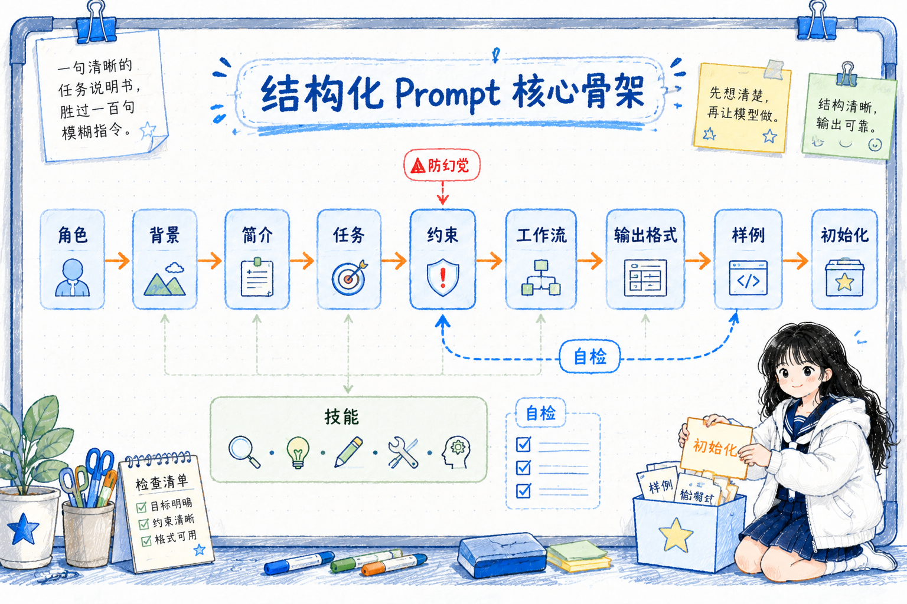
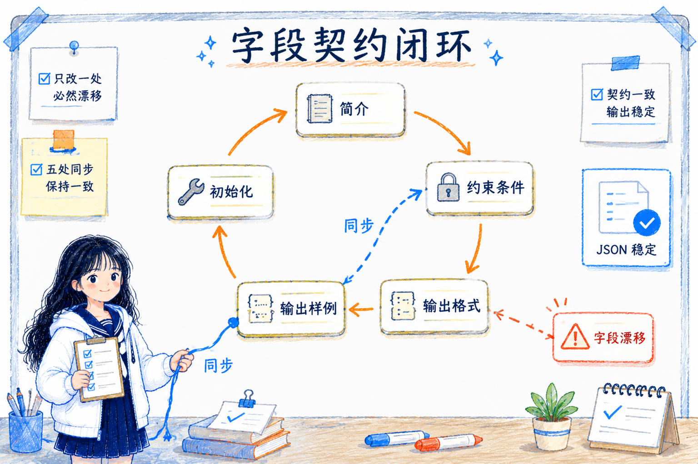

# 结构化 Prompt 编写指南和最佳实践
---
参考资料：
- [NanGePlus/PromptsCollection](https://github.com/NanGePlus/PromptsCollection)
---

## 这个项目主要在解决什么？

**这个项目的核心不是收集“好看的 prompt”，而是总结一套能进入真实工作流的结构化 Prompt 写法。** 仓库当前示例主要集中在内容生产自动化和结构化信息识别，但这套方法本身并不只服务这两类场景。

- **内容生产自动化**：例如公众号文章摘要、文章评选归类、AI 科技新闻评估、正文创作等。
- **结构化信息识别**：例如账单图片识别、账单文本识别，把非结构化输入转成固定 JSON。

只要一个 Prompt 需要被反复使用、接入流程、交给程序解析，或者需要多人维护，它就适合用这种结构化写法。比如客服分流、销售线索整理、合同条款抽取、运营日报生成、知识库入库、Agent 工具调用前的数据整理，都可以套用同一套思路。

它的目标很明确：让 prompt 产出同时满足 **可解析、可复用、可维护、可迭代**。

这四个词其实就是工程化 Prompt 的标准：

- **可解析**：输出能被程序稳定读取，不依赖人工二次整理。
- **可复用**：同一套骨架可以换业务字段继续使用。
- **可维护**：字段、规则、样例、版本说明能同步更新。
- **可迭代**：Prompt 改动后能知道改了什么、为什么改、影响哪些输出契约。

## 统一核心骨架

这个项目里的 Prompt 通常不是一句自然语言指令，而是一份“任务说明书”。它会把模型的身份、任务、约束、工作流和输出契约分开写。



一个可复用的骨架大致包括：

| 组成部分 | 主要作用 | 写作重点 |
|---|---|---|
| 角色 | 定义模型是谁、负责什么、不负责什么 | 把任务域收窄，避免模型用错误身份回答 |
| 背景 | 说明输入来源、使用场景、模型容易犯的错误 | 交代业务上下文和高风险误判点 |
| 简介 | 记录 `author`、`version`、`language`、`description` | 让 Prompt 有版本锚点，方便后续追踪变更 |
| 任务 | 说明模型要完成哪些动作 | 分点写清任务，不写空泛口号 |
| 约束条件 | 写死必须遵守的硬规则 | 包括输出形态、字段限制、禁用项、异常处理 |
| 技能 | 说明模型需要具备或模拟的能力 | 例如识别、归一化、判断、分类 |
| 工作流 | 把任务拆成可执行步骤 | 降低漏步概率，让复杂任务按顺序完成 |
| 输出格式 | 定义字段、类型、枚举、顺序和解释 | 这是下游能否稳定解析的关键 |
| 输入模板 | 告诉用户应该提供什么输入 | 让使用者按固定结构提交材料 |
| 输出样例 | 用样例对齐预期 | 覆盖正常样例和异常样例，但真实输出仍遵守输出格式 |
| 初始化 | 首轮交互时说明如何开始 | 简短告诉用户该输入什么，避免重复整份规则 |

**我的理解：这套骨架像是在给模型写一份岗位说明 + 操作手册 + 接口契约。**  
普通 prompt 只告诉模型“帮我做什么”，结构化 prompt 还会告诉模型“输入是什么、规则是什么、结果必须长什么样、异常怎么处理”。

## 9 条硬标准

### 1. 简介必须可追踪版本变化

`简介` 不只是作者信息，而是版本管理入口。它应该写清楚输入、输出、关键字段和本版变化。

如果 Prompt 需要多人维护、长期迭代，或者已经和自动化工作流绑定，就不能只写“这是一个摘要助手”。更好的写法是说明这一版新增了什么字段、调整了什么缺失值策略、改变了哪些输出约束。这样以后回看 Prompt 时，才能知道问题是模型能力导致的，还是 Prompt 契约变更导致的。

---

### 2. 输出形态只能有一个

输出形态必须提前固定：到底是 JSON 对象/数组/自然语言文本/markdown格式文件

如果要求 JSON，就要同时禁止 JSON 外解释、Markdown 代码块、前后缀说明。因为下游系统真正需要的不是“看起来像 JSON 的回答”，而是可以直接 `JSON.parse` 的稳定结果。只要输出形态允许摇摆，自动化流程就会被迫增加清洗逻辑。

---

### 3. 字段契约要全量闭环

字段定义不能只出现在一个地方，而要在多个关键章节保持一致。

对于 JSON 输出或字段较多的识别任务，字段清单至少要在 `简介`、`约束条件`、`输出格式`、`输出样例`、`初始化` 中同步。否则改版时很容易出现“输出格式要求 A，但样例还停留在 B”的问题。**字段契约的稳定性，取决于所有相关位置是否一起更新。**



---

### 4. 缺失值策略要统一且可执行

**必须明确无法识别时返回什么，最好统一返回 `null`。**（宁可空，不捏造）

缺失值策略的关键是可执行，而不是礼貌地提醒模型“不要乱猜”。**对于账单识别、OCR 信息抽取、表单整理、数据入库这类任务，模型不能用默认值、猜测值或空字符串冒充识别结果。即使输入不是目标内容，也可以返回同结构 JSON，再用状态字段区分成功或失败**。

---

### 5. 枚举值要可列举、可校验

分类字段必须给出允许值集合。

只要字段后续要被程序判断，就不能让模型自由发明分类词。比如 `confidence` 只能是 `高 / 中 / 低`，`transaction_type` 只能是 `收入 / 支出`。无法判断时返回 `null`，不要输出枚举外的新词。**枚举写得越清楚，后续校验和统计越稳定。**

---

### 6. 字段来源约束是防幻觉关键

必须规定哪些字段只能来自输入原文，哪些字段允许模型判断或生成。

在文章评选、资料整理、搜索结果筛选、知识库入库这类任务里，标题、来源、时间、链接等字段应该原样来自输入，不改写、不翻译、不补全。模型可以生成 `reason` 这类解释字段，但不能编造输入里没有的元数据。字段来源约束越清楚，越能减少幻觉。

---

### 7. 规则写法用“条件 + 结果”

规则要写成可执行的“条件 + 结果”，少写抽象原则。

比如“若输入不是账单文本，则 `code=400` 且其他字段为 `null`”；“仅当满足某条件，才能进入某分类”。这种写法比“请准确判断”“请严格分类”更稳定，因为模型知道触发条件是什么，也知道触发后应该输出什么。

---

### 8. 样例要覆盖主流程和异常流程

样例不能只覆盖成功情况，还要覆盖异常情况。

对于结构化识别、账单抽取、文章归类、接口型输出，至少应该准备成功、部分缺失、非目标输入这几类样例。否则模型只学到“正常情况下怎么输出”，遇到异常输入就容易自由发挥。**样例的价值不是展示漂亮结果，而是锁定边界条件。**

---

### 9. 初始化要短，但必须能直接开工

初始化只需要完成三件事：重申身份、重申输出结构、提示用户按模板输入。

初始化不是把整份规则再背一遍。太长会制造首轮噪声，太短又可能让用户不知道该怎么开始。对于自定义 GPT、Agent 启动语、多轮助手、固定工作流入口，初始化的标准是：用户看到后能立刻知道该输入什么，模型也能立刻进入正确工作模式。


## 推荐写作模板

可以把这个项目的方法压缩成下面这个模板：

```text
# 角色 : <助手名称>

## 背景 :
说明输入来源、使用场景、模型易错点。

## 简介 :
- author:
- version:
- language:
- description: <输入 + 输出 + 本版关键变化>

## 任务 :
分点说明要完成的动作。

## 约束条件（重要）:
- 输出形态
- 缺失值策略
- 字段来源约束
- 枚举和类型约束
- 异常输入处理

## 技能 :
说明模型需要执行的识别、判断、归一化、分类能力。

## 工作流：
- 第一步：
- 第二步：
- 第三步：

## 输出格式（必遵）:
定义字段、类型、枚举、顺序。

## 输入模板：
告诉用户如何提供输入。

## 输出样例：
至少覆盖成功样例和异常样例。

## 初始化：
简短说明如何开始。
```

## 版本迭代纪律

**结构化 Prompt 一旦进入工作流，就不能随便改一处。**

如果涉及字段契约变更，要同步检查：

- `简介` 里的字段说明有没有更新。
- `约束条件` 里的硬规则有没有更新。
- `输出格式` 里的字段、类型、枚举有没有更新。
- `输出样例` 有没有同步新字段。
- `初始化` 有没有仍然引用旧字段。

版本号也应该跟着变化，例如 `v1.0 -> v1.1`。`description` 要写清为什么改，而不只是写“优化了 prompt”。

## 如何用这套方法写自己的专属 Prompt？

可以按这个顺序做：

- **先明确业务场景**：输入来自哪里，输出给谁用，下游是否要自动解析。
- **选一个相似模板**：内容生产、票据识别、分类评选、摘要生成，不同场景优先复用不同模板。
- **列字段契约**：字段名、类型、枚举、是否允许 `null`、是否必须来自输入。
- **写约束条件**：输出形态、禁止项、异常输入、缺失值策略。
- **写工作流**：让模型按步骤判断，而不是一次性自由发挥。
- **补样例**：至少给成功和异常两类样例。
- **用真实输入演练**：检查输出能否解析、字段是否稳定、异常是否按预期处理。

**建议先照抄骨架，再改字段和规则。**  
不要一开始就推倒重写，先把接口和契约稳定下来，再逐步细化业务判断。

## 使用经验

**先把结构写标准，再把契约写死，把异常分支写全，把缺失值策略统一，最后用样例和自检清单锁住输出稳定性。**

真正写业务 Prompt 时，可以先问自己：

- 这个 prompt 的输出是不是要给程序解析？
- 输出到底是一个 JSON 对象、数组，还是自然语言？
- 哪些字段必须来自输入，哪些字段允许模型判断？
- 无法识别时是 `null`、空字符串，还是失败状态？
- 枚举值是否写全？
- 样例是否覆盖异常情况？
- 改字段时，简介、约束、输出格式、样例、初始化是否同步？

**结构化 Prompt 的关键不是写得长，而是让模型没有机会在关键地方自由发挥。**
