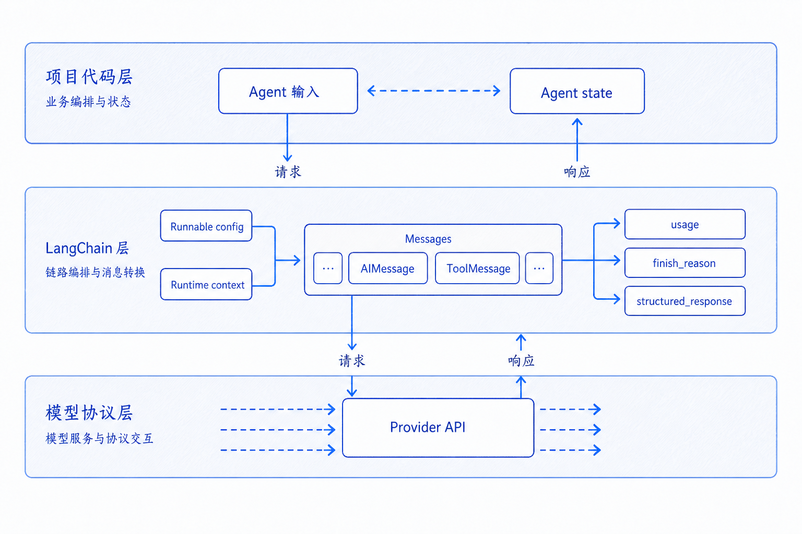

# 模型请求与响应结构

---
参考资料：
- [OpenAI Chat Completions API](https://platform.openai.com/docs/api-reference/chat/create)
- [OpenAI Responses API](https://platform.openai.com/docs/api-reference/responses/create)
- [Anthropic Messages API](https://platform.claude.com/docs/en/build-with-claude/working-with-messages)
- [LangChain Messages](https://docs.langchain.com/oss/python/langchain/messages)
- [LangChain Models](https://docs.langchain.com/oss/python/langchain/models)
---

## 这篇笔记要解决什么问题

学习模型请求与响应结构时，最容易混淆三件事：

1. 业务代码传给 `agent.invoke()` 的输入。
2. LangChain Agent 返回的 `response` 状态。
3. Provider API 原始请求和原始响应。

**本项目直接操作的是 LangChain Agent 的输入和返回状态，不是 OpenAI、Anthropic 或其他 Provider 的原始 HTTP JSON。** Provider API 的字段会被 `ChatOpenAI` 和 LangChain integration 转换，最后以 `HumanMessage`、`AIMessage`、`ToolMessage`、`structured_response` 等对象形式暴露出来。

因此，复习这篇笔记时先记住一个判断：**看到 `response["messages"]`，是在看 Agent state；看到 `choices`、`output`、`stop_reason`，才是在看某个 Provider 的原始协议结构。**

## 先分清三层结构

| 层级 | 典型对象 | 在项目中的表现 |
| --- | --- | --- |
| Provider API 协议层 | Chat Completions、Responses、Anthropic Messages | 由 `ChatOpenAI` 和 integration 负责转换，项目没有手写 HTTP JSON |
| LangChain 消息层 | `HumanMessage`、`AIMessage`、`ToolMessage` | 保存在 `response["messages"]` |
| LangChain Agent 状态层 | `messages`、`structured_response`、自定义 state 字段 | `agent.invoke()` 的输入和返回值 |

这三层的字段会互相映射，但不能直接画等号。



例如：

- `agent.invoke({"messages": [...]})` 中的 `messages` 是写入 Agent state 的输入。
- Provider 请求里的 `messages` 或 `input` 是 integration 最终组装后发给模型的协议字段。
- `response["messages"]` 是 Agent 执行后的完整消息状态，可能包含用户消息、模型消息、工具结果和短期记忆中的历史消息。
- `response["structured_response"]` 是 LangChain 根据 `response_format` 提取和校验后的业务对象，不是 Provider 原始响应顶层字段。

## 项目请求结构

项目入口在 [agent.py](<../code/agent.py>)。一次 Agent 调用分为两个阶段：先装配 Agent，再执行 Agent。

### 装配阶段：绑定模型、工具和输出格式

```python
agent = create_agent(
    model=llm_chat,
    system_prompt=SYSTEM_PROMPT,
    tools=tools,
    context_schema=Context,
    response_format=WeatherResponseFormat,
    checkpointer=checkpointer,
)
```

这些参数不是一次用户请求的全部内容，而是 Agent 的运行能力配置：

| 参数 | 项目对象 | 对模型请求的影响 |
| --- | --- | --- |
| `model` | `llm_chat` | 决定使用哪个 Chat Model、`base_url`、模型名、采样参数、超时和重试 |
| `system_prompt` | `SYSTEM_PROMPT` | 作为系统规则进入模型上下文 |
| `tools` | `get_weather_for_location`、`get_user_location` | 转换为模型可见的工具定义，包括工具名、描述和参数 Schema |
| `context_schema` | `Context` | 声明运行时 context 的结构，主要给工具和 middleware 使用 |
| `response_format` | `WeatherResponseFormat` | 约束最终结构化结果，并在成功时写入 `structured_response` |
| `checkpointer` | `InMemorySaver()` | 按 `thread_id` 保存和恢复线程级消息状态 |

`context_schema` 和 `checkpointer` 属于 Agent runtime，不是模型 API 里的同名字段。

### 执行阶段：传入本轮用户输入

```python
response = agent.invoke(
    {
        "messages": [
            {
                "role": "user",
                "content": "外面的天气怎么样？记住我的暗号是 banana-007",
            }
        ]
    },
    config={"configurable": {"thread_id": "1"}},
    context=Context(user_id="1"),
)
```

这段调用里有三类输入：

| 输入 | 作用 | 是否会直接变成对话消息 |
| --- | --- | --- |
| `{"messages": [...]}` | 把本轮用户消息写入 Agent state | 是 |
| `config={"configurable": {"thread_id": "1"}}` | 指定读写哪条线程状态 | 否 |
| `context=Context(user_id="1")` | 给工具和 middleware 提供运行时业务依赖 | 否 |

`thread_id` 和 `user_id` 不能混用：

- `thread_id` 决定本轮对话读写哪段短期记忆。
- `user_id` 决定工具按哪个用户身份查询业务数据。

## 对应到底层 Provider 请求字段

如果只看项目代码，不会看到完整的 Provider 请求 JSON。可以用下面的表把 LangChain 侧字段和常见 API 字段对应起来：

| 常见字段 | 在协议中的含义 | 在项目中的来源 |
| --- | --- | --- |
| `model` | 指定要调用的模型 | `ChatOpenAI(model=config["chat_model"])` |
| `messages` | Chat Completions 风格的对话消息 | `agent.invoke({"messages": [...]})`、短期记忆、system prompt、工具结果共同转换 |
| `input` | Responses API 风格的输入，可以是文本、消息或 input item | 项目未直接构造，由 integration 负责 |
| `instructions` / system message | 系统或开发者层级指令 | `create_agent(system_prompt=SYSTEM_PROMPT)` |
| `tools` | 模型可调用的工具定义 | `create_agent(tools=tools)` |
| `tool_choice` | 控制自动选择、强制调用或禁用工具 | 项目未显式设置，交给 Agent runtime 和模型自动选择 |
| `response_format` | 原生结构化输出约束 | 项目在 Agent 层传入 `WeatherResponseFormat`，可能走 ToolStrategy 或 ProviderStrategy |
| `stream` | 是否流式返回 | 项目使用同步 `invoke()`，没有开启流式 |
| `usage` | Token 用量统计 | Provider 返回后进入 `AIMessage.usage_metadata` 或 `response_metadata.token_usage` |
| `finish_reason` / `stop_reason` / `status` | 结束原因或响应状态 | 通常进入 `AIMessage.response_metadata` |

这里的关键是：**LangChain 的字段是框架输入，Provider 的字段是协议输入。字段名相近时，要先判断它位于哪一层。**

## role 与 message 的职责

`role` 表示一条消息在对话中的身份，message 承载该身份对应的内容和元数据。LangChain 会把不同 Provider 的协议差异尽量转换成统一消息对象。

| 协议角色 | LangChain 对象 | 职责 |
| --- | --- | --- |
| `system` / `developer` | `SystemMessage` | 设置高优先级规则、角色、边界和上下文 |
| `user` | `HumanMessage` | 保存用户输入，可以是文本或多模态内容 |
| `assistant` | `AIMessage` | 保存模型生成内容、工具调用意图和响应元数据 |
| `tool` | `ToolMessage` | 保存业务系统执行工具后的结果，并回传给模型 |

OpenAI Chat Completions 常用 `role: tool` 表示工具结果。Anthropic Messages 更常用内容块表达工具使用和工具结果。LangChain 的统一消息对象可以降低学习成本，但不能抹平所有 Provider 能力差异。

## 项目响应结构

`agent.invoke()` 返回的是一个 Agent state。项目最常使用两个字段：

```python
messages = response["messages"]
structured_response = response["structured_response"]
```

可以把返回结构理解成：

```python
{
    "messages": [
        HumanMessage(...),
        AIMessage(...),
        ToolMessage(...),
        AIMessage(...),
        ToolMessage(...),
        AIMessage(...),
        ToolMessage(...),
    ],
    "structured_response": WeatherResponseFormat(...),
}
```

`structured_response` 是最终业务结果，`messages` 是生成这个结果之前的执行轨迹。需要理解模型调用、工具调用、Token 用量、结束原因时，主要看 `messages`。

## 一次天气 Agent 的消息链

用户输入是：

```text
外面的天气怎么样？记住我的暗号是 banana-007
```

结合项目里的工具和结构化输出，返回状态中的消息链可以整理为：

| 顺序 | 消息类型 | 关键字段 | 含义 |
| --- | --- | --- | --- |
| 1 | `HumanMessage` | `content` | 用户提出天气问题，并要求记住暗号 |
| 2 | `AIMessage` | `tool_calls=[get_user_location]`、`finish_reason="tool_calls"` | 模型判断需要先确认用户所在地点 |
| 3 | `ToolMessage` | `name="get_user_location"`、`content="北京"`、`tool_call_id=...` | Agent runtime 执行定位工具，并把结果回传给模型 |
| 4 | `AIMessage` | `tool_calls=[get_weather_for_location]`、`args={"city": "北京"}` | 模型读取地点后，继续请求天气工具 |
| 5 | `ToolMessage` | `name="get_weather_for_location"`、`content="北京的天气是晴天!"` | Agent runtime 执行天气工具，并把天气结果回传给模型 |
| 6 | `AIMessage` | `tool_calls=[WeatherResponseFormat]` | 模型按结构化输出 Schema 提交最终字段 |
| 7 | `ToolMessage` | `name="WeatherResponseFormat"` | LangChain 接收结构化字段，并生成 `structured_response` |

这个链条体现了 Agent 的基本运行方式：**模型只生成工具调用意图；工具由 Agent runtime 执行；工具结果再作为消息送回模型。**

## AIMessage 的结构

项目响应中的 `AIMessage` 是理解模型响应的核心对象。一次工具调用型 `AIMessage` 可以简化成：

```python
AIMessage(
    content="",
    tool_calls=[
        {
            "name": "get_weather_for_location",
            "args": {"city": "北京"},
            "id": "call_030162df4a724b2fa45cb214",
            "type": "tool_call",
        }
    ],
    response_metadata={
        "model_provider": "openai",
        "model_name": "qwen3.7-plus",
        "finish_reason": "tool_calls",
        "token_usage": {...},
    },
    usage_metadata={
        "input_tokens": 558,
        "output_tokens": 24,
        "total_tokens": 582,
    },
)
```

| 字段 | 含义 | 复习重点 |
| --- | --- | --- |
| `content` | 模型直接生成的文本内容 | 工具调用阶段可能为空 |
| `tool_calls` | 模型提出的工具调用意图 | 只表示“想调用”，不表示工具已经执行成功 |
| `response_metadata` | Provider 和 integration 保留的元数据 | 常见字段包括模型名、Provider、`finish_reason`、原始 `token_usage` |
| `usage_metadata` | LangChain 标准化后的 Token 用量 | 便于跨 Provider 读取输入、输出、总 Token |
| `id` | LangChain run message ID | 用于追踪消息，不等于工具调用 ID |
| `invalid_tool_calls` | 无法解析或不合法的工具调用 | 排查工具参数 JSON、Schema 或模型输出问题 |

`finish_reason="tool_calls"` 表示模型这一步不是最终回答，而是把控制权交给工具执行阶段。

## ToolMessage 的结构

工具执行结果会以 `ToolMessage` 回到 Agent state。可以简化成：

```python
ToolMessage(
    content="北京的天气是晴天!",
    name="get_weather_for_location",
    tool_call_id="call_030162df4a724b2fa45cb214",
)
```

| 字段 | 含义 |
| --- | --- |
| `content` | 工具执行后返回给模型的文本或序列化结果 |
| `name` | 被执行的工具名 |
| `tool_call_id` | 对应某一次 `AIMessage.tool_calls[].id` |

`tool_call_id` 的作用是把“模型提出的工具调用”和“业务系统返回的工具结果”精确配对。顺序工具调用时它可以帮助检查链路；并行工具调用时它是必要的关联字段，否则模型无法可靠判断哪个结果对应哪个调用。

本项目中的配对关系可以这样读：

| 模型提出的调用 | 工具返回结果 | 关联方式 |
| --- | --- | --- |
| `AIMessage.tool_calls[].id = call_54a5...`，`name=get_user_location` | `ToolMessage(content="北京")` | `ToolMessage.tool_call_id = call_54a5...` |
| `AIMessage.tool_calls[].id = call_030...`，`name=get_weather_for_location` | `ToolMessage(content="北京的天气是晴天!")` | `ToolMessage.tool_call_id = call_030...` |
| `AIMessage.tool_calls[].id = call_680...`，`name=WeatherResponseFormat` | `ToolMessage(content="Returning structured response: ...")` | `ToolMessage.tool_call_id = call_680...` |

工具调用的细节可以参考 [04_Tools与FunctionCalling](<04_Tools与FunctionCalling.md>)。

## structured_response 的结构

项目中定义的结构化结果是：

```python
@dataclass
class WeatherResponseFormat:
    punny_response: str
    weather_location: str
    weather_conditions: str | None = None
```

成功后，`response["structured_response"]` 类似：

```python
WeatherResponseFormat(
    punny_response="北京的天气好得让人想“京”喜若狂！☀️",
    weather_location="北京",
    weather_conditions="晴天",
)
```

这里要区分两个结果：

| 对象 | 来源 | 用途 |
| --- | --- | --- |
| `ToolMessage(name="WeatherResponseFormat")` | 结构化输出流程中的消息轨迹 | 说明模型按 Schema 提交了字段 |
| `response["structured_response"]` | LangChain 校验和提取后的业务对象 | 业务代码最终应读取的结构化结果 |

业务代码通常不需要从最后一条 `AIMessage.content` 里解析天气字段，而应读取 `structured_response`。

## usage 和 finish_reason 怎么看

一次 Agent 调用可能包含多次模型调用。项目里的天气问题通常至少包含：

1. 模型判断需要调用定位工具。
2. 模型判断需要调用天气工具。
3. 模型提交结构化输出。

每一次模型调用都会产生一个 `AIMessage`，每个 `AIMessage` 可能都有自己的 `usage_metadata` 和 `finish_reason`。

| 字段 | 常见位置 | 含义 |
| --- | --- | --- |
| `input_tokens` / `prompt_tokens` | `usage_metadata` 或 `response_metadata.token_usage` | 本次模型调用输入消耗 |
| `output_tokens` / `completion_tokens` | `usage_metadata` 或 `response_metadata.token_usage` | 本次模型调用输出消耗 |
| `total_tokens` | `usage_metadata` 或 `response_metadata.token_usage` | 本次模型调用总消耗 |
| `finish_reason` | `response_metadata` | Chat Completions 风格的结束原因 |
| `stop_reason` | `response_metadata` | Anthropic 风格的停止原因 |
| `status` / `incomplete_details` | Provider 原始响应或 metadata | Responses API 更常见的响应状态表达 |

Chat Completions 常见 `finish_reason`：

| 值 | 含义 |
| --- | --- |
| `stop` | 自然结束或命中停止序列 |
| `length` | 达到最大输出 Token 限制 |
| `tool_calls` | 模型生成了工具调用 |
| `content_filter` | 输出被内容安全策略中断或过滤 |
| `function_call` | 旧式函数调用结束原因，已被 `tool_calls` 替代 |

Responses API 不应硬套 `finish_reason`。应优先看 `status`；如果响应不完整，再看 `incomplete_details.reason`。Anthropic Messages 通常使用 `stop_reason`。

## build_response_record 怎样整理响应

[call_records.py](<../code/utils/call_records.py>) 的作用是把 Agent state 整理成便于记录的摘要。

核心逻辑是：

```python
messages = response.get("messages") or []
ai_calls = [message for message in messages if _is_ai_message(message)]
```

然后从所有 `AIMessage` 中提取：

| 记录字段 | 来源 | 含义 |
| --- | --- | --- |
| `model` | 最后一条包含模型信息的 `AIMessage.response_metadata` | 最终可见模型名 |
| `provider` | 最后一条包含 Provider 信息的 `AIMessage.response_metadata` | 最终可见 Provider |
| `input` | state 中可见的所有 `HumanMessage` | 用户消息摘要 |
| `output` | `response["structured_response"]` | 最终业务结构化结果 |
| `usage` | 所有可见 `AIMessage` 的 usage 累加 | Agent state 中可见模型调用的 Token 合计 |
| `latencyMs` | Provider 返回的延迟 metadata | Provider 未提供时为 `None` |

复用同一个 `thread_id` 时，`response["messages"]` 可能包含历史消息。此时 `usage` 反映的是返回 state 中可见 `AIMessage` 的累计值，不一定等于本轮新增成本。需要精确统计单轮消耗时，更适合使用 callbacks、LangSmith 单次 Run 数据，或在调用前后对消息差值做统计。

## Chat Completions、Responses、Anthropic Messages 的差异

| 维度 | OpenAI Chat Completions | OpenAI Responses | Anthropic Messages | LangChain 统一对象 |
| --- | --- | --- | --- | --- |
| 输入主字段 | `messages` | `input`、`instructions` | `messages`、顶层 `system` | `messages` / message objects |
| 文本输出 | `choices[].message.content` | `output[]` 中的 message content | `content[]` 的 text block | `AIMessage.content` / `content_blocks` |
| 工具调用 | `message.tool_calls` | `function_call` 等 output item | `tool_use` content block | `AIMessage.tool_calls` |
| 工具结果 | `role="tool"` message | `function_call_output` 等 input item | `tool_result` content block | `ToolMessage` |
| 用量 | `usage` | `usage` | `usage` | `AIMessage.usage_metadata` |
| 结束原因 | `finish_reason` | `status`、`incomplete_details` | `stop_reason` | `response_metadata` |

LangChain 的价值在于把这些协议差异包装成相对统一的调用体验。学习底层协议仍然重要，因为出现工具不兼容、结构化输出失败、usage 缺失、流式分块异常时，最终仍要回到 Provider 语义排查。

## 流式响应

项目使用同步 `invoke()`，因此一次性拿到完整 Agent state。改成流式后，需要注意：

- 文本可能以多个 `AIMessageChunk` 返回。
- 工具调用的名称和参数可能分块到达。
- 工具参数 JSON 在中间 chunk 中可能并不完整。
- usage 可能只在最终 chunk 或额外 chunk 中出现，也可能由 Provider 决定是否返回。
- Agent 流式输出要区分模型 token 流、工具步骤流和最终 state 更新。

流式调用改变的是返回方式，不改变“模型生成意图、runtime 执行工具、工具结果回到消息状态”这条主线。

## 常见误区

- **把 `agent.invoke()` 返回值当成 Provider 原始响应。** 实际返回的是 Agent state。
- **只看最后的 `structured_response`。** 它适合业务读取，但不能解释工具链和 Token 用量。
- **认为一个用户问题只会有一次模型调用。** Agent 可能多次经历“模型调用、工具执行、再次模型调用”的循环。
- **把 `tool_calls` 当成工具执行结果。** `tool_calls` 是模型生成的调用意图，工具结果在 `ToolMessage`。
- **忽略 `tool_call_id`。** 多工具和并行工具场景中，必须用它关联调用和结果。
- **把 `thread_id` 当成用户身份。** `thread_id` 是会话状态键，`user_id` 是业务身份。
- **把 `usage` 当成单轮固定成本。** 复用短期记忆时，返回 state 可能包含历史消息，需要明确统计口径。

## 相关学习笔记

- [01_多厂商LLM集成与API协议](<01_多厂商LLM集成与API协议.md>)：理解 OpenAI-compatible 接入和 Provider 差异。
- [10_ChatOpenAI对象详解](<10_ChatOpenAI对象详解.md>)：理解模型初始化参数、调用参数和返回对象。
- [02_模型采样参数与ChatOpenAI](<02_模型采样参数与ChatOpenAI.md>)：理解 temperature、top_p 等字段怎样影响生成。
- [04_Tools与FunctionCalling](<04_Tools与FunctionCalling.md>)：理解工具定义、工具调用意图和结果回传。
- [03_结构化输出](<03_结构化输出.md>)：理解 `response_format`、ToolStrategy 与 ProviderStrategy。
- [05_create_agent参数详解](<05_create_agent参数详解.md>)：理解 Agent 装配参数与 runtime 输入。
- [06_Agent短期记忆](<06_Agent短期记忆.md>)：理解 `thread_id`、checkpointer 和 messages 状态。
- [08_LangSmith跟踪与调用记录](<08_LangSmith跟踪与调用记录.md>)：理解如何观察完整调用链、Token、延迟和错误。

**最终记忆：请求结构要分清 Agent 输入、runtime 配置和 Provider 协议；响应结构要分清 `messages` 执行轨迹和 `structured_response` 业务结果。读 Agent 响应时，先看消息链，再看每条 `AIMessage` 的 `tool_calls`、`usage_metadata` 和 `response_metadata`。**
