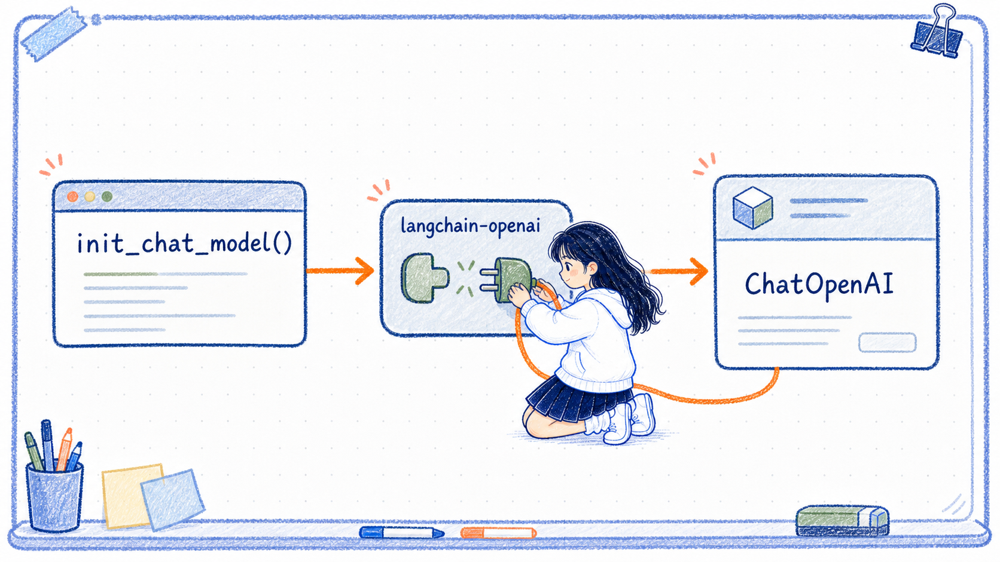

# ChatOpenAI 与 init_chat_model 的区别

---
参考资料：
- [LangChain Models](https://docs.langchain.com/oss/python/langchain/models)
- [LangChain ChatOpenAI](https://docs.langchain.com/oss/python/integrations/chat/openai)
- [LangChain `init_chat_model` API Reference](https://reference.langchain.com/python/langchain/chat_models/base/init_chat_model)
- [LangChain Providers and models](https://docs.langchain.com/oss/python/concepts/providers-and-models)
---

## 它们的核心关系

**`ChatOpenAI` 是一个具体的 Chat Model 类；`init_chat_model()` 是一个根据 Provider 选择具体模型类的工厂函数。**

当 `init_chat_model()` 收到 `model_provider="openai"` 时，它会加载 `langchain-openai` integration，并创建相应的 OpenAI Chat Model。因此，固定配置下的这两种写法最终通常都会得到 `ChatOpenAI` 对象：

```python
from langchain.chat_models import init_chat_model
from langchain_openai import ChatOpenAI

direct_model = ChatOpenAI(model="MODEL_NAME")

factory_model = init_chat_model(
    model="MODEL_NAME",
    model_provider="openai",
)
```

两种写法的区别主要在**由谁负责选择具体类**，不是谁调用了更高级的模型，也不是使用了两种不同的聊天协议。



## 主要区别

| 判断维度 | 直接 `ChatOpenAI()` | `init_chat_model()` |
| --- | --- | --- |
| 定位 | 具体 Provider 模型类 | LangChain 模型工厂 |
| 谁选择具体类 | 开发者在 import 和构造时直接选择 | 工厂根据 `model_provider` 选择 |
| 固定 OpenAI Provider 的最终对象 | `ChatOpenAI` | 通常仍是 `ChatOpenAI` |
| Provider 专属参数 | 构造函数与 IDE 提示更直观 | 通过 `**kwargs` 转交给具体模型类 |
| OpenAI-compatible 多地址 | 很适合 | 可以使用，但要指定 `model_provider="openai"` |
| 多个原生 Provider | 需要自行 import 和选择不同类 | 更适合集中维护 Provider 路由 |
| 运行时切换模型 | 需要自行封装 | 支持 configurable model 机制 |
| 学习和排错 | 调用链短，更容易确认实际对象 | 需要先理解 Provider 与具体类的映射 |

## 应该怎样选择

- **Provider 已经确定，而且希望具体类、类型提示和专属参数一眼可见**：直接创建 `ChatOpenAI` 或其他具体模型类。
- **希望用一个入口创建不同原生 Provider 的模型类**：使用 `init_chat_model()`。
- **只是在多个 OpenAI-compatible 地址之间切换**：直接使用 `ChatOpenAI(base_url=...)` 通常更直观，工厂不会增加新的模型能力。
- **需要调用时再切换模型或 Provider**：使用 `init_chat_model()` 的运行时可配置模式，但应把它当成独立能力理解。

当前项目主要学习 OpenAI-compatible 接入和 `ChatOpenAI` 参数，因此正式代码直接创建 `ChatOpenAI` 更容易理解和排错；`init_chat_model()` 作为统一工厂与后续模型路由能力单独学习。

## 容易混淆的点

- `init_chat_model()` 不是比 `ChatOpenAI` 更高级的模型，它只是替开发者选择具体模型类。
- 固定模式下，`init_chat_model(model_provider="openai", ...)` 通常仍然返回 `ChatOpenAI`。
- 两种方式最终得到相同具体类型，不代表所有 Provider 专属参数都会被工厂统一。
- `ChatOpenAI` 可以通过 `base_url` 连接多个兼容地址，不等于它能调用任意厂商原生协议。
- 运行时可配置模式返回的是包装器，不能用固定模式的对象类型结论直接套用。

## 关联笔记

- [10_ChatOpenAI对象详解](<10_ChatOpenAI对象详解.md>)：单独理解 `ChatOpenAI` 的构造参数和调用边界。
- [11_init_chat_model方法详解](<11_init_chat_model方法详解.md>)：理解工厂参数、Provider 映射、固定模式和运行时配置。
