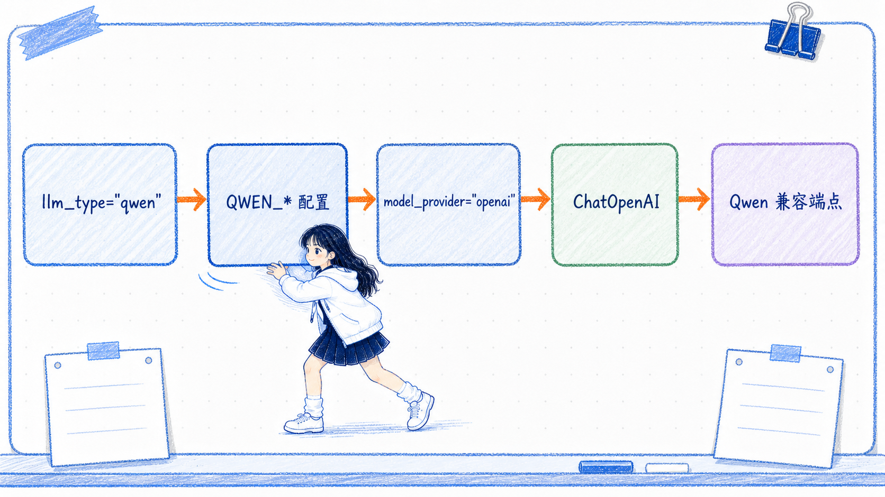

# init_chat_model 方法详解

---
参考资料：
- [LangChain：Models](https://docs.langchain.com/oss/python/langchain/models)
- [LangChain：Models - Configurable models](https://docs.langchain.com/oss/python/langchain/models#configurable-models)
- [LangChain：init_chat_model API Reference](https://reference.langchain.com/python/langchain/chat_models/base/init_chat_model)
- [LangChain：Providers and models](https://docs.langchain.com/oss/python/concepts/providers-and-models)
- [LangChain：ChatOpenAI 集成](https://docs.langchain.com/oss/python/integrations/chat/openai)
---

## `init_chat_model()` 是什么

**`init_chat_model()` 是 LangChain 提供的 Chat Model 工厂函数：开发者告诉它模型与 Provider，它负责选择相应的 integration，并返回可以使用统一 Chat Model 接口调用的对象。**

```python
from langchain.chat_models import init_chat_model

llm = init_chat_model(
    model="MODEL_NAME",
    model_provider="openai",
)
```

它不是新的模型类，也不是新的 API 协议。最终创建 `ChatOpenAI`、`ChatAnthropic` 还是其他对象，仍由 `model_provider` 和已安装的 integration package 决定。

`init_chat_model()` 主要有两种工作模式：

- **固定模型模式**：创建时已经给出模型，直接返回具体 Chat Model 对象。
- **运行时可配置模式**：返回一个包装器，在调用时根据 `config` 决定模型或其他参数。

这篇笔记统一解释方法本身、`model_provider` 与 Provider 映射、固定模型模式，以及运行时可配置模型。

## 方法签名怎样理解

以项目固定的 `langchain==1.2.1` 为准，`init_chat_model()` 的主要参数可以概括为：

```python
def init_chat_model(
    model: str | None = None,
    *,
    model_provider: str | None = None,
    configurable_fields: "any" | list[str] | tuple[str, ...] | None = None,
    config_prefix: str | None = None,
    **kwargs,
):
    ...
```

| 参数 | 作用 | 应该怎样理解 |
| --- | --- | --- |
| `model` | 指定后端模型 ID | 可以单独写模型名，也可以使用 `provider:model` 形式 |
| `model_provider` | 指定 LangChain Provider | 决定加载哪个 integration 和具体模型类，下面单独详解 |
| `configurable_fields` | 声明哪些模型参数允许运行时覆盖 | 不传且已经提供 `model` 时得到固定模型；运行时配置规则见后文 |
| `config_prefix` | 给运行时配置键添加前缀 | 主要用于同一条 Chain 中存在多个可配置模型的场景 |
| `**kwargs` | 传给最终具体模型类的构造参数 | 例如 `temperature`、`timeout`、`base_url`，支持范围由最终 integration 决定 |

`init_chat_model()` 只统一了入口。它不会把所有 Provider 的构造参数变成完全相同的一套参数。

## `model_provider` 到底决定什么

**`model_provider` 是 `init_chat_model()` 的选型参数：它决定工厂加载哪个 LangChain integration，并创建哪一种具体 Chat Model 类。**

```python
llm = init_chat_model(
    model="MODEL_NAME",
    model_provider="openai",
)
```

这里的 `openai` 表示使用 OpenAI integration，通常会创建 `ChatOpenAI`。它不表示后端模型一定是 GPT，也不等于项目里的 `llm_type`。

| 参数 | 回答的问题 |
| --- | --- |
| `model_provider` | LangChain 应该使用哪个 integration 和具体模型类？ |
| `model` | 请求最终交给后端的哪个模型 ID？ |
| `base_url` | 请求应该发送到哪个 API 地址？ |

`init_chat_model()` 统一的是模型初始化入口，不是把所有厂商的原生 API 统一成 OpenAI 协议。最后怎样组织请求，仍然由选中的具体模型类决定。

## `model_provider` 到底应该填什么

判断时不要先看模型品牌，而要先看**准备使用哪个 LangChain integration 与哪种 API 协议**：

1. 确认后端提供的是厂商原生 API，还是 OpenAI-compatible API。
2. 确认希望 `init_chat_model()` 创建哪个具体 Chat Model 类。
3. 把与该 integration 对应的 Provider 标识填入 `model_provider`。
4. 确认相应 integration package 已经安装。

| 接入场景 | `model_provider` | 典型结果 | 说明 |
| --- | --- | --- | --- |
| OpenAI 官方 API | `openai` | `ChatOpenAI` | 使用 `langchain-openai` |
| Qwen 的 OpenAI-compatible 地址 | `openai` | `ChatOpenAI` | 模型可以是 Qwen，但客户端使用 OpenAI integration |
| OneAPI 等 OpenAI-compatible 网关 | `openai` | `ChatOpenAI` | Provider 由客户端协议决定，不由网关名称决定 |
| Ollama 的 OpenAI-compatible 地址 | `openai` | `ChatOpenAI` | 前提是地址确实暴露兼容接口 |
| Ollama 原生接口 | `ollama` | `ChatOllama` | 使用 `langchain-ollama` |
| Anthropic 原生 Messages API | `anthropic` | `ChatAnthropic` | 使用 `langchain-anthropic` |
| Google Gemini 原生接口 | `google_genai` | `ChatGoogleGenerativeAI` | 使用 `langchain-google-genai` |

最需要记住的是：

> **模型可以叫 Qwen，但只要代码通过 `ChatOpenAI` 和 OpenAI-compatible 接口访问它，`model_provider` 就应该填 `openai`。**

如果后端只提供厂商原生协议，就不应该为了统一配置而强行填 `openai`。这时应选择对应的原生 integration。

## Provider、integration 和具体类的映射

| `model_provider` | integration package | 典型具体对象 |
| --- | --- | --- |
| `openai` | `langchain-openai` | `ChatOpenAI` |
| `anthropic` | `langchain-anthropic` | `ChatAnthropic` |
| `google_genai` | `langchain-google-genai` | `ChatGoogleGenerativeAI` |
| `ollama` | `langchain-ollama` | `ChatOllama` |

Provider 名称不是任意字符串。它必须是当前 LangChain 版本能够识别的标识，对应 integration package 也必须已经安装。传给工厂的其他模型参数会继续交给最终具体类，所以同名参数在不同 Provider 下不一定拥有相同的支持范围。

## 固定模型的三种写法

### 分别传入模型名和 Provider

```python
llm = init_chat_model(
    model="MODEL_NAME",
    model_provider="openai",
    temperature=0,
)
```

这种方式最明确，尤其适合模型名无法自动推断 Provider、使用网关或连接 OpenAI-compatible 地址的场景。

### 在模型名中使用 Provider 前缀

```python
llm = init_chat_model(
    model="openai:MODEL_NAME",
    temperature=0,
)
```

冒号前面的 `openai` 是 Provider，后面才是交给具体 integration 的模型名。

### 让 LangChain 根据模型名前缀推断

```python
llm = init_chat_model(
    model="gpt-4o-mini",
    temperature=0,
)
```

LangChain 能根据部分常见模型名前缀推断 Provider，但这种推断不是任意模型名都支持。自定义模型名、网关别名或 OpenAI-compatible 模型服务应显式传入 `model_provider`，避免推断失败或选错 integration。

**`model="openai:MODEL_NAME"` 和 `model_provider="openai"` 是两种表达 Provider 的方式，应二选一。** 在当前实现中，如果两者同时出现，显式的 `model_provider` 不会自动替你移除模型名里的 `openai:` 前缀，后端可能收到错误的模型 ID。

## 固定模式最终返回什么

当 `model` 已经提供，并且没有启用 `configurable_fields` 时，工厂会立即选择 integration，返回相应的具体 `BaseChatModel`：

```python
llm = init_chat_model(
    model="MODEL_NAME",
    model_provider="openai",
    api_key="TEST_KEY",
)

print(type(llm))
# <class 'langchain_openai.chat_models.base.ChatOpenAI'>
```

当前项目使用 `model_provider="openai"`，因此固定模式最终得到的仍是 `ChatOpenAI`。工厂没有在 `ChatOpenAI` 外再套一层更高级的模型能力，只是代替开发者完成了具体类的选择。

| 调用方式 | 典型返回结果 |
| --- | --- |
| 提供 `model`，不启用可配置字段 | 某个具体 `BaseChatModel`，例如 `ChatOpenAI` |
| 不提供 `model`，或显式启用可配置字段 | `_ConfigurableModel` 包装器 |

第二种返回结果不是具体 Provider 模型，而是后文介绍的运行时可配置包装器。

## `**kwargs` 会交给谁

除四个工厂参数以外，其余关键字参数都会交给最终选中的具体模型类：

```python
llm = init_chat_model(
    model="MODEL_NAME",
    model_provider="openai",
    base_url="https://example.com/v1",
    api_key="API_KEY",
    temperature=0,
    timeout=30,
    max_retries=2,
    extra_body={"enable_thinking": False},
)
```

在这个例子里，工厂选择 `ChatOpenAI`，再把 `base_url`、`api_key`、`temperature`、`timeout`、`max_retries` 和 `extra_body` 交给 `ChatOpenAI`。

因此要注意：

- `init_chat_model()` 接受 `**kwargs`，不等于所有 Provider 都支持同一参数。
- `extra_body` 是 `ChatOpenAI` 兼容服务的扩展机制，切换到其他模型类后不一定可用。
- Provider 专属参数应查最终具体模型类，而不是只查工厂函数。
- 工厂不会替你转换不兼容的参数名称或语义。

`ChatOpenAI` 支持的参数见 [10_ChatOpenAI对象详解](<10_ChatOpenAI对象详解.md>)。

## 当前项目与工厂写法的关系

当前 `code/utils/llms.py` 真正生效的是直接创建 `ChatOpenAI`。`init_chat_model()` 只作为需要理解的另一种模型工厂写法，不属于当前 Agent 的实际运行路径。

如果以后把项目切换为工厂写法，当前四组 OpenAI-compatible 服务都应显式映射到 `model_provider="openai"`；Qwen 的 `extra_body={"enable_thinking": False}` 等参数则继续传给工厂最终创建的 `ChatOpenAI`。

### 当前项目的三层名称

| 名称 | 当前项目中的例子 | 它决定什么 |
| --- | --- | --- |
| 项目配置名 `llm_type` | `qwen`、`oneapi`、`ollama` | 从 `MODEL_CONFIGS` 选择哪组 URL、Key 和模型名 |
| LangChain Provider 名 `model_provider` | `openai`、`anthropic`、`ollama` | 加载哪个 integration，并创建哪个模型类 |
| 后端模型名 `model` | 某个 Qwen、GPT 或其他模型 ID | 请求最终发送给后端的哪个模型 |

项目可以把配置组命名为 `qwen`，但它只是项目内部选择键。如果这组配置保存的是 Qwen 的 OpenAI-compatible 地址，工厂仍应使用 `model_provider="openai"`。

如果项目以后把正式模型入口切换为 `init_chat_model()`，可以显式维护项目配置名到 Provider 的映射：

```python
PROVIDER_BY_LLM_TYPE = {
    "openai": "openai",
    "oneapi": "openai",
    "qwen": "openai",
    # 仅当这一组配置使用 Ollama 的 OpenAI-compatible 地址
    "ollama": "openai",
}
```



如果改用 Ollama 原生 integration，就应把对应映射改为 `"ollama": "ollama"`。**同一个 `llm_type` 最终映射到哪个 Provider，取决于这组配置实际使用的接口协议。**

因此，当前项目运行时不会读取 `model_provider`。这里的映射用于解释工厂选型规则，以及将来切换初始化方式时应该怎样配置。

注释示例里曾把 `model_provider` 直接设为 `DEFAULT_LLM_TYPE`。当默认值是 `qwen`，但后端实际走 OpenAI-compatible 接口时，这种写法会让工厂尝试寻找名为 `qwen` 的 Provider。**当前项目使用工厂写法时，应先把项目配置名显式映射为 `openai`。**

## 创建后的对象怎样使用

固定模式返回的是标准 Chat Model，所以后续使用方式与直接创建具体类一致：

| 方法 | 作用 |
| --- | --- |
| `invoke(input)` | 完成一次请求并返回 `AIMessage` |
| `stream(input)` | 流式返回 `AIMessageChunk` |
| `batch(inputs)` | 并发处理多组独立输入 |
| `bind_tools(tools)` | 把工具 Schema 绑定给模型 |
| `with_structured_output(schema)` | 创建结构化输出包装器 |

```python
response = llm.invoke(
    [
        {"role": "system", "content": "你是一个简洁的助手。"},
        {"role": "user", "content": "请解释 LangChain。"},
    ]
)

print(response.content)
```

消息、工具和结构化输出不是在 `init_chat_model()` 中执行的。工厂只负责创建模型对象，真正的请求发生在 `invoke()`、`stream()` 等调用阶段。

## 运行时可配置模型

**运行时可配置模型不是一个固定的 Provider 模型对象，而是 `init_chat_model()` 返回的 `_ConfigurableModel` 包装器；它会在调用时把默认配置与 `config["configurable"]` 合并，再选择并创建真正执行请求的底层 Chat Model。**

```python
configurable_model = init_chat_model(temperature=0)

response = configurable_model.invoke(
    "你好",
    config={
        "configurable": {
            "model": "MODEL_NAME",
            "model_provider": "openai",
        }
    },
)
```

这里的 `configurable` 不是 `init_chat_model()` 的形参，而是 `invoke()` 接收的 LangChain `RunnableConfig` 中的一个键。

### 什么时候会返回可配置模型

| 初始化写法 | 返回结果 | 默认可配置字段 |
| --- | --- | --- |
| 提供 `model`，不传 `configurable_fields` | 具体 `BaseChatModel` | 无，属于固定模型 |
| 不提供 `model`，不传 `configurable_fields` | `_ConfigurableModel` | `model`、`model_provider` |
| 提供默认 `model`，同时传非空 `configurable_fields` | `_ConfigurableModel` | 只允许声明的字段 |
| `configurable_fields="any"` | `_ConfigurableModel` | 所有模型构造字段 |

最小的可配置模型可以不传 `model`：

```python
configurable_model = init_chat_model(temperature=0)
```

因为没有默认模型，每次调用时都必须通过运行配置补齐模型信息。如果初始化时已经提供 `model`，但没有设置 `configurable_fields`，得到的是固定模型；仅在 `invoke()` 中传入 `configurable`，不会把固定对象自动变成可配置模型。

### 没有默认模型的写法

```python
configurable_model = init_chat_model(
    temperature=0,
    timeout=30,
)

response = configurable_model.invoke(
    "请用一句话解释 Agent。",
    config={
        "configurable": {
            "model": "MODEL_NAME",
            "model_provider": "openai",
        }
    },
)
```

`temperature=0` 和 `timeout=30` 是包装器保存的默认模型参数，运行时提供的模型与 Provider 会和这些默认值合并。

如果不传 `model`，却把 `configurable_fields` 限制成不包含 `model` 的字段，例如只允许配置 `temperature`，调用阶段仍然无法得到必需的模型名，最终会失败。

### 带默认模型的写法

可以先提供一组默认配置，再只开放部分字段供运行时覆盖：

```python
configurable_model = init_chat_model(
    model="DEFAULT_MODEL",
    model_provider="openai",
    temperature=0,
    timeout=30,
    configurable_fields=(
        "model",
        "model_provider",
        "temperature",
    ),
)
```

不传运行时配置时，使用默认模型：

```python
response = configurable_model.invoke("你好")
```

只在当前调用中覆盖模型与温度：

```python
response = configurable_model.invoke(
    "你好",
    config={
        "configurable": {
            "model": "ANOTHER_MODEL",
            "model_provider": "anthropic",
            "temperature": 0.5,
        }
    },
)
```

运行时覆盖不会修改包装器保存的默认配置。下一次没有传 `configurable` 的调用，仍然使用原来的默认模型。

### `configurable_fields` 怎样设置

| 写法 | 含义 | 建议 |
| --- | --- | --- |
| `None` | 有默认 `model` 时不开放运行时配置；无 `model` 时自动开放 `model`、`model_provider` | 先用默认规则理解固定与可配置模式 |
| `("model", "model_provider")` | 只允许调用时切换模型与 Provider | 跨模型实验的常用最小白名单 |
| `("model", "temperature", "max_tokens")` | 只允许覆盖列出的模型参数 | 适合受控 A/B 测试 |
| `"any"` | 所有模型构造参数都可被运行时覆盖 | 不要用于不可信输入 |

**生产代码优先显式列出白名单，不要把 `configurable_fields="any"` 作为方便的默认选择。**

如果允许配置所有字段，调用者可能在运行时修改 `base_url`、`api_key` 等敏感参数，把请求重定向到其他服务，或者让凭据进入不受信任的请求链路。未列入 `configurable_fields` 的键不会作为可配置模型参数生效。

### `config_prefix` 有什么作用

同一条 Chain 中存在多个可配置模型时，可以用 `config_prefix` 区分它们的配置键：

```python
chat_model = init_chat_model(
    model="DEFAULT_MODEL",
    model_provider="openai",
    temperature=0,
    configurable_fields=(
        "model",
        "model_provider",
        "temperature",
    ),
    config_prefix="chat",
)

response = chat_model.invoke(
    "你好",
    config={
        "configurable": {
            "chat_model": "ANOTHER_MODEL",
            "chat_model_provider": "openai",
            "chat_temperature": 0.3,
        }
    },
)
```

`config_prefix="chat"` 对应 `chat_model`、`chat_model_provider` 和 `chat_temperature`。如果只设置前缀却没有任何可配置字段，前缀没有实际作用，LangChain 会给出警告。

### 运行时怎样同时覆盖模型和 Provider

可以使用 `model="openai:MODEL_NAME"`，让模型字符串携带 Provider；也可以使用 `model="MODEL_NAME"` 与 `model_provider="openai"` 两个字段。不要在同一次选择中既保留 Provider 前缀，又额外传入显式 `model_provider`。

如果需要跨 Provider 切换，还要满足：

1. `model_provider` 本身在可配置字段中，或者每次使用 `provider:model` 形式。
2. 所有候选 Provider 的 integration package 都已经安装。
3. 初始化时保存的公共 `**kwargs` 能被所有候选模型类接受。
4. tools、structured output、streaming 等能力在候选模型中都经过验证。

`extra_body` 这类 Provider 专属参数尤其需要谨慎。它可能适合 `ChatOpenAI`，但切换到 `ChatAnthropic` 等其他具体类时可能造成参数不兼容。

### 可配置模型仍然可以绑定能力

`_ConfigurableModel` 是一个 Runnable 包装器，可以继续声明工具或结构化输出：

```python
configurable_model = init_chat_model(
    configurable_fields=("model", "model_provider"),
)

model_with_tools = configurable_model.bind_tools([weather_tool])

response = model_with_tools.invoke(
    "深圳天气怎么样？",
    config={
        "configurable": {
            "model": "MODEL_NAME",
            "model_provider": "openai",
        }
    },
)
```

`bind_tools()` 在这里仍然只是绑定工具定义。真正调用时，包装器才创建底层模型并应用这些声明式操作。所有候选模型都必须支持相应工具协议；`with_structured_output()` 也遵循相同原则。

### 当前项目有没有使用运行时可配置模型

当前 `code/utils/llms.py` 没有使用 `_ConfigurableModel`。项目先通过 `Config.LLM_TYPE` 选择一组配置，再直接创建固定的 `ChatOpenAI` 对象。

如果以后需要让同一个 Agent 在调用时选择模型，可以再把固定工厂写法升级为可配置模式；这属于新能力，不是当前代码已经执行的路径。

### 与动态模型选择的区别

| 机制 | 谁决定使用哪个模型 | 典型入口 |
| --- | --- | --- |
| 运行时可配置模型 | 调用方在 `config["configurable"]` 中显式传入 | `init_chat_model(configurable_fields=...)` |
| 动态模型选择 | Agent middleware 根据 state、context 或业务规则判断 | `@wrap_model_call` 等模型路由机制 |

运行时可配置模型提供“可以覆盖哪些参数”的配置入口；动态模型选择负责“根据当前情况自动选择哪个模型”的决策逻辑。两者可以组合，但不能混为一个功能。

## 初始化和真正请求的边界

调用固定模式的 `init_chat_model()` 时，会加载 integration package、选择具体类并创建客户端对象，但通常不会立即访问模型服务。

所以，本地成功实例化只能证明：

- Provider 名能够被识别。
- 对应 integration package 已安装。
- 构造参数通过了本地校验。

至少执行一次真实 `invoke()`，才能继续验证 API Key、`base_url`、模型名、协议兼容性和服务端模型能力。

## 常见异常

| 异常或现象 | 常见原因 |
| --- | --- |
| `ValueError`：无法推断 Provider | 模型名没有可识别前缀，同时没有传 `model_provider` |
| `ValueError`：Provider 不受支持 | `model_provider` 不是当前 LangChain 版本支持的值 |
| `ImportError` | 对应 integration package 没有安装 |
| 构造参数校验错误 | `**kwargs` 不被最终具体模型类接受，或值类型不正确 |
| 实例化成功但调用失败 | API Key、地址、模型名、协议或服务端能力存在问题 |

## 容易混淆的点

- `init_chat_model()` 是工厂函数，不是具体 Chat Model 类。
- 它统一初始化入口，不统一所有厂商的原生 API 协议和专属参数。
- 工厂不会自动安装缺少的 integration package。
- 自动推断 Provider 只覆盖部分常见模型名前缀，网关别名最好显式配置。
- `model_provider` 与 Provider 前缀不要重复表达。
- `model_provider` 不是模型名，也不能默认把项目的 `llm_type` 原样传进去。
- `model_provider="openai"` 不代表模型一定是 GPT，只代表使用 OpenAI integration 和相应协议。
- OpenAI-compatible 服务能返回文本，不代表 tools、structured output、streaming 和 usage 都完整兼容。
- `configurable=True` 不是这个方法的参数；误传后可能只会被塞进 `**kwargs`，不会开启运行时配置。
- `_ConfigurableModel` 是包装器，不是某个 Provider 的具体 `BaseChatModel`。
- 运行时覆盖只影响当前调用，不会修改包装器的默认值。
- 可配置模型不是对话记忆，也不会自动保存历史消息。
- 可配置模型不等于 Agent 根据上下文进行动态路由。
- `init_chat_model()` 只创建 Chat Model，不会同时创建 Embedding Model。

## 关联笔记

- [10_ChatOpenAI对象详解](<10_ChatOpenAI对象详解.md>)：理解本项目最终创建的具体 `ChatOpenAI` 对象。
- [09_ChatOpenAI与init_chat_model的区别](<09_ChatOpenAI与init_chat_model的区别.md>)：比较直接创建具体类与使用工厂。
