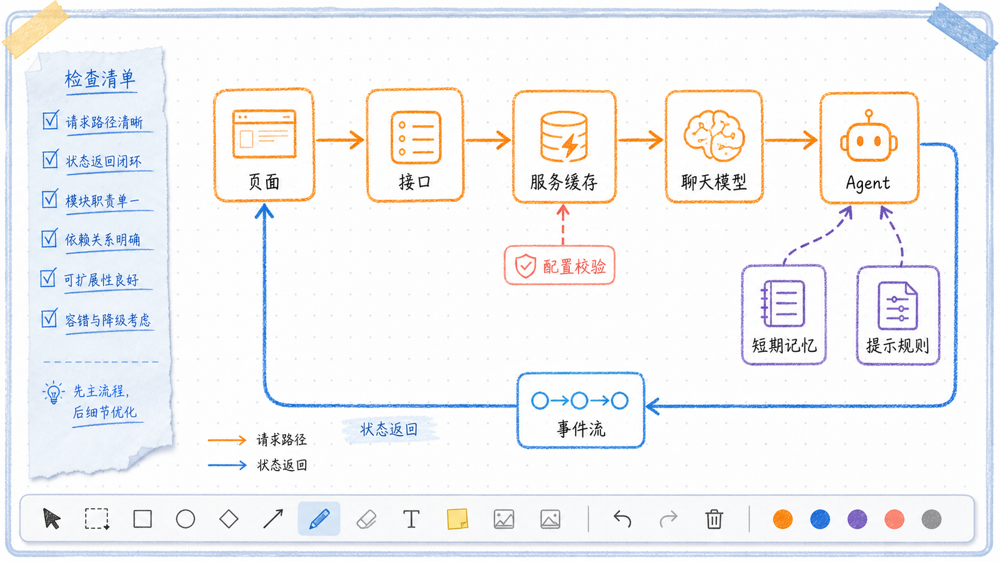

# 套餐客服 Agent 项目学习总览

---
参考资料：
- [LangChain Overview](https://docs.langchain.com/oss/python/langchain/overview)
---

这个示例的目标不是实现真实套餐系统，而是把一个最小 Agent 应用拆成可观察的层：Prompt、模型、Agent、状态、HTTP 服务和 WebUI。业务场景保持简单，便于把注意力放在调用边界和数据流上。

## 项目的主要入口

| 入口或模块 | 主要职责 | 阅读重点 |
| --- | --- | --- |
| `code/web_ui.py` | 收集输入、选择模型与温度、消费 SSE | 前端不直接调用模型，而是调用后端 API |
| `code/agent_service.py` | 定义 FastAPI 接口、SSE 事件、Agent 缓存 | 请求如何进入 Agent，结果如何返回浏览器 |
| `code/agent_runtime.py` | 创建 `create_agent()` 与管理会话配置 | 模型、Prompt、结构化输出、记忆如何组合 |
| `code/utils/llms.py` | 创建 `ChatOpenAI` | 多厂商 OpenAI-compatible 配置与采样参数 |
| `code/utils/models.py` | 定义 Pydantic Schema | 请求体、响应体和套餐推荐结构的边界 |
| `code/prompts/` | 保存系统与 Human Prompt | 规则与用户输入如何分离 |

## 一次流式请求如何经过项目

页面把用户输入、`conversation_id`、`llm_type` 和 `temperature` 提交到 `POST /v1/chat`。后端按照“模型接口 + 温度”寻找或创建对应的 `AgentPackageService`，再把用户输入交给 Agent。

Agent 执行时，`ToolStrategy` 以工具调用参数的形式生成 `PackageRecommendation` 所需字段。后端从参数增量中提取 `reply`，先发送 `token` 事件；Agent 完成后读取 `structured_response`，发送 `final` 和 `done` 事件。WebUI 用最后一条 `final` 结果覆盖流式阶段的临时文本。

## 先建立的三个边界

**WebUI 负责交互，不负责业务推理。** `web_ui.py` 只组装请求、读取 SSE 和更新页面，不包含套餐判断规则。

**HTTP 服务负责协议转换，不负责 Prompt 设计。** `agent_service.py` 将 Pydantic 请求体转换为 Agent 调用，并把异步输出编码为 SSE 数据帧。

**Agent 运行层负责模型调用与状态。** `agent_runtime.py` 保存 Prompt 加载、`create_agent()`、`thread_id` 和结构化输出读取逻辑。

这种分层的价值在于：替换前端、增加命令行客户端或修改接口协议时，不需要改动 Agent 的核心规则；替换模型时，不需要改动 SSE 和页面逻辑。

## 建议的代码阅读顺序

1. 先读 `code/utils/models.py`，明确输入、输出和结构化响应字段。
2. 再读 `code/prompts/` 与 `code/agent_runtime.py`，理解 Agent 接收什么、返回什么、怎样记住会话。
3. 阅读 `code/utils/llms.py`，理解模型厂商与温度怎样变成 `ChatOpenAI` 对象。
4. 阅读 `code/agent_service.py`，理解普通 JSON 和 SSE 两种 API 返回。
5. 最后阅读 `code/web_ui.py`，把页面控件与后端请求字段一一对应。

相关细节参考 [[01_PromptTemplate与外部Prompt文件]]、[[02_create_agent与Agent运行层]]、[[03_PydanticSchema与ToolStrategy结构化输出]]、[[04_短期记忆与Agent缓存]]、[[05_运行时模型选择与LLM_TEMPERATURE]] 和 [[06_FastAPI_SSE与WebUI]]。
