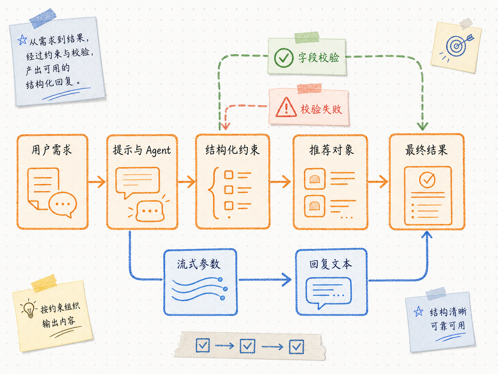

# Pydantic Schema 与 ToolStrategy 结构化输出

---
参考资料：
- [LangChain Structured output](https://docs.langchain.com/oss/python/langchain/structured-output)
- [Pydantic Fields](https://docs.pydantic.dev/latest/concepts/fields/)
---

## Schema 在项目中的作用

**Schema 是数据的结构契约。** 它规定 Agent 最终结果必须包含哪些字段、字段可以取什么值、哪些值不允许为空。页面和后端因此不必从自然语言里猜测“推荐套餐”和“推荐依据”分别在哪里。

项目使用 `PackageRecommendation` 描述套餐推荐结果：

| 字段 | 类型与约束 | 业务含义 |
| --- | --- | --- |
| `reply` | 非空 `str` | 直接展示给用户的自然语言回复 |
| `recommended_plan` | 固定套餐枚举或 `None` | 信息充分时给出套餐；不足时允许不推荐 |
| `recommendation_basis` | 非空 `str` | 说明推荐依据或待补充条件 |

`ConfigDict(extra="forbid")` 禁止 Schema 外的字段静默通过。`Field(min_length=1)` 防止关键文本为空。`Literal[...] | None` 把套餐名限制在业务允许的范围内，同时保留“信息不足”的状态。

## ToolStrategy 如何参与结果生成



`create_agent()` 的 `response_format=ToolStrategy(schema=PackageRecommendation)` 会把 Pydantic 模型转换为模型可理解的参数 Schema，并要求模型以工具调用参数提交结果。Agent 在运行结束时校验数据，并把通过校验的 Pydantic 实例保存到状态的 `structured_response` 字段。

```python
result = await self._agent.ainvoke(...)
structured = result["structured_response"]
```

这不是调用真实业务工具。项目的 `tools=[]` 表明没有“查询套餐”或“写数据库”等外部动作；ToolStrategy 只借用工具调用协议，解决“模型输出必须符合指定结构”的问题。

## 为什么 SSE 从 tool_call_chunks 读取内容

ToolStrategy 的流式增量位于 `AIMessageChunk.tool_call_chunks` 的 `args` 中，而不是普通助手文本的 `content` 中。`astream_tool_arguments()` 因此产出参数 JSON 片段，服务层累积片段并尝试提取 `reply` 字段。

```text
参数增量 -> 累积为不完整 JSON -> 提取 reply 当前值 -> SSE token 事件
```

`token` 事件传给页面的是当前 `reply` 的完整快照，而不是可直接盲目拼接的单个字符。前端用最新快照覆盖助手占位消息，避免重复内容。流结束后，`final` 事件携带经过 Pydantic 校验的完整结果。

## 结构化输出的失败边界

- **字段缺失或类型不符**：Pydantic 校验无法得到有效的 `PackageRecommendation`。
- **枚举不匹配**：`recommended_plan` 不在预定义套餐范围内。
- **模型中断**：流式执行结束后，checkpointer 中可能没有 `structured_response`。
- **Schema 与业务不一致**：代码允许的字段值不能表达真实业务状态时，模型即使校验通过也可能产生错误业务结果。

生产场景还需要增加重试、记录原始响应、降级提示和人工检查；本项目用 `RuntimeError` 明确暴露“流式结束后没有有效结构化结果”的学习边界。

相关的 Agent 运行方式参考 [[02_create_agent与Agent运行层]]；会话状态如何保存参考 [[04_短期记忆与Agent缓存]]。
