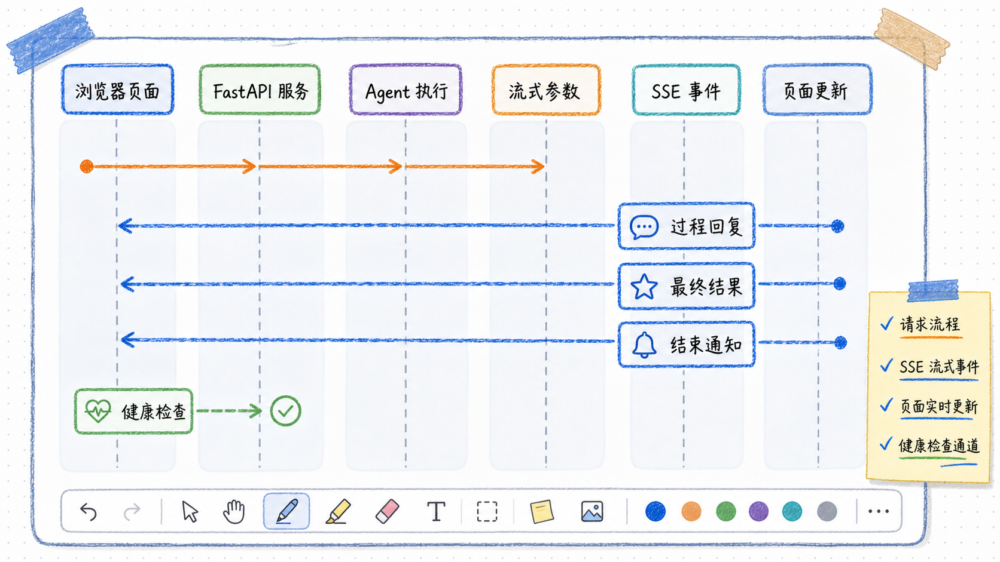

# FastAPI、SSE 与 WebUI

---
参考资料：
- [LangChain Streaming](https://docs.langchain.com/oss/python/langchain/streaming)
- [FastAPI StreamingResponse](https://fastapi.tiangolo.com/advanced/custom-response/#streamingresponse)
---

## 后端接口的输入与输出

`POST /v1/chat` 接收 `ChatRequest`。请求体由 `message`、`user_id`、`conversation_id`、`stream`、`llm_type` 和 `temperature` 构成。

当 `stream=false` 时，接口返回普通 JSON：

```json
{
  "content": "可直接展示的完整文本",
  "structured_response": {
    "reply": "...",
    "recommended_plan": "校园套餐",
    "recommendation_basis": "..."
  }
}
```

当 `stream=true` 时，接口返回 `text/event-stream`。每条 SSE 数据帧使用 `data: <JSON>` 形式，客户端按行读取即可。

## SSE 事件的含义



| 事件类型 | 何时发送 | `content` 的含义 |
| --- | --- | --- |
| `token` | `reply` 字段出现新的可见内容时 | 当前 `reply` 的完整快照 |
| `final` | Agent 已得到有效结构化响应时 | 格式化后的完整回复，并附带 `structured_response` |
| `done` | 本轮 SSE 结束时 | 不携带回复内容 |

项目的 `token` 不是底层文本模型 `content` 的原始 token，而是从 ToolStrategy 工具参数增量中恢复出的 `reply` 快照。前端必须覆盖当前助手占位消息，不能把每个快照继续拼接；否则会出现重复文本。

## async generator 在服务层的作用

`event_stream()` 是一个异步生成器：它在 `async for` 中等待 Agent 的下一段输出，每拿到一段就 `yield` 一条 SSE 字符串。`StreamingResponse` 将这些字符串持续写入 HTTP 响应，而不必等 Agent 全部完成。

```python
async def event_stream() -> AsyncIterator[str]:
    async for arguments_delta in agent_service.astream_tool_arguments(...):
        yield _sse({"type": "token", "content": current_reply})
```

`AsyncIterator[str]` 表示该函数会异步地产出多个字符串。它不是一次性返回 `str`，而是“等待下一段数据到来，再返回一段数据”的接口形状。

## WebUI 如何消费事件

`web_ui.py` 用 `requests.post(..., stream=True)` 发起请求，再用 `response.iter_lines()` 逐行读取 SSE。解析到 `token` 时更新聊天框；解析到 `final` 时更新聊天框和结构化结果面板。

页面的 `/health` 检查只说明 FastAPI 服务可访问。模型厂商的密钥、接口地址和模型名会在第一次实际聊天请求创建 Agent 时校验，因此“健康检查成功”不等于所有模型配置都可用。

## 复习重点

- **SSE 适合单向、持续的服务端推送。** 本项目使用它展示模型生成过程。
- **流式协议与业务结构要同时设计。** `token`、`final`、`done` 的职责必须明确。
- **前端应区分临时流式文本和最终校验结果。** 最终页面结果以 `final` 中的 Pydantic 数据为准。
- **模型配置错误应在后端暴露为明确 HTTP 错误。** 前端负责展示，不应自行猜测要切换哪个模型。

结构化响应的来源参考 [[03_PydanticSchema与ToolStrategy结构化输出]]，模型选择参数参考 [[05_运行时模型选择与LLM_TEMPERATURE]]。
