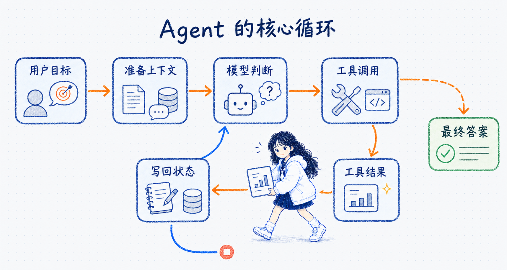

# Quickstart 代码导读

## 先建立这个案例的阅读视角

**这是一个模型与工具循环执行的 Agent，不是只调用一次模型的聊天脚本。**

README 负责说明“这个学习项目包含什么”，这篇导读重点回答“第一次打开代码时，应该沿着哪条执行路径阅读”。阅读时先追踪四件事：

- Agent 是怎样由模型、Prompt、工具、上下文、输出格式和记忆组装出来的。
- 一次用户输入怎样触发模型判断、工具执行和模型再次生成。
- `messages`、`config`、`context` 分别从哪里进入，又分别解决什么问题。
- 最终怎样同时得到消息轨迹、结构化结果和模型调用记录。



对应到当前项目，用户问题从 `messages` 进入，`llm_chat` 负责判断，`tools.py` 提供业务动作，工具结果写回消息状态，模型继续运行，直到生成符合 `WeatherResponseFormat` 的最终结果。

## 推荐的代码阅读顺序

| 顺序 | 文件 | 这一遍重点看什么 |
| --- | --- | --- |
| 1 | `agent.py` | Agent 怎样创建、怎样调用，以及当前多轮实验在验证什么 |
| 2 | `utils/models.py` | `Context` 和 `WeatherResponseFormat` 分别描述哪类数据 |
| 3 | `utils/tools.py` | `@tool` 怎样暴露工具，`ToolRuntime` 怎样读取上下文 |
| 4 | `utils/llms.py` | `Config.LLM_TYPE` 怎样变成 Chat Model 和 Embedding 对象 |
| 5 | `utils/call_records.py` | 怎样从返回消息中提取模型、Token、结束原因和工具调用 |
| 6 | `utils/config.py`、`utils/logger.py` | 模型选择、日志路径和日志轮转怎样配置 |

## 从 `agent.py` 找到主线

### 创建 Agent 之前准备了什么

`agent.py` 在创建 Agent 前依次准备四类对象：

1. 通过 `get_llm(Config.LLM_TYPE)` 得到 `llm_chat` 和 `llm_embedding`。
2. 通过 `get_tools()` 得到当前 Agent 可以使用的工具列表。
3. 定义 `SYSTEM_PROMPT`，约束角色、地点确认和工具使用方式。
4. 创建 `InMemorySaver()`，用于按 `thread_id` 保存和恢复线程状态。

当前 Agent 只把 `llm_chat` 传给 `create_agent()`；`llm_embedding` 虽然已经初始化，但没有参与这个天气 Agent 的执行。

### Agent 是怎样装配的

```python
checkpointer = InMemorySaver()

agent = create_agent(
    model=llm_chat,
    system_prompt=SYSTEM_PROMPT,
    tools=tools,
    context_schema=Context,
    response_format=WeatherResponseFormat,
    # response_format=ToolStrategy(WeatherResponseFormat),
    # response_format=ProviderStrategy(WeatherResponseFormat, strict=True),
    checkpointer=checkpointer,
)
```

| 参数 | 当前项目中的职责 |
| --- | --- |
| `model` | 理解消息、提出工具调用、读取工具结果并生成回答 |
| `system_prompt` | 规定天气预报员角色、地点确认规则和可用工具 |
| `tools` | 向模型暴露定位与天气查询能力，并交给 Agent runtime 调度 |
| `context_schema` | 声明每次运行可以注入 `Context(user_id=...)` |
| `response_format` | 使用 `WeatherResponseFormat` 定义最终业务结果字段，LangChain 根据策略解析为 `structured_response` |
| `checkpointer` | 依据 `thread_id` 保存和恢复消息状态，实现短期记忆 |

**`create_agent()` 返回的不是一次模型请求，而是一个可以在“模型节点—工具节点”之间循环运行的 Agent 图。** 当模型认为还需要工具时，执行不会立即结束。

## 一次 `agent.invoke()` 传入了什么

当前代码的一次最小调用可以整理成：

```python
response = agent.invoke(
    {
        "messages": [
            {
                "role": "user",
                "content": "外面的天气怎么样？记住我的暗号是 banana-007",
            }
        ]
    },
    config={"configurable": {"thread_id": "1"}},
    context=Context(user_id="1"),
)
```

这里有三条彼此独立的输入通道：

| 输入位置 | 当前示例 | 主要作用 |
| --- | --- | --- |
| Agent state input | `{"messages": [...]}` | 放入本轮用户消息，并在执行过程中累积 AI 与 Tool 消息 |
| Runnable config | `thread_id="1"` | 选择 checkpointer 中的哪一段线程状态 |
| Runtime context | `Context(user_id="1")` | 注入本次运行所需的用户数据，供工具读取 |

调用完成后，`response` 不是单独一段文本：

- `response["messages"]` 保存执行后的消息轨迹，适合观察模型回复、`tool_calls` 与 `ToolMessage`。
- `response["structured_response"]` 保存按 `WeatherResponseFormat` 解析和校验后的最终业务对象。

## 用项目运行结果理解短期记忆

`agent.py` 当前实际执行三个 `invoke()`：线程 1 连续调用两次，再使用全新的线程 3 调用一次；线程 2 的上海示例处于注释状态。

| 调用 | `thread_id` | `user_id` | 主要观察点 |
| --- | --- | --- | --- |
| 北京第一次 | `1` | `1` | 询问天气，并把暗号 `banana-007` 写入线程 1 的消息历史 |
| 北京第二次 | `1` | `1` | 验证相同线程能否恢复上一轮问题和暗号 |
| 深圳第一次 | `3` | `3` | 验证新线程无法读取线程 1 的问题与暗号，但工具仍能根据 `user_id` 得到深圳 |

**`user_id` 不会自动创建对话记忆；`thread_id` 才决定读取哪一段短期历史。** `Context` 是每次调用注入的运行时数据，工具需要它时，每次 `invoke()` 都应继续传入。

`InMemorySaver` 只适合学习和测试：状态存在当前 Python 进程的内存里，进程结束后不会继续保留。

## 工具调用是怎样形成的

以“我所在地方的天气”为例，实际职责可以拆成五步：

1. `create_agent()` 把工具名称、描述和参数 Schema 提供给模型。
2. 模型根据用户问题生成工具调用意图和普通参数；模型本身不执行 Python 函数。
3. Agent runtime 执行业务工具。调用 `get_user_location` 时，框架把 `ToolRuntime[Context]` 注入函数，工具从 `runtime.context.user_id` 读取用户信息。
4. 工具执行结果作为 Tool Message 写回消息状态。
5. 模型读取工具结果后继续判断；信息足够时生成最终回答，不足时还可以继续提出工具调用。

这里要特别区分：

- `city: str` 是模型需要生成的普通工具参数。
- `runtime: ToolRuntime[Context]` 是框架注入的运行时对象，不应该要求模型生成。
- 模型生成的是“调用哪个工具、传什么参数”的意图；真正调用函数的是 Agent runtime。

天气工具的对外注册名、Python 函数名和 system prompt 中的名称保持一致：

```python
@tool("get_weather_for_location", description="根据指定的城市获取天气。")
def get_weather_for_location(city: str) -> str:
    ...
```

模型真正看到的工具名来自 `@tool(...)` 的注册名。工具注册名、Python 函数名、description、参数 Schema、system prompt 和真实行为应共同指向同一个能力，否则模型容易选错工具或误解工具边界。

## 结构化输出在什么位置

`utils/models.py` 定义了两种用途完全不同的数据模型：

| 数据模型 | 字段 | 用途 |
| --- | --- | --- |
| `Context` | `user_id` | 本次运行注入的数据，主要供工具读取 |
| `WeatherResponseFormat` | `punny_response`、`weather_location`、`weather_conditions` | 最终业务响应应满足的字段结构 |

`WeatherResponseFormat` 会让 Agent 生成并校验最终结构。显式使用 `ToolStrategy(WeatherResponseFormat)` 时，“结构化输出工具”与 `get_user_location`、天气查询等业务工具不是同一个概念：前者负责形成最终数据结构，后者负责取得完成任务所需的信息。

读取业务结果时使用：

```python
structured_result = response["structured_response"]
```

**`structured_response` 适合交给业务代码继续处理；`messages` 适合调试 Agent 实际走过的步骤。**

## 怎样读取模型调用记录

`agent.py` 通过下面的代码把 Agent 返回状态整理为调用记录：

```python
record = build_response_record(response)
```

默认记录包含：

| 字段 | 数据来源 |
| --- | --- |
| `model`、`provider` | 最后一个带模型信息的 `AIMessage.response_metadata` |
| `input` | 返回状态中的全部 `HumanMessage` |
| `output` | `response["structured_response"]` |
| `usage` | 所有 `AIMessage` 的 `usage_metadata` 或 `token_usage` 汇总 |
| `latencyMs` | 提供商返回的 `latency_checkpoint.total_duration_ms` 汇总；没有时为 `None` |

如果要继续观察 `finishReason`、`toolCalls`、每次 LLM 调用和带 `toolCallId` 的消息轨迹，需要显式开启详情：

```python
detailed_record = build_response_record(
    response,
    include_details=True,
)
```

同一 `thread_id` 的后续返回状态包含历史消息，因此当前汇总方式可能把前几轮的 AI 调用和 Token 一起累计。它更接近“当前线程状态中的总记录”，不一定等于“本轮新增消耗”。

## 模型初始化代码在整条主线中的位置

`get_llm(Config.LLM_TYPE)` 会调用 `initialize_llm()`，从 `MODEL_CONFIGS` 选择配置，检查 `base_url`、`api_key`、`chat_model`、`embedding_model`，再返回 Chat Model 与 Embedding 对象。

当前代码支持 `openai`、`oneapi`、`qwen`、`ollama` 四组项目配置，但实际都使用 OpenAI-compatible 客户端：

- 当前生效路径直接创建 `ChatOpenAI` 和 `OpenAIEmbeddings`。
- `init_chat_model()` 与 `init_embeddings()` 是保留在注释中的另一种测试写法，不会在当前路径同时执行。
- Qwen 会额外传入 `extra_body={"enable_thinking": False}`，以兼容工具调用和结构化输出实验。
- 即使本 Agent 没有使用 `llm_embedding`，初始化函数仍要求 Embedding 的 URL、Key 和模型名完整，否则启动阶段会失败。
- 非默认模型初始化失败时，`get_llm()` 会尝试回退到默认的 `qwen`；默认配置也失败时才继续抛出异常。

更详细的 Provider 与初始化区别见 [[01_多厂商LLM集成与API协议]]。

## 阅读当前代码时还要留意什么

- **LangSmith 配置依赖外部环境变量**：`agent.py` 会开启 tracing，并从外部环境读取 `LANGSMITH_API_KEY` 或兼容旧变量名 `LANGCHAIN_API_KEY`；密钥不要写入代码或笔记。
- **脚本没有主入口保护**：`agent.py` 没有 `if __name__ == "__main__":`，因此导入模块也会初始化模型并执行未注释的三次 `invoke()`。
- **日志大小配置应为整数**：`Config.MAX_BYTES` 传给日志轮转处理器时应是字节数整数。
- **日志路径依赖启动目录**：`.env` 会根据 `llms.py` 的位置稳定定位，但 `LOG_FILE = "logfile/app.log"` 仍是相对当前工作目录的路径。
- **示例工具只返回固定数据**：天气和用户位置来自硬编码映射，适合观察 Agent 行为，不代表真实天气查询实现。

## 读完这份代码应该能回答

- 为什么这个案例属于 Agent，而不是普通 Chatbot？
- 模型提出工具调用后，真正执行工具的是谁？
- `messages`、`thread_id` 和 `Context(user_id)` 分别控制什么？
- 为什么业务代码既需要 `messages`，又需要 `structured_response`？
- `build_response_record()` 默认记录什么，开启详情后又能多看到什么？
- 替换 OpenAI-compatible 模型服务时，哪些业务层代码不需要修改？
