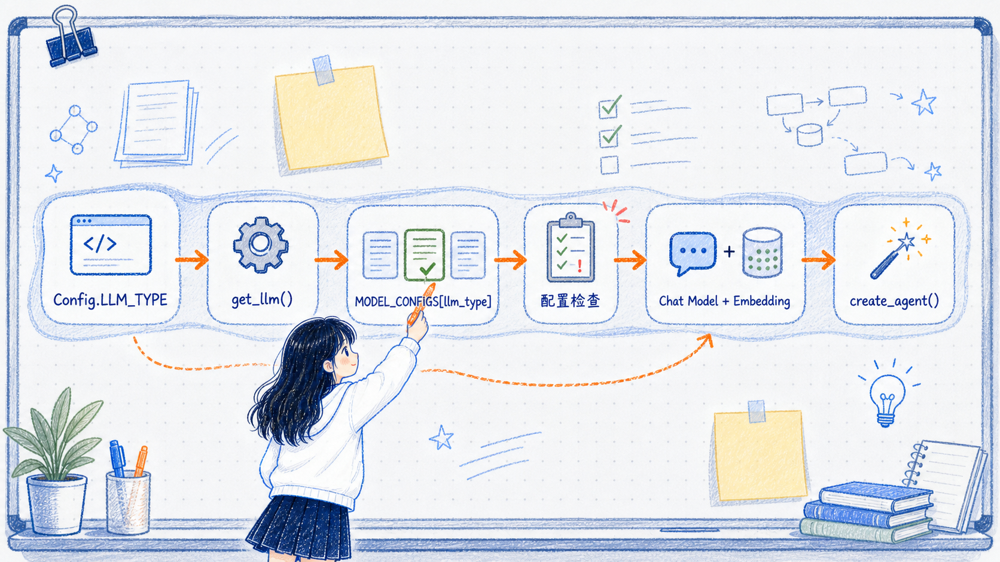

# 多厂商 LLM 集成与 API 协议

---
参考资料：
- [LangChain Providers and models](https://docs.langchain.com/oss/python/concepts/providers-and-models)
- [LangChain Models](https://docs.langchain.com/oss/python/langchain/models)
- [LangChain ChatOpenAI](https://docs.langchain.com/oss/python/integrations/chat/openai)
- [OpenAI Chat Completions](https://platform.openai.com/docs/api-reference/chat/create)
- [OpenAI Responses](https://platform.openai.com/docs/api-reference/responses/create)
- [Anthropic Messages API](https://platform.claude.com/docs/en/build-with-claude/working-with-messages)
---

## 项目代码是怎么组织的

这个项目把模型接入集中到了 `utils/llms.py`。`agent.py` 不需要分别了解 OpenAI、Qwen、OneAPI 或 Ollama 的环境变量和初始化参数，只需要把 `Config.LLM_TYPE` 交给 `get_llm()`，再接收统一返回的 Chat Model 与 Embedding 对象。

**集中接入多个模型，不是启动时把所有模型都创建出来，而是把多组配置集中保存，在运行时根据 `llm_type` 只选择其中一组。**

### `llms.py` 的主要结构

| 组成部分 | 主要职责 |
| --- | --- |
| `.env` 加载 | 从项目根目录读取各厂商 URL、API Key 和模型名 |
| `MODEL_CONFIGS` | 把分散的环境变量整理成统一配置结构 |
| `LLMInitializationError` | 把初始化阶段的错误包装成项目自己的异常类型 |
| `initialize_llm()` | 选择配置、检查必填字段并创建 Chat/Embedding 对象 |
| `get_llm()` | 给 `agent.py` 提供统一入口，并在初始化失败时执行默认模型回退 |

主调用链可以先记成：



### 第一步：集中加载各厂商配置

`llms.py` 先定位项目根目录下的 `.env`，然后把四组环境变量整理进同一个 `MODEL_CONFIGS` 字典：

```python
PROJECT_ROOT = Path(__file__).resolve().parents[1]
ENV_FILE = PROJECT_ROOT / ".env"

load_dotenv(dotenv_path=ENV_FILE, override=False)

MODEL_CONFIGS = {
    "openai": {
        "base_url": os.getenv("OPENAI_BASE_URL"),
        "api_key": os.getenv("OPENAI_API_KEY"),
        "chat_model": os.getenv("OPENAI_CHAT_MODEL"),
        "embedding_model": os.getenv("OPENAI_EMBEDDING_MODEL"),
    },
    "oneapi": {
        "base_url": os.getenv("ONEAPI_BASE_URL"),
        "api_key": os.getenv("ONEAPI_API_KEY"),
        "chat_model": os.getenv("ONEAPI_CHAT_MODEL"),
        "embedding_model": os.getenv("ONEAPI_EMBEDDING_MODEL"),
    },
    "qwen": {
        "base_url": os.getenv("QWEN_BASE_URL"),
        "api_key": os.getenv("QWEN_API_KEY"),
        "chat_model": os.getenv("QWEN_CHAT_MODEL"),
        "embedding_model": os.getenv("QWEN_EMBEDDING_MODEL"),
    },
    "ollama": {
        "base_url": os.getenv("OLLAMA_BASE_URL"),
        "api_key": os.getenv("OLLAMA_API_KEY", "ollama"),
        "chat_model": os.getenv("OLLAMA_CHAT_MODEL"),
        "embedding_model": os.getenv("OLLAMA_EMBEDDING_MODEL"),
    },
}
```

四组配置拥有相同的字段名，所以后续逻辑不需要再为每个厂商分别写一套变量读取代码。调用方只需要使用：

```python
config = MODEL_CONFIGS[llm_type]
```

就可以得到当前模型对应的完整配置。

### 第二步：选择配置并提前检查

`initialize_llm()` 先检查项目是否支持传入的 `llm_type`，再检查这一组配置是否完整：

```python
def initialize_llm(llm_type: str = DEFAULT_LLM_TYPE):
    if llm_type not in MODEL_CONFIGS:
        raise ValueError(
            f"不支持的 LLM 类型：{llm_type}。"
            f"可用类型：{list(MODEL_CONFIGS.keys())}"
        )

    config = MODEL_CONFIGS[llm_type]

    required_fields = (
        "base_url",
        "api_key",
        "chat_model",
        "embedding_model",
    )

    missing_fields = [
        field
        for field in required_fields
        if not config.get(field)
    ]

    if missing_fields:
        raise ValueError(
            f"{llm_type} 缺少配置："
            f"{', '.join(missing_fields)}"
        )
```

这一步把“缺少环境变量”提前转换成明确的配置错误，避免等到真正发请求时才发现地址、Key 或模型名为空。

当前代码把 `embedding_model` 也列为必填项，所以即使本次 Agent 只使用 Chat Model，只要 Embedding 没配置，初始化仍然会失败。这是当前项目“Chat 与 Embedding 一起初始化”的直接结果。

### 第三步：通过统一函数创建模型对象

配置检查通过后，`initialize_llm()` 使用同一组 `config` 创建 Chat Model 和 Embedding。无论前面选择的是哪一个 `llm_type`，函数最后都返回相同形状的结果：

```python
# 使用ChatOpenAI和OpenAIEmbeddings对象，创建对话 LLM 实例  
llm_chat = ChatOpenAI(  
	# 指定后端服务地址  
	base_url=config["base_url"],  
	# 指定访问后端的 API Key            api_key=config["api_key"],  
	# 指定使用的聊天模型名称  
	model=config["chat_model"],  
	# 控制模型输出的随机性，这里使用统一默认值  
	temperature=DEFAULT_TEMPERATURE,  
	# 设置单次调用的超时时间（秒），避免长时间阻塞  
	timeout=30,  
	# 设置失败时的最大重试次数，提高稳定性  
	max_retries=2,  
	# 思考模式不能强制指定工具；结构化输出与思考模式冲突时,以兼容 ToolStrategy 结构化输出，应关闭思考模式  
	extra_body=(  
		{"enable_thinking": False}  
		if llm_type == "qwen"  
		else None  
	)  
)  
# 创建向量嵌入模型实例  
llm_embedding = OpenAIEmbeddings(  
	# 嵌入服务的基础 URL，与 chat 使用同一后端  
	base_url=config["base_url"],  
	# 访问嵌入服务的 API Key            api_key=config["api_key"],  
	# 嵌入模型名称  
	model=config["embedding_model"],  
	# 部署名称，一般与模型名保持一致  
	deployment=config["embedding_model"]  
)  

# 返回对话模型和嵌入模型两个实例  
return llm_chat, llm_embedding 
```

这里真正实现统一的关键不是类名，而是所有厂商配置最终都被转换成了同样的四个输入：`base_url + api_key + chat_model + embedding_model`。

### 第四步：向 `agent.py` 暴露一个统一入口

`get_llm()` 把 `initialize_llm()` 再封装一层：

```python
def get_llm(llm_type: str = DEFAULT_LLM_TYPE):
    try:
        return initialize_llm(llm_type)
    except LLMInitializationError as e:
        logger.warning(f"使用默认配置重试: {str(e)}")

        if llm_type != DEFAULT_LLM_TYPE:
            return initialize_llm(DEFAULT_LLM_TYPE)

        raise
```

`agent.py` 因此只保留一行模型接入代码：

```python
llm_chat, llm_embedding = get_llm(Config.LLM_TYPE)
```

后面创建 Agent 时只传入 `llm_chat`。`agent.py` 不需要知道当前对象来自 OpenAI、Qwen、OneAPI 还是 Ollama，也不需要重复模型初始化参数。

## 当前项目怎样接入多个模型

当前项目采用的是“**配置集中管理 + 统一初始化入口 + 运行时选择一组配置**”的方式，但这里的“接入多个模型”有一个明确前提：**当前生效代码始终使用 `ChatOpenAI` 创建聊天模型，并使用 `OpenAIEmbeddings` 创建向量模型，所以后端必须提供它们能够理解的 OpenAI-compatible API。**

因此，当前项目可以直接扩展的是“不同地址、不同模型名的 OpenAI-compatible 模型服务”，而不是任意厂商的原生 API。新增一组配置时，需要在 `.env` 和 `MODEL_CONFIGS` 中加入 URL、Key、Chat Model 与 Embedding Model，再让 `Config.LLM_TYPE` 选择它；业务层仍然通过 `get_llm()` 获取统一对象。

| 当前创建的对象 | 后端至少需要兼容什么 |
| --- | --- |
| `ChatOpenAI` | OpenAI 风格的聊天请求与响应；当前基础路径主要依赖 Chat Completions 兼容接口 |
| `OpenAIEmbeddings` | OpenAI 风格的 Embeddings 请求与响应 |
| 当前 Agent 的 Tools 与 `ToolStrategy` | 在基础聊天兼容之外，还要正确支持 tools、tool calls、工具调用 ID 和结构化输出相关语义 |

**“能返回一段文本”只能证明最基础的聊天调用可用，不能证明工具调用、结构化输出、streaming、usage metadata 或 Provider 扩展字段都完全兼容。** 这些能力需要针对具体服务逐项验证。

如果后端只提供 Anthropic、Gemini 或 Ollama 等厂商的原生协议，就不能只替换 `base_url` 后继续使用 `ChatOpenAI`。此时应改用对应的 LangChain integration 和模型类，例如 `ChatAnthropic`、`ChatGoogleGenerativeAI` 或 `ChatOllama`；Embedding 也要单独选择兼容的实现。

所以，这套设计统一的是项目内部的配置选择和模型获取入口，并没有抹平 API 协议与模型能力差异。当前四组配置名可以叫 `openai`、`qwen`、`oneapi`、`ollama`，但只要最终创建的仍是 `ChatOpenAI`，对应地址就必须走 OpenAI-compatible 接口。

## 两种 API 接入方式

模型服务的 API 接入可以分为原生 Provider API 与 OpenAI-compatible endpoint。它们决定客户端按什么请求和响应协议与后端通信。

| 接入方式 | 示例 | 优点 | 局限 |
| --- | --- | --- | --- |
| 原生 Provider integration | `ChatOpenAI`、`ChatAnthropic`、`ChatGoogleGenerativeAI` | 能较完整地使用厂商特有能力和元数据 | 需要安装并配置对应 integration package |
| OpenAI-compatible endpoint | `ChatOpenAI(base_url=...)` | 一个客户端可连接网关、本地服务和兼容厂商 | 非标准字段可能丢失，兼容能力需要逐项验证 |

LangChain 的统一模型接口可以降低业务代码的替换成本，但不代表所有模型拥有相同能力。切换模型服务后仍要分别验证：

- 普通消息调用。
- tool calling。
- structured output。
- streaming。
- usage metadata。
- 多模态与推理参数。

## 模型初始化相关笔记

- [10_ChatOpenAI对象详解](<10_ChatOpenAI对象详解.md>)：单独理解具体 `ChatOpenAI` 对象。
- [11_init_chat_model方法详解](<11_init_chat_model方法详解.md>)：理解工厂参数、Provider 映射、固定模式与运行时配置。
- [09_ChatOpenAI与init_chat_model的区别](<09_ChatOpenAI与init_chat_model的区别.md>)：最后比较两种初始化方式。
