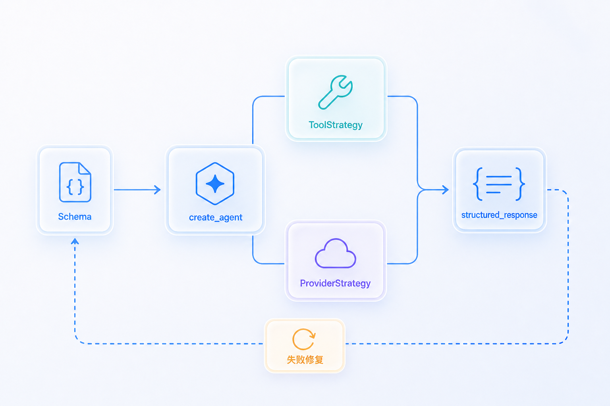

# 结构化输出

---
参考资料：
- [LangChain：Structured output](https://docs.langchain.com/oss/python/langchain/structured-output)
- [阿里云百炼：OpenAI 兼容 Chat API](https://help.aliyun.com/zh/model-studio/qwen-api-via-openai-chat-completions)
- [LangGraph：Unsafe msgpack deserialization 安全公告](https://github.com/langchain-ai/langgraph/security/advisories/GHSA-g48c-2wqr-h844)
- [JSON Schema：基础](https://json-schema.org/understanding-json-schema/basics)
---

## 结构化输出解决什么问题

**结构化输出让模型按照事先约定的 Schema 返回数据，使业务代码能够按字段读取、校验和继续处理结果。**

Schema 本身不是模型返回的数据，而是字段、类型、必填项和约束条件的说明。关于 Schema、数据实例、必填、可空与可省略的区别，可以参考 [[12_Schema基础概念]]。

如果只让模型返回自然语言，业务代码往往需要通过字符串切割或正则表达式猜测字段。即使 Prompt 要求模型“返回 JSON”，模型也可能增加 Markdown 代码围栏、遗漏字段，或者返回错误类型。

学习结构化输出时，需要区分三个层次：

| 层次 | 解决的问题 | 仍然不能保证什么 |
| --- | --- | --- |
| 有效 JSON | 输出能否被 JSON 解析器读取 | 字段是否齐全、类型是否正确 |
| 符合 Schema | 字段、类型和结构是否满足约束 | 字段值是否真实、业务语义是否正确 |
| 业务校验通过 | 数据是否符合当前业务规则 | 外部数据源本身是否正确 |

**符合 JSON Schema 不等于回答事实正确。** Schema 可以要求 `weather_location` 必须是字符串，却不能保证模型填入的城市为用户真实所在地。

## 底层 API 背景放在哪里看

JSON Mode、Function Calling strict、OpenAI `response_format=json_schema`、Responses API 的 `text.format` 都属于底层 API 协议层能力。

底层 API 怎样直接实现结构化输出，可以参考 [[13_OpenAI API结构化输出]]。复习重点不在于记忆 API 字段，而在于理解：

- `ToolStrategy` 为什么可以借助工具调用路线得到结构化结果。
- `ProviderStrategy` 为什么依赖 Provider 原生 Structured Outputs 能力。
- OpenAI-compatible 服务能聊天、能工具调用，不等于一定支持原生 `json_schema`。

## LangChain 怎样封装结构化输出

LangChain Agent 通过 `create_agent(response_format=...)` 把 Python 类型或 JSON Schema 转换为结构化输出策略。完成后，解析结果统一放入 Agent 最终状态的 `structured_response` 字段。

| 策略 | 工作方式 | 主要依赖 | 适用场景 |
| --- | --- | --- | --- |
| `ToolStrategy` | 把目标 Schema 表示成一个人工工具，让模型通过工具参数提交结果，再由 LangChain 解析和校验 | 模型能够稳定进行工具调用 | OpenAI-compatible 服务或缺少原生 Structured Outputs 的模型 |
| `ProviderStrategy` | 调用 Provider 原生结构化输出能力 | Provider、模型和 integration 都支持原生 Structured Outputs | 希望在模型生成阶段严格约束最终结果 |
| 直接传 Schema 类型 | LangChain 根据模型能力信息自动选择策略 | profile 或版本内置判断能够识别实际模型能力 | 模型来源和能力信息明确时 |

三种写法表达的意图不同：

```python
from langchain.agents.structured_output import ProviderStrategy, ToolStrategy

# 明确使用工具调用策略
response_format = ToolStrategy(WeatherResponseFormat)

# 明确使用 Provider 原生策略
response_format = ProviderStrategy(WeatherResponseFormat, strict=True)

# 让 LangChain 自动选择策略
response_format = WeatherResponseFormat
```

`ToolStrategy` 细节参考 [[14_ToolStrategy详解]]，`ProviderStrategy` 细节参考 [[15_ProviderStrategy详解]]。两种策略的选择差异参考 [[16_ToolStrategy和ProviderStrategy区别]]。



## 当前项目怎样实现结构化输出

当前 Quickstart 采用的是下面这条装配路线：

**Qwen OpenAI-compatible 接口 + `ChatOpenAI` + `create_agent` + 直接传入 `WeatherResponseFormat`。**

当前代码没有显式固定为 `ToolStrategy` 或 `ProviderStrategy`，而是把 dataclass Schema 直接交给 `create_agent()`。这种写法会让 LangChain 根据模型能力信息选择结构化输出策略。为了对比实验，`agent.py` 里保留了显式 `ToolStrategy(...)` 与 `ProviderStrategy(...)` 的注释写法。

这一功能分布在四个文件中：

| 文件 | 在结构化输出中的职责 |
| --- | --- |
| [models.py](<../utils/models.py>) | 定义最终结果必须包含哪些 Python 字段 |
| [llms.py](<../utils/llms.py>) | 创建 `ChatOpenAI`，并处理当前 Qwen 端点的兼容配置 |
| [tools.py](<../utils/tools.py>) | 提供查询位置和天气的业务工具 |
| [agent.py](<../agent.py>) | 把模型、业务工具、Schema 和短期记忆组装成 Agent，并读取最终结果 |

### 第一步：定义最终输出的数据模型

`utils/models.py` 使用 dataclass 定义 `WeatherResponseFormat`：

```python
from dataclasses import dataclass


@dataclass
class WeatherResponseFormat:
    punny_response: str
    weather_location: str
    weather_conditions: str | None = None
```

它会成为最终结构化结果的目标类型：

| 字段 | 类型 | 是否必须提供 | 当前项目中的含义 |
| --- | --- | --- | --- |
| `punny_response` | `str` | 是 | 包含冷笑话或谐音梗的回答 |
| `weather_location` | `str` | 是 | 本次天气对应的城市 |
| `weather_conditions` | `str | None` | 否，默认值为 `None` | 晴天、多云或下雨等天气情况 |

普通代码注释只帮助开发者阅读，不会自动进入模型看到的 Schema。需要给模型提供明确字段描述、枚举或数值范围时，Pydantic 的 `Field()` 更合适。

### 第二步：创建兼容工具调用的 Chat Model

`utils/llms.py` 使用 `ChatOpenAI` 连接模型服务：

```python
llm_chat = ChatOpenAI(
    base_url=config["base_url"],
    api_key=config["api_key"],
    model=config["chat_model"],
    temperature=DEFAULT_TEMPERATURE,
    timeout=30,
    max_retries=2,
    extra_body=(
        {"enable_thinking": False}
        if llm_type == "qwen"
        else None
    ),
)
```

这一段本身还没有启用结构化输出，它只创建了后面交给 Agent 使用的模型对象。`temperature=0` 用于降低测试时的随机性，但不能保证 Schema 正确。

### 第三步：准备业务工具

`utils/tools.py` 返回两个业务工具：

- `get_user_location`：根据 `Context.user_id` 得到用户所在城市。
- `get_weather_for_location`：根据城市返回天气。模型实际看到的工具名来自 `@tool("get_weather_for_location", ...)` 的注册名。

这些工具负责获取生成最终结果所需的数据。业务工具和结构化输出 Schema 的职责不同：业务工具会执行 Python 函数，结构化输出 Schema 用于约束最终返回对象。

### 第四步：把 Schema 交给 create_agent

`agent.py` 的核心装配代码是：

```python
agent = create_agent(
    model=llm_chat,
    system_prompt=SYSTEM_PROMPT,
    tools=tools,
    context_schema=Context,
    response_format=WeatherResponseFormat,
    # response_format=ToolStrategy(WeatherResponseFormat),
    # response_format=ProviderStrategy(WeatherResponseFormat, strict=True),
    checkpointer=checkpointer,
)
```

这里同时涉及两类能力：

| 类型 | 当前项目中的对象 | 职责 |
| --- | --- | --- |
| 业务工具 | `get_user_location`、`get_weather_for_location` | 让 Agent 查询位置和天气 |
| 结构化输出 Schema | `WeatherResponseFormat` | 约束最终 `structured_response` 的字段 |

直接传 `WeatherResponseFormat` 的好处是代码短，适合作为默认学习入口。
进行模型兼容性排查时，显式改成 `ToolStrategy(WeatherResponseFormat)` 更容易验证“工具调用路线”是否稳定；
显式改成 `ProviderStrategy(WeatherResponseFormat, strict=True)` 则用于验证底层 Provider 原生结构化输出是否可用。

### 第五步：调用 Agent

业务调用只需要提交正常的 Agent 输入：

```python
response = agent.invoke(
    {
        "messages": [
            {
                "role": "user",
                "content": "外面的天气怎么样？记住我的暗号是 banana-007",
            }
        ]
    },
    config={"configurable": {"thread_id": "1"}},
    context=Context(user_id="1"),
)
```

`response_format` 不需要在每次 `invoke()` 中重复传递，因为它已经在创建 Agent 时固定下来。这里的三类输入分别是：

| 输入 | 作用 |
| --- | --- |
| `messages` | 本轮用户对话内容 |
| `config.configurable.thread_id` | 标识并恢复一段短期记忆线程 |
| `context=Context(...)` | 给工具提供当前调用的运行时用户信息 |

## 响应中怎样看结构化结果

当前项目最终读取：

```python
result = response["structured_response"]

print(result.punny_response)
print(result.weather_location)
print(result.weather_conditions)
```

`structured_response` 是按 `WeatherResponseFormat` 解析出来的 Python 对象，不是原始 JSON 字符串，也不是 `AIMessage.content`。

如果运行时采用工具调用路线，最后一次结构化提交通常会出现在 `AIMessage.tool_calls[].args` 中，随后 LangChain 会追加确认性的 `ToolMessage`，并把解析后的对象放入 `structured_response`。如果运行时采用 Provider 原生结构化输出，消息形状可能没有人工结构化工具调用，但 LangChain Agent 的最终读取位置仍然是 `response["structured_response"]`。

因此，复习时要分清两层：

- **业务代码读取层**：统一读 `structured_response`。
- **底层生成路线层**：可能是人工工具调用，也可能是 Provider 原生 Structured Outputs。

## 使用 Pydantic 增强 Schema

当前 dataclass 足以演示基本字段和类型，但普通代码注释不会成为模型可见的字段说明，也没有枚举、嵌套对象和范围约束。生产中通常会使用 Pydantic `BaseModel` 增强 Schema 表达能力。

Pydantic 与 `@dataclass` 的区别、当前项目如何升级、以及它和 `ToolStrategy` / `ProviderStrategy` 的关系，可以参考 [[18_Pydantic增强Schema与dataclass区别]]。

## 结构化输出失败怎样处理

结构化输出失败需要先区分失败层级，再选择处理方式。相关原因和处理顺序参考 [[17_结构化输出失败原因与处理]]。

复习时先问四个问题：

1. 当前使用的是 `ToolStrategy`、`ProviderStrategy`、JSON Mode，还是纯 Prompt？
2. 模型和 Provider 是否真正支持该策略以及所用 Schema 子集？
3. 失败发生在请求阶段、模型生成阶段、LangChain 解析阶段，还是业务校验阶段？
4. 是否保留了原始响应、验证错误和重试次数？

**不要静默把错误值强制转换后当作成功。** 自动修复需要有边界，生产代码应记录原始响应、验证错误、重试次数和最终失败原因。

## 当前运行警告怎样理解

`Deserializing unregistered type utils.models.WeatherResponseFormat from checkpoint` 一类提示属于 checkpoint 反序列化的安全加固和未来兼容警告，不等于本轮 Schema 生成失败。只要响应中已经包含 `structured_response=WeatherResponseFormat(...)`，说明本轮结构化结果已经生成。

学习示例使用进程内 `InMemorySaver`，主要用于观察短期记忆和结构化输出进入 Agent state 的过程。进入生产环境或使用可持久化 checkpoint store 前，应结合官方安全公告和版本说明检查 checkpoint 序列化策略、严格模式和 allowlist 配置。

## 相关学习笔记

- [[12_Schema基础概念]]：先理解 Schema、数据实例、必填、可空与可省略的区别。
- [[13_OpenAI API结构化输出]]：理解 JSON Mode、Function Calling strict、原生 `json_schema` 和 LangChain 策略之间的关系。
- [[14_ToolStrategy详解]]：理解人工结构化工具怎样承载最终结果。
- [[15_ProviderStrategy详解]]：理解 Provider 原生结构化输出怎样接入 Agent。
- [[16_ToolStrategy和ProviderStrategy区别]]：比较两种策略的选择条件、消息形状和失败处理。
- [[17_结构化输出失败原因与处理]]：排查结构化输出失败的常见原因和修复顺序。
- [[18_Pydantic增强Schema与dataclass区别]]：理解生产中为什么更常用 Pydantic 定义结构化输出 Schema。
- [[04_Tools与FunctionCalling]]：继续理解业务工具、人工结构化工具、`tool_call_id` 和 `ToolMessage`。
- [[05_create_agent参数详解]]：查看 `response_format` 与其他 Agent 装配参数的关系。
- [[06_Agent短期记忆]]：理解 `structured_response` 进入 checkpoint 后的状态持久化问题。
- [[07_模型请求与响应结构]]：进一步拆解 `AIMessage.tool_calls`、`finish_reason` 和完整 Agent state。
- [[10_ChatOpenAI对象详解]]：理解底层模型对象怎样接收工具和 Provider 请求参数。

**最终记忆：当前项目把 `WeatherResponseFormat` 交给 `create_agent(response_format=...)`，最终统一读取 `response["structured_response"]`；具体走 ToolStrategy 还是 ProviderStrategy，取决于显式配置或 LangChain 对模型能力的判断。**
