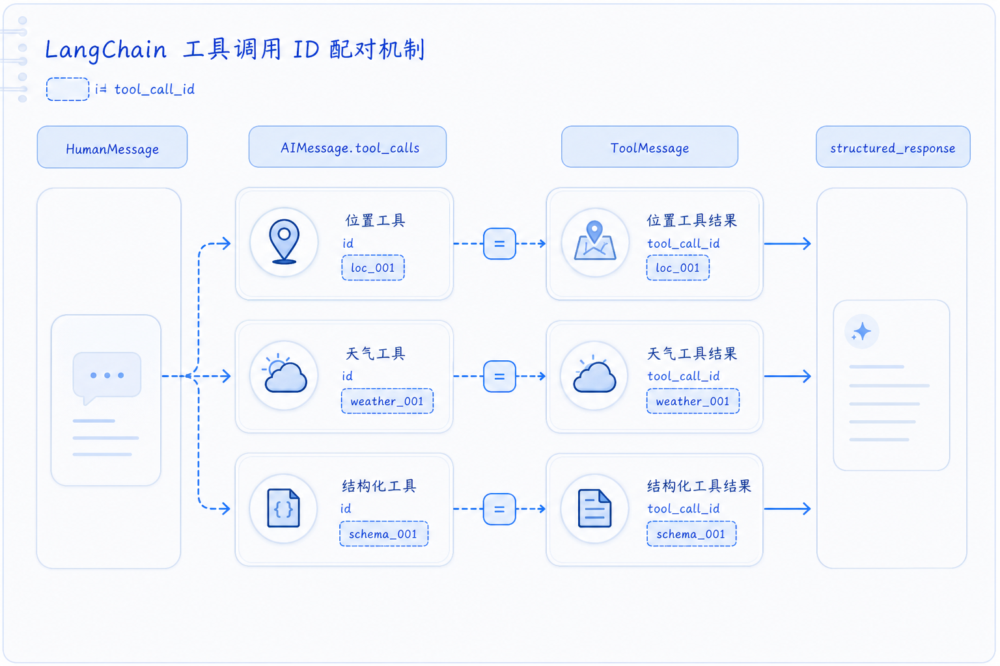

# Tools 与 Function Calling

---
参考资料：
- [LangChain：Tools](https://docs.langchain.com/oss/python/langchain/tools)
- [LangChain：Agents](https://docs.langchain.com/oss/python/langchain/agents)
- [OpenAI：Function calling](https://platform.openai.com/docs/guides/function-calling)
- [Anthropic：Tool use](https://platform.claude.com/docs/en/agents-and-tools/tool-use/overview)
---

## 核心概念

**Tools 是模型可选择的外部能力，Function Calling / Tool Use 是模型表达“我要调用哪个工具、参数是什么”的协议机制。**

模型本身不会执行 Python 函数、访问数据库或调用 HTTP API。除 Provider 托管的 server-side tool 外，模型通常只生成工具调用意图；真正的工具执行、权限判断、异常处理和结果回传都由业务系统或 Agent runtime 完成。

复习时要先分清三件事：

| 概念 | 关注点 | 当前项目中的例子 |
| --- | --- | --- |
| Tool 定义 | 给模型看见哪些工具、参数和描述 | `utils/tools.py` 中的 `@tool(...)` |
| Tool call | 模型决定调用某个工具，并生成参数 | `AIMessage.tool_calls` |
| Tool result | 工具执行完成后，把结果回传给模型 | `ToolMessage` |

**关键判断：模型生成工具调用，不代表工具已经执行成功。** 工具调用只是一个待执行动作，业务系统仍需要校验、执行和回传。

## 一次工具调用包含哪些步骤

工具调用不是单次模型输出，而是一个多步回合。当前项目使用 `create_agent()` 后，这些步骤由 LangChain Agent runtime 自动编排。

| 步骤 | 执行者 | 当前项目中的表现 |
| --- | --- | --- |
| 1. 暴露工具 | 业务代码 / LangChain | `create_agent(tools=tools)` |
| 2. 选择工具 | 模型 | `AIMessage.tool_calls` 中出现工具名和参数 |
| 3. 执行工具 | LangChain Agent runtime | 调用 `utils/tools.py` 中的 Python 函数 |
| 4. 回传结果 | LangChain Agent runtime | 生成对应 `ToolMessage` |
| 5. 继续推理 | 模型 | 基于工具结果继续调用工具或生成最终回答 |

如果一次任务需要多个工具，模型可能顺序调用，也可能并行调用。顺序调用适合“后一步依赖前一步结果”，例如先获取用户位置，再查询该城市天气。并行调用适合互不依赖的多个查询，例如同时查询多个城市天气。

## Tool 定义由什么组成

一个稳定工具至少包含六个要素：

| 要素            | 作用             | 写作重点                   |
| ------------- | -------------- | ---------------------- |
| `name`        | 模型选择工具时使用的稳定标识 | 简短、准确、避免空格和特殊字符        |
| `description` | 告诉模型什么时候使用工具   | 说明能力、边界和返回内容           |
| 参数 Schema     | 定义模型需要生成哪些参数   | 字段名、类型、必填项、枚举和描述要清楚    |
| 执行逻辑          | 真正访问外部系统或本地函数  | 做权限、幂等、超时和异常控制         |
| 返回结果          | 让模型读取下一步所需信息   | 返回清晰、可解释、不要泄露敏感信息      |
| 错误契约          | 告诉调用方失败类型      | 区分参数错误、权限失败、资源不存在和系统异常 |

LangChain 的 `@tool` 可以根据函数名、类型注解、docstring 或显式参数生成工具定义。当前项目采用显式名称和描述：

```python
@tool("get_user_location", description="根据用户 ID 检索用户信息。")
def get_user_location(runtime: ToolRuntime[Context]) -> str:
    user_id = runtime.context.user_id
```

类型注解会影响工具参数 Schema。没有类型注解时，模型难以稳定生成正确参数。

## 当前项目的工具结构

当前项目的工具集中在 [tools.py](<../utils/tools.py>)，由 `get_tools()` 返回：

```python
tools = [
    get_weather_for_location,
    get_user_location,
]
```

然后在 [agent.py](<../agent.py>) 中交给 Agent：

```python
agent = create_agent(
    model=llm_chat,
    system_prompt=SYSTEM_PROMPT,
    tools=tools,
    context_schema=Context,
    response_format=WeatherResponseFormat,
    checkpointer=checkpointer,
)
```

这表示模型在运行过程中可以选择这些工具。是否调用、何时调用、传什么参数，由模型根据用户问题、system prompt、工具描述和已有消息状态决定。

## get_user_location：从 Runtime Context 读取用户信息

`get_user_location` 的职责是根据当前调用上下文中的 `user_id` 返回城市：

```python
@tool("get_user_location", description="根据用户 ID 检索用户信息。")
def get_user_location(runtime: ToolRuntime[Context]) -> str:
    user_id = runtime.context.user_id
    if user_id == "1":
        return "北京"
    if user_id == "2":
        return "上海"
    if user_id == "3":
        return "深圳"
```

这里的 `runtime` 由 LangChain 注入，模型不会看到这个参数。模型看到的是一个不需要输入参数的工具；运行时则通过 `context=Context(user_id="1")` 把用户信息交给工具。

```python
response = agent.invoke(
    {"messages": [{"role": "user", "content": "外面的天气怎么样？"}]},
    config=config1,
    context=Context(user_id="1"),
)
```

这能帮助区分两类信息：

| 信息来源            | 是否由模型生成 | 当前例子                           |
| --------------- | ------- | ------------------------------ |
| 工具参数            | 是       | `city="北京"` 这类模型生成参数           |
| Runtime Context | 否       | `Context(user_id="1")` 由业务代码传入 |

**Runtime Context 适合放用户 ID、租户 ID、权限范围、会话配置等不希望模型自由编造的数据**。

## get_weather_for_location：模型需要生成参数

天气工具接收 `city: str`，因此 `city` 会进入模型看到的工具参数 Schema：

```python
@tool("get_weather_for_location", description="根据指定的城市获取天气。")
def get_weather_for_location(city: str) -> str:
    if city == "北京":
        return f"{city}的天气是晴天!"
    if city == "上海":
        return f"{city}的天气是多云!"
    if city == "深圳":
        return f"{city}的天气是下雨!"
```

模型需要先决定调用这个工具，再生成类似 `{"city": "北京"}` 的参数。LangChain 执行函数后，会把返回字符串写回 `ToolMessage`，模型再基于这个结果继续生成最终回答。

工具注册名、Python 函数名、system prompt 中的名称应保持一致，并共同指向同一个真实能力。生产代码中还应保持工具名、description、参数 Schema 和执行逻辑一致，这能降低模型选错工具或误解工具边界的概率。

## 当前项目的典型调用链

用户询问“外面的天气怎么样？”时，项目通常会形成下面的调用顺序：

1. 用户消息进入 `messages`。
2. 模型判断需要先确认用户所在城市。
3. 模型生成 `get_user_location` 的工具调用。
4. Agent runtime 执行 `get_user_location`，得到城市。
5. 模型根据城市生成天气工具调用。
6. Agent runtime 执行天气工具，得到天气结果。
7. 模型生成最终结构化输出。
8. LangChain 把最终对象放入 `response["structured_response"]`。

在响应状态中，相关信息主要分布在：

| 位置                     | 保存内容        | 学习重点             |
| ---------------------- | ----------- | ---------------- |
| `HumanMessage`         | 用户原始问题      | 工具调用的任务来源        |
| `AIMessage.tool_calls` | 模型生成的工具名和参数 | 这是调用意图，不是执行结果    |
| `ToolMessage`          | 工具执行后的返回内容  | 必须与某次工具调用关联      |
| `structured_response`  | 最终业务对象      | 结构化输出结果，不是工具结果本身 |

完整消息结构可参考 [07_模型请求与响应结构](<07_模型请求与响应结构.md>)。

## call ID 的作用

工具调用必须能和工具结果对应起来。不同协议字段名不同，但作用一致：标识“这个结果属于哪一次工具调用”。

| 协议或框架                   | 工具调用位置                   | 工具结果关联字段                   |
| ----------------------- | ------------------------ | -------------------------- |
| OpenAI Chat Completions | `message.tool_calls`     | `tool_call_id`             |
| OpenAI Responses        | `function_call` item     | `call_id`                  |
| Anthropic Messages      | `tool_use` content block | `tool_use_id`              |
| LangChain               | `AIMessage.tool_calls`   | `ToolMessage.tool_call_id` |

call ID 在并行工具调用时尤其重要。多个工具同时执行后，不能依靠返回顺序判断哪个结果属于哪个调用，必须依靠 ID 关联。



### 结合当前 response 看 call ID

你这次运行返回了三组工具调用。每一组都遵循同一个规则：`AIMessage.tool_calls[].id` 与后续 `ToolMessage.tool_call_id` 必须相同。

| 顺序  | 模型生成的工具调用                                      | 工具调用 ID                         | 对应的 ToolMessage                                | 工具结果                                 |
| --- | ---------------------------------------------- | ------------------------------- | ---------------------------------------------- | ------------------------------------ |
| 1   | `get_user_location`，参数 `{}`                    | `call_54a5dff5fcce4db19ee6eb5f` | `tool_call_id='call_54a5dff5fcce4db19ee6eb5f'` | `北京`                                 |
| 2   | `get_weather_for_location`，参数 `{"city": "北京"}` | `call_030162df4a724b2fa45cb214` | `tool_call_id='call_030162df4a724b2fa45cb214'` | `北京的天气是晴天!`                          |
| 3   | `WeatherResponseFormat`，参数为最终结构化字段             | `call_6808a8a89cd648d88aa57ebd` | `tool_call_id='call_6808a8a89cd648d88aa57ebd'` | `Returning structured response: ...` |

这三组信息说明当前 Agent 不是一次模型调用直接给出最终答案，而是经历了三次模型决策：

1. 第一次模型调用决定先获取用户位置。
2. 第二次模型调用根据位置查询天气。
3. 第三次模型调用提交最终结构化输出。

每次 `AIMessage` 都有自己的消息 ID，例如 `lc_run--...`；Provider 响应元数据中也有自己的完成 ID，例如 `chatcmpl-...`。这些 ID 用来标识消息或模型响应。**工具结果配对看的是 tool call ID，不是 `AIMessage.id`，也不是 `ToolMessage.id`。**

因此，在当前项目中可以这样读消息链：

- `AIMessage.tool_calls[].id`：模型提出的某一次工具调用编号。
- `ToolMessage.tool_call_id`：该工具结果对应哪一次工具调用。
- `ToolMessage.name`：执行的是哪个工具。
- `ToolMessage.content`：工具返回给模型看的结果。

如果没有 call ID，多个工具调用同时出现时，Agent runtime 就难以可靠判断某个结果应该回填给哪一次工具调用。即使当前示例是顺序调用，也仍然保留 call ID，保证协议结构稳定。

## tool_choice 控制什么

`tool_choice` 用来控制模型是否可以调用工具，以及是否必须调用工具。不同 Provider 字段形状不同，但常见语义相似：

| 模式         | 含义             | 适合场景           |
| ---------- | -------------- | -------------- |
| `auto`     | 模型自行判断是否调用工具   | 普通 Agent 对话    |
| `none`     | 禁止模型调用工具，只生成文本 | 只想要自然语言回答      |
| `required` | 要求模型至少调用一个工具   | 必须查库、查权限或查实时数据 |
| 指定某个工具     | 强制模型调用特定工具     | 已知下一步必须执行某个动作  |

当前项目没有显式设置 `tool_choice`，因此工具选择主要由模型根据 system prompt 和工具描述决定。生产中，如果某些任务必须查实时数据，不能只依赖模型自由判断，应通过系统指令、工具选择策略或外层业务流程强制约束。

## 工具返回值怎样设计

工具返回值会进入下一轮模型上下文，因此要让模型能稳定理解。

| 返回方式 | 适合内容 | 注意点 |
| --- | --- | --- |
| 字符串 | 简单、面向模型阅读的结果 | 语义要清晰，避免混入日志和敏感信息 |
| 字典或对象 | 多字段结构化结果 | 字段名稳定，便于模型引用 |
| `Command` | 需要更新 Agent state | 需要注意状态合并和并行冲突 |
| 错误消息 | 可恢复错误 | 应说明失败类型和可修正方向 |

当前天气工具返回字符串，例如 `北京的天气是晴天!`。这足以演示工具调用链路；如果进入生产，更推荐返回稳定结构，例如城市、天气、数据来源和更新时间。

## 工具错误处理

工具错误不能简单交给模型自由解释。业务系统需要明确错误边界。

| 错误类型 | 处理方式 |
| --- | --- |
| 参数校验失败 | 返回字段级错误，让模型修正参数，必要时限制重试次数 |
| 资源不存在 | 明确返回未找到，不要让模型编造结果 |
| 权限不足 | 拒绝执行，并避免泄露权限细节 |
| 外部服务超时 | 业务层做有限重试，失败后返回可解释错误 |
| 内部异常 | 详细信息写入受控日志，给模型的结果应脱敏 |
| 并行调用部分失败 | 按各自 call ID 返回成功或失败，不要合并成模糊结果 |

高风险工具需要额外控制。付款、发消息、删除数据、修改权限、提交审批等动作，不能只依赖模型的工具选择结果，还需要权限校验、幂等键、审计日志和必要的人类确认。

## 业务工具与结构化输出工具的区别

当前项目同时涉及业务工具和结构化输出 Schema，容易混在一起。

| 类型 | 例子 | 职责 |
| --- | --- | --- |
| 业务工具 | `get_user_location`、`get_weather_for_location` | 获取完成任务所需的外部信息 |
| 结构化输出 | `WeatherResponseFormat` | 规定最终回答应具有哪些字段 |
| ToolStrategy 结构化工具 | `ToolStrategy(WeatherResponseFormat)` 显式启用时由 LangChain 创建 | 让模型通过工具调用形式提交最终结构化结果 |

业务工具通常会执行真实业务逻辑。结构化输出工具不应被理解为天气查询函数，它只是承载最终字段的一种机制。相关细节可以参考 [14_ToolStrategy详解](<14_ToolStrategy详解.md>)。

## 生产使用经验

- **工具名要稳定**：工具名、函数能力和 system prompt 中的名称应保持一致。
- **description 要写边界**：不仅说明工具能做什么，也说明什么时候不该用。
- **参数 Schema 要具体**：字段名、类型、枚举和必填项越清晰，模型越不容易乱填。
- **业务系统负责执行**：模型只生成意图，执行前必须做权限、参数和幂等校验。
- **工具结果要可读**：返回给模型的内容应清晰、简洁、可用于下一步推理。
- **错误要分类**：可修复错误交给模型重试，不可修复错误应中断或返回明确失败。
- **高风险动作要加保护**：涉及外部写入、资金、权限、通知的工具必须有审计和人工确认策略。

## 相关学习笔记

- [07_模型请求与响应结构](<07_模型请求与响应结构.md>)：查看 `AIMessage.tool_calls`、`ToolMessage`、usage 和 finish reason。
- [03_结构化输出](<03_结构化输出.md>)：理解 `response_format`、结构化输出和业务工具的边界。
- [14_ToolStrategy详解](<14_ToolStrategy详解.md>)：理解结构化输出怎样借用工具调用机制。
- [16_ToolStrategy和ProviderStrategy区别](<16_ToolStrategy和ProviderStrategy区别.md>)：区分工具调用结构化输出和 Provider 原生结构化输出。
- [05_create_agent参数详解](<05_create_agent参数详解.md>)：查看 `tools` 怎样进入 Agent 装配。
- [06_Agent短期记忆](<06_Agent短期记忆.md>)：理解工具调用结果如何进入线程消息状态。

**最终记忆：Function Calling 不是让模型执行函数，而是让模型生成函数调用意图；真正执行工具、校验权限、处理错误和回传结果的是业务系统或 Agent runtime。**
