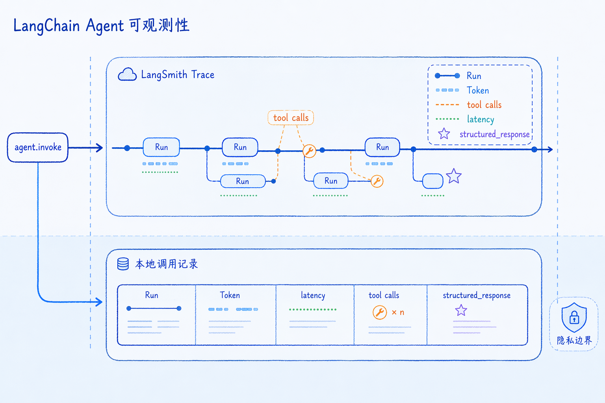

# LangSmith 跟踪与调用记录

---
参考资料：
- [LangChain Observability](https://docs.langchain.com/oss/python/langchain/observability)
- [LangSmith Tracing quickstart](https://docs.langchain.com/langsmith/observability-quickstart)
- [LangSmith Observability concepts](https://docs.langchain.com/langsmith/observability-concepts)
- [LangSmith Trace LangChain applications](https://docs.langchain.com/langsmith/trace-with-langchain)
---

## 核心定位

**LangSmith 用来观察 LLM 应用一次请求的完整执行链；本地调用记录用来把项目关心的字段整理成稳定的业务日志。**

Agent 不是单次模型调用。一次天气请求可能包含多次模型调用、多个工具调用、结构化输出、短期记忆读取和状态写回。只看最终回答，很难判断问题发生在哪一步；只看本地日志，又可能缺少图形化的父子 Run、耗时分布和调试上下文。

本项目的观测体系可以分成两条线：

| 观测方式 | 主要作用 | 适合回答的问题 |
| --- | --- | --- |
| LangSmith Trace | 记录 Agent、模型、工具、结构化输出等步骤的完整链路 | 为什么调用了这个工具？哪一步慢？哪一步失败？Prompt 和消息历史是否符合预期？ |
| 本地调用记录 | 从 Agent state 中提取模型、输入、输出、Token、耗时和工具调用摘要 | 本次业务调用用了哪个模型？消耗多少 Token？最终结构化结果是什么？ |

两者不是替代关系。LangSmith 偏开发调试、评估和生产观测；本地调用记录偏业务审计、成本统计、离线分析和内部系统集成。



## 项目里有哪几类观测数据

本项目运行一次 `agent.invoke()` 后，至少可以看到三类结果：

| 数据位置 | 来源 | 作用 |
| --- | --- | --- |
| `response["messages"]` | LangChain Agent state | 保存用户消息、模型消息、工具调用和工具结果 |
| `response["structured_response"]` | `WeatherResponseFormat` | 保存最终业务结构化结果 |
| `build_response_record(response)` | `utils/call_records.py` | 把 Agent state 整理成便于记录的调用摘要 |

`logger.info(...)` 会把结构化响应和调用记录写入本地日志文件：

```python
logger.info(f"北京Agent首次回复是: {response['structured_response']}")
logger.info(f"北京Agent首次调用记录是: {build_response_record(response)}")
```

本地日志记录的是项目整理后的摘要，不等于 LangSmith trace，也不等于 Provider 原始响应。消息结构和响应字段的详细关系可以参考 [07_模型请求与响应结构](<07_模型请求与响应结构.md>)。

## LangSmith 怎样启用

LangChain Agent 对 LangSmith tracing 有内置支持。推荐把 LangSmith 配置放在 shell、`.env` 或部署平台环境变量中，不要把 API Key 写进代码或笔记。

```dotenv
LANGSMITH_TRACING=true
LANGSMITH_API_KEY=在本机环境变量或密钥管理器中配置
LANGSMITH_PROJECT=langchain-quickstart
```

如果 LangSmith 账号所在区域不是默认区域，还需要配置对应的 `LANGSMITH_ENDPOINT`。

```dotenv
LANGSMITH_ENDPOINT=https://eu.api.smith.langchain.com
```

项目中的 `agent.py` 会在本地运行时开启 tracing，并从外部环境读取 API Key：

```python
os.environ["LANGSMITH_TRACING"] = "true"

langsmith_api_key = os.getenv("LANGSMITH_API_KEY") or os.getenv("LANGCHAIN_API_KEY")
if langsmith_api_key:
    os.environ["LANGSMITH_API_KEY"] = langsmith_api_key
```

学习和新项目配置应优先使用 `LANGSMITH_TRACING`、`LANGSMITH_API_KEY`、`LANGSMITH_PROJECT`。保留旧变量名只适合作为兼容过渡，仍应以当前 LangSmith 配置为主。

更稳妥的做法是只从外部读取环境变量，而不是在业务代码里写死配置：

```powershell
$env:LANGSMITH_TRACING="true"
$env:LANGSMITH_API_KEY="你的 LangSmith API Key"
$env:LANGSMITH_PROJECT="langchain-quickstart"
python agent.py
```

代码内设置环境变量时，应先判断值是否存在，避免把空值写入 `os.environ`：

```python
langsmith_api_key = os.getenv("LANGSMITH_API_KEY")
if langsmith_api_key:
    os.environ["LANGSMITH_API_KEY"] = langsmith_api_key
```

生产项目更推荐由部署环境注入这些变量。代码只使用配置，不负责暴露或硬编码密钥。

## LangSmith 中的核心概念

| 概念 | 含义 | 学习时重点看什么 |
| --- | --- | --- |
| Project | 一组 traces 的集合 | 按项目、环境、版本或实验分组 |
| Trace | 一次顶层请求的完整执行链 | 一次用户输入如何经过 Agent、模型和工具 |
| Run | Trace 中的一个执行步骤 | 单次 Agent、模型、工具、链或函数调用 |
| Thread | 多轮对话中的一组相关 traces | 多个 turn 如何通过 `thread_id` / `session_id` 关联 |
| Tags | 附着在 runs 上的字符串标签 | 按环境、功能、模型版本检索 |
| Metadata | 附着在 runs 上的键值信息 | 保存版本、租户、实验组等非敏感上下文 |
| Feedback | 对某个 run 的评分或标记 | 人工评价、自动评估和质量回流 |

对 Agent 学习来说，最重要的是 Trace 和 Run。Trace 告诉你完整链路，Run 告诉你每一步的输入、输出、耗时、错误和父子关系。

## 在 Trace 中重点观察什么

调试 Agent 时，LangSmith 的价值不只是“看到日志”，而是把一次请求拆成可定位的步骤。

重点检查：

- **输入消息**：用户消息、历史消息、system prompt 是否进入了预期上下文。
- **模型调用**：每次模型调用的输入、输出、Token、耗时和停止原因是否合理。
- **工具选择**：模型为什么选择 `get_user_location` 或 `get_weather_for_location`。
- **工具参数**：工具参数是否符合 Schema，例如天气工具是否拿到了 `city`。
- **工具结果**：工具返回值是否通过 `ToolMessage` 回到模型。
- **call ID 关联**：`AIMessage.tool_calls[].id` 是否和 `ToolMessage.tool_call_id` 正确配对。
- **结构化输出**：模型是否按 `WeatherResponseFormat` 提交字段，失败后是否发生重试。
- **短期记忆**：相同 `thread_id` 是否读取历史，不同 `thread_id` 是否隔离。
- **异常位置**：错误发生在模型调用、工具执行、结构化校验还是状态持久化。

这些问题很难只靠最终回答判断。LangSmith 的 Trace 更适合做链路定位，本地调用记录更适合做结果归档。

## Tags 与 Metadata 怎样使用

调用 Runnable 时可以通过 `config` 添加 tags 和 metadata：

```python
response = agent.invoke(
    {"messages": [{"role": "user", "content": "查询天气"}]},
    config={
        "configurable": {"thread_id": "thread-1"},
        "tags": ["dev", "weather-agent", "quickstart"],
        "metadata": {
            "model_family": "openai-compatible",
            "environment": "local",
        },
    },
    context=Context(user_id="user-1"),
)
```

`tags` 适合放短标签，`metadata` 适合放结构化筛选条件。

| 字段 | 适合保存 | 不适合保存 |
| --- | --- | --- |
| `tags` | 环境、功能名、版本、实验名 | 大段文本、用户输入、工具结果 |
| `metadata` | 模型族、应用版本、租户类型、灰度组 | API Key、完整用户凭据、内部文件路径、敏感业务数据 |

如果希望 LangSmith 把多轮对话聚合成 thread，可以在 metadata 中使用稳定的 `thread_id` 或 `session_id`。项目里已经通过 `configurable.thread_id` 管理短期记忆；是否同步把它写入 LangSmith metadata，要根据数据披露策略决定。

## 本地调用记录的结构

`utils/call_records.py` 的入口函数是：

```python
record = build_response_record(response)
```

默认记录结构可以理解为：

```python
{
    "model": "qwen3.7-plus",
    "provider": "openai",
    "input": {
        "messages": [
            {"role": "user", "content": "外面的天气怎么样？记住我的暗号是 banana-007"}
        ]
    },
    "output": {
        "punny_response": "...",
        "weather_location": "北京",
        "weather_conditions": "晴天",
    },
    "usage": {
        "inputTokens": 1691,
        "outputTokens": 101,
        "totalTokens": 1792,
    },
    "latencyMs": None,
}
```

`include_details=True` 时，还会附加更细的模型调用和消息轨迹：

```python
record = build_response_record(response, include_details=True)
```

详细记录会增加：

| 字段 | 含义 |
| --- | --- |
| `id` | 本地生成的调用记录 ID |
| `capability` | 记录类型，例如 `agent_invoke` |
| `status` | 本地记录状态，例如 `success` |
| `latencySource` | 延迟字段来源 |
| `llmCallCount` | Agent state 中可见的 `AIMessage` 数量 |
| `llmCalls` | 每次模型调用的模型名、Provider、finish reason、usage、tool calls |
| `messageTrace` | 简化后的 `HumanMessage`、`AIMessage`、`ToolMessage` 轨迹 |

这类记录适合写入日志、数据库或审计系统。它的优点是字段可控，缺点是只能记录项目主动提取的内容。

## call_records.py 怎样提取字段

`build_response_record()` 的核心步骤是从 Agent state 中读取 `messages`，然后筛选所有模型消息：

```python
messages = response.get("messages") or []
ai_calls = [message for message in messages if _is_ai_message(message)]
```

再分别提取摘要字段：

| 记录字段 | 提取来源 | 说明 |
| --- | --- | --- |
| `model` | 最后一条包含模型信息的 `AIMessage.response_metadata` | 一个 Agent 过程可能有多次模型调用，摘要中保留最终可见模型名 |
| `provider` | 最后一条包含 Provider 信息的 `AIMessage.response_metadata` | 兼容 `model_provider` 和 `provider` |
| `input` | 所有可见 `HumanMessage` | 复用同一 `thread_id` 时可能包含历史用户消息 |
| `output` | `response["structured_response"]` | 优先记录业务可用的结构化结果 |
| `usage` | 所有可见 `AIMessage` 的 usage 累加 | 统计口径是返回 state 中可见模型调用的合计 |
| `latencyMs` | `response_metadata.latency_checkpoint.total_duration_ms` | Provider 未返回该字段时为 `None` |

Token 用量优先读取 LangChain 标准化字段：

```python
usage = getattr(message, "usage_metadata", None) or {}
```

如果没有，再回退读取 Provider 原始字段：

```python
token_usage = response_metadata.get("token_usage") or {}
```

这种写法能兼容不同 Provider 的响应差异，但无法创造 Provider 没有返回的数据。没有 usage、延迟或模型名时，本地记录只能返回默认值或 `None`。

## usage 统计的口径

Agent 一次执行可能包含多次模型调用。例如天气问题常见过程是：

1. 模型判断需要调用定位工具。
2. 模型读取定位结果后调用天气工具。
3. 模型读取天气结果后提交结构化输出。

`call_records.py` 会遍历所有可见 `AIMessage` 并累加 usage：

```python
for message in ai_calls:
    usage = _usage_for_message(message)
    total["inputTokens"] += usage["inputTokens"]
    total["outputTokens"] += usage["outputTokens"]
    total["totalTokens"] += usage["totalTokens"]
```

这个统计口径适合回答“返回 state 中可见模型调用共消耗多少 Token”。如果同一个 `thread_id` 已经积累历史消息，返回 state 中可能包含历史 `AIMessage`，这时记录结果不一定等于本轮新增 Token 成本。

生产中如果需要精确成本，应明确口径：

- **单个模型 Run 成本**：看 LangSmith 中单个模型 Run 的 usage。
- **单次 Agent invoke 成本**：看本次 trace 下所有模型 Run 的 usage 合计。
- **线程累计成本**：按 `thread_id` 聚合多次 trace 或多次本地调用记录。
- **业务账单成本**：结合 Provider 价格、缓存命中、失败重试和折扣策略计算。

## latencyMs 为什么可能是 None

`latencyMs` 来自 Provider 或兼容服务返回的延迟 metadata：

```python
latency_checkpoint.total_duration_ms
```

如果 Provider 没有返回该字段，仅凭 `agent.invoke()` 完成后的 `response` 无法反推出真实端到端耗时。因此本地记录返回 `None` 是合理结果。

生产中要记录可靠耗时，应在调用外层主动计时：

```python
from time import perf_counter

started_at = perf_counter()
response = agent.invoke(...)
latency_ms = round((perf_counter() - started_at) * 1000)
```

外层计时表示业务端到端耗时，Provider metadata 表示模型服务侧或兼容服务侧统计。两者含义不同，不应混用。

## 本地记录与 LangSmith 的区别

| 对比维度 | 本地调用记录 | LangSmith Trace |
| --- | --- | --- |
| 数据位置 | 本地日志、数据库或业务系统 | LangSmith 平台 |
| 数据粒度 | 项目主动整理的摘要字段 | Agent、模型、工具、函数等父子 Run |
| 链路可视化 | 需要自己建设展示 | 自动展示执行时间线和嵌套关系 |
| 字段控制 | 高，可按业务定义 | 中，自动采集为主，可补充 tags / metadata |
| 成本统计 | 取决于本地提取逻辑 | 可查看每个模型 Run 的 usage |
| 评估能力 | 需要自建数据集和评估流程 | 可关联数据集、反馈和评估 |
| 隐私边界 | 可完全留在本地 | Trace 数据会发送到外部服务 |

本地记录适合作为业务系统的一部分，LangSmith 适合作为工程可观测平台。开发阶段优先用 LangSmith 定位问题；上线后通常同时保留必要的本地审计记录。

## 隐私和数据披露

启用 tracing 后，Prompt、用户输入、模型输出、工具参数、工具结果和 metadata 可能被发送到 LangSmith。是否开启 tracing，不只是技术配置，也是数据披露决策。

生产使用前应确认：

- **是否允许上传用户输入和模型输出。**
- **工具结果中是否包含个人信息、订单、地址、内部文档或敏感业务数据。**
- **metadata 中是否包含可识别用户身份的信息。**
- **是否需要脱敏、采样、按环境关闭或只对测试账号开启。**
- **数据保留期限是否满足业务和合规要求。**

不要把 API Key、token、完整用户凭据、内部文件绝对路径、私有 endpoint 或敏感工具结果写入 tags、metadata、Prompt 或本地笔记。

## 生产使用经验

- **开发阶段先开 LangSmith。** 先确认 Agent 是否按预期调用模型和工具，再讨论优化 prompt 或模型参数。
- **本地记录只保留业务需要的字段。** 不要为了“完整”把全部消息、工具结果和敏感上下文无差别写入日志。
- **区分调试 trace 和业务审计。** Trace 服务于定位问题，审计记录服务于成本、排障、追责和统计。
- **明确 usage 统计口径。** 单个模型调用、单次 Agent 调用、线程累计和业务账单不是同一口径。
- **给 trace 加稳定标签。** 环境、模型族、Agent 版本和功能名适合进入 tags / metadata。
- **异常记录要保留失败阶段。** 记录错误发生在模型调用、工具执行、结构化输出校验还是状态持久化。
- **生产环境要控制披露范围。** tracing 可以采样开启，也可以只在开发、灰度或问题复现时开启。

## 相关学习笔记

- [07_模型请求与响应结构](<07_模型请求与响应结构.md>)：理解 `messages`、`AIMessage`、`ToolMessage`、usage 和 finish reason 的来源。
- [04_Tools与FunctionCalling](<04_Tools与FunctionCalling.md>)：理解工具调用意图、工具执行和 `tool_call_id`。
- [03_结构化输出](<03_结构化输出.md>)：理解 `structured_response` 和结构化输出策略。
- [05_create_agent参数详解](<05_create_agent参数详解.md>)：理解 `agent.invoke()`、`config`、`context` 和 Agent runtime。
- [06_Agent短期记忆](<06_Agent短期记忆.md>)：理解 `thread_id` 与短期记忆状态。

**最终记忆：LangSmith 负责观察完整链路，本地调用记录负责沉淀业务摘要。调试 Agent 时先看 Trace 定位步骤，再用本地记录固化模型、输入、输出、usage、finish reason 和工具调用摘要。**
